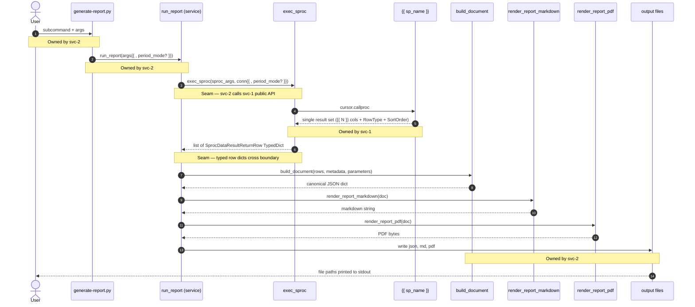

<!--
  TEMPLATE — Stacked SPEC (spec-builder skill)

  Copy this file to:
    <container-root>/<report-slug>-stacked-SPEC.md
  (container root, shared across both branches in the stack).

  Replace every `{{ ... }}` placeholder. Resolve every `<!-- TBD: ... -->`
  marker. Delete this template comment block when filling in for a real
  report.

  Stack-size cap: 2 feature branches (svc-1 + svc-2). If a deliverable feels
  like it needs a 3-deep stack, stop — the SPEC is probably packaging
  multiple deliverables. See stacked-branch-workflow.md.

  Stacking exists for review boundaries:
  1. Let humans review dependent slices separately.
  2. Stabilize a lower-layer contract before upper-layer consumer code is reviewed.
  If neither applies, use the regular SPEC template.

  Conventions assumed (do not redefine in the SPEC body):
  - One report lane worktree contains stacked branches. Do not create stacked
    worktrees.
  - Filename convention for CLI output: `<QbName>-<Mon>-<YYYY>_<ReportType>_<ts>.{json,md,pdf}`.
    See backend/scripts/generate-report.py and the unified naming applied across reports.
  - No batch/harness CLI subcommand — shell loops over the single-case subcommand.
  - Testing strategy: minimal @pytest.mark.db tests + unit-tested document.py.
  - Dependency hygiene: no broad mypy overrides; use types-* dev deps + inline ignores.
  - Container conventions (`.env` toggle, `withenv`, `uv run`, `sqlcmd`) live in
    qb-agent-orientation.md — link, do not inline.
-->

# {{ Report Name }} — Stacked Deliverable SPEC

> This SPEC is shared across both branches in the stacked deliverable. Per-branch
> sequencing, ACs, and implementation prompts live in this SPEC and the shared run log.
> This document is the **integration view** — the seam contract, branch ownership, and
> shared decisions.

---

## 0. Stacked-branch model — read this first

The *{{ Report Name }}* report is delivered across **two stacked branches** that ship
together but are reviewed in sequence.

### Why stacked branches

Large report-migration deliverables decompose cleanly into:

1. A **data layer** foundation — SQL Server stored procedure (+ supporting view/TVF if
   needed) plus its Python binding and tSQLt coverage. Produces typed, decimal-precise rows;
   nothing is rendered.
2. A **render/consume** layer — canonical JSON document, markdown renderer, PDF renderer,
   developer CLI subcommand, and service-layer JSON fixtures.

Splitting the work into a stack lets reviewers approve the data contract independently of the
rendering choices, while the engineer still iterates end-to-end during implementation. svc-2
is rebased upstack from svc-1 so it always has svc-1's code physically present.

### Worktree topology

Both branches live inside one report lane worktree under `<container-root>/`.
The worktree isolates the agent's filesystem and dependency state; the stacked branches define
the review units.

- `mw-{{ slug }}-lane/` — the report lane worktree.
- `mw-{{ slug }}-svc-1` — bottom branch; data layer.
- `mw-{{ slug }}-svc-2` — top branch; render / CLI.

Do not split the stack across multiple worktrees. Branch stacking happens inside this
single lane worktree via `gh-stack`.

Mental model:

- one worktree = one isolated agent lane / deliverable workspace
- one stack inside that worktree = multiple review branches for the same deliverable
  or tightly related deliverable group
- one branch = one review unit, represented by commits, not by a remembered file list
- the worktree has one working directory, one index, and one checked-out branch at a
  time

### Rebase rule

`mw-{{ slug }}-svc-2` rebases on **`mw-{{ slug }}-svc-1`'s HEAD**, *not* on
`{{ integration-branch }}`. Until the svc-1 PR lands on `{{ integration-branch }}`
through human review, svc-2 is a stacked PR opened against svc-1, not against
`{{ integration-branch }}`.

When svc-1's tip moves (rebase on `{{ integration-branch }}`, hot-fix), svc-2 must
rebase on the new svc-1 head. Never collapse svc-1's commits into svc-2 by
squash-rebasing onto `{{ integration-branch }}` directly — that absorbs svc-1's work
into svc-2's PR and breaks AC7 ("0 bytes diff against svc-1-owned files").

After the svc-1 PR lands on `{{ integration-branch }}`, svc-2 rebases on
`{{ integration-branch }}`; svc-1's commits drop out of
`git diff origin/{{ integration-branch }}...HEAD` for svc-2, and AC7 reads cleanly.

Branch 2 sees Branch 1 as of the last time Branch 2 was created from, based on, or
rebased onto Branch 1. After new Branch 1 commits, run `gh stack rebase --upstack`.
After the Branch 1 PR lands, run `gh stack sync`, then verify Branch 2's remaining diff
against `{{ integration-branch }}`.

Agents may push stack branches and create/update PRs when instructed, but they must not
merge directly to `{{ integration-branch }}`. All integration to
`{{ integration-branch }}` happens through human PR review.

`gh-stack` tracks branch order and PR relationships; it does not track file ownership.
Changes belong to a branch only after they are staged and committed on that branch. When mixed
changes exist, use path-specific `git add` or `git add -p`.

All `gh stack` commands in this SPEC must be non-interactive:

- pass branch names to `init`, `add`, and `checkout`
- use `gh stack view --json`
- use `gh stack submit --auto` when creating PRs
- use `--remote origin` when multiple remotes are configured, or preconfigure
  `git config remote.pushDefault origin`
- configure `git config rerere.enabled true` before stack setup

---

## 0.5 End-to-end execution flow

A single CLI invocation crosses both stacked branches. The diagrams below trace that path and mark
the ownership seam.

### Diagram A — High-level full-stack sequence



### Diagram B — Slice ownership at a glance

```mermaid
flowchart LR
    subgraph svc1[svc-1 — data layer]
        SQL[SQL migrations<br/>SP{{ + view/TVF? }}]
        BIND[Python binding<br/>exec_sproc]
    end
    subgraph seam[Integration seam]
        API[Public symbols<br/>exec_sproc<br/>SprocArguments<br/>SprocDataResultReturnRow<br/>InvalidQualityBankError]
    end
    subgraph svc2[svc-2 — render / CLI]
        SVC[run_report orchestration]
        DOC[build_document]
        REND[markdown.py + pdf.py]
        CLI2[generate-report.py CLI]
    end

    SQL --> BIND --> API --> SVC --> DOC --> REND
    CLI2 --> SVC
```

### What the diagrams encode

**Integration touchpoint.** The seam is the boundary between the binding and `run_report`.
Locked public symbols crossing it are listed in §4.

**Two correctness regimes.** Left of the seam = **data correctness** (tSQLt + mock-based
binding tests in svc-1). Right of the seam = **presentation correctness** (JSON convergence
fixtures + PDF smoke in svc-2).

**The SP is the contract.** If svc-2 needs a column or `RowType` value the SP does not emit,
that is a svc-1-style change (new svc-1 PR or follow-up) — never a workaround in the service
layer or document builder.

---

## 1. Branch map

| Branch | Role | SPEC section / run-log section |
| --- | --- | --- |
| `mw-{{ slug }}-svc-1` | **Database + Python wrapper** — SQL objects ({{ sp + view/TVF list }}) and the binding that wraps them | SPEC §2; run log `svc-1` section |
| `mw-{{ slug }}-svc-2` | **Everything else** — service orchestration, document, renderers, CLI, JSON fixtures | SPEC §3; run log `svc-2` section |

No PLAN docs are created. The checked-out branch determines which branch-owned section is
active for implementation. Progress, deviations, evidence, and verifier results live in
the shared run log.

### Boundary principle

The split is **role-based, not path-based.** svc-1 is the database and its Python wrapper:
anything that defines what rows the SP returns or how the binding presents them to Python
callers. svc-2 is everything that consumes those rows.

When deciding which branch a change belongs in, ask: *does this change the data contract that
crosses the seam?* The locked public API in §4 is the actual boundary. Paths cited in §2 / §3
ownership inventories are practical guidance, not a whitelist.

---

## 2. Branch: `mw-{{ slug }}-svc-1` — Data layer

### Scope

Ship {{ describe SP scope: e.g. "a single, fully-aggregated, decimal-precise SP plus its
Python binding for the {{ Report Name }} report" }}. Legacy `qb_*` SPs and views are
untouched. This branch produces typed rows; it does not render.

### Decisions unique to this branch

<!-- TBD: list svc-1-specific design decisions. Examples to consider:
  - New qb2_ SP vs wrapping legacy qb_ SP, and why.
  - Single SP with parameter (e.g., @PeriodMode) vs separate SPs.
  - View / TVF / temp-table strategy and rationale.
  - Aggregation in SP vs binding vs service layer.
  - Single result set with RowType discriminator (list values).
  - exec_sproc signature shape — required keyword args, types.
  - Subtotal / grouping scopes specific to this report.
  - Performance choices (indexes, materialization, plan-cache seeding).
  - Error mapping for invalid inputs.
-->

### SP signature (svc-1-internal contract)

```sql
CREATE OR ALTER PROCEDURE [dbo].[{{ sp_name }}]
    -- TBD: parameters with types and defaults
    @ErrorMessage varchar(500) = null output
```

Return-code mapping (see svc-1 binding tests): `gcOK` → rows; `gcNoRowsFound` → `[]`;
`{{ invalid-input return code }}` → `{{ TypedError }}`; anything else →
`UnexpectedStoredProcedureCallError`.

### Acceptance criteria

- **AC1** — Migrations apply cleanly (`just db-migrate-test` exit 0; sys.views /
  sys.procedures / tSQLt.TestClasses counts as expected).
- **AC2** — tSQLt suite green: <!-- TBD: enumerate the cardinalities, filters,
  classifications, mappings, precision, ordering, validation rules covered. -->
- **AC3** — Python binding tests green: happy path(s), parameter propagation, return-code
  mapping, column-drift detection, `SprocArguments` shape lock.
- **AC4** — Column lock documented in HANDOFF (all {{ N }} columns + types + sign-off).
- **AC5** — Performance smoke: <!-- TBD: target threshold (e.g., ≤ 5× pathfinder
  qb2_GetAllShippers on comparable fixture rows). -->
- **AC6** — `just format` and `just test-unit` exit 0.
- **AC7** — Legacy untouched: `git diff origin/{{ integration-branch }} -- <legacy paths>` empty.
- **AC8** — Reference-report value match: <!-- TBD: cases × variants byte-exact. -->

### Ownership

svc-1 owns the **data contract**. If a change affects what rows come back from the SP, their
typed shape, or return-code semantics, it lands in:

- SQL Server objects (migrations creating `{{ sp_name }}`{{ , and any vw2_/fn2_ helpers }}).
- The Python binding wrapping the SP, mapping return codes to typed errors, exposing
  `exec_sproc`.
- tSQLt classes locking SP behavior and binding tests locking return-code mapping +
  column-drift detection.
- The svc-1 section of this SPEC, the shared run log, and any HANDOFF docs.

svc-1 does **not** own anything that consumes those rows.

---

## 3. Branch: `mw-{{ slug }}-svc-2` — Service / render / CLI

### Scope

On top of svc-1's data layer, build the service layer, canonical JSON document builder, two
renderers (markdown, PDF), and a single CLI subcommand extending
`backend/scripts/generate-report.py`. Locked artifacts are JSON fixtures only; markdown is
not byte-locked.

### Decisions unique to this branch

- **Canonical JSON is the contract for renderers.** `build_document(rows, metadata,
  parameters) -> dict[str, Any]` is a pure function. Top-level keys: <!-- TBD: enumerate. -->
- **No QB / pipeline / shipper-specific code paths anywhere in svc-2.** Hard rule.
- **Per-cell formatter routing is exhaustive.** <!-- TBD: which formatter (fmt_volume_2dp,
  fmt_currency_2dp, fmt_raw_decimal, etc.) is used for which cell column. -->
- **PDF visual identity (monochrome).** US Letter, **{{ landscape | portrait }}**, 0.5"
  margins. Three greys: line `Color(0.7,0.7,0.7)`, header `Color(0.93,0.93,0.93)`, zebra
  `Color(0.97,0.97,0.97)`. Header rows bold + light-grey background; data rows zebra-striped
  (first row white); total/subtotal rows white background + bold; row padding
  `TOPPADDING/BOTTOMPADDING = 4pt`; long text cells wrap via `Paragraph`; numeric cells stay
  plain strings.
- **CLI filename convention.** Follows the project standard
  `<QbName>-<Mon>-<YYYY>_<ReportType>_<ts>.{json,md,pdf}` — see
  `backend/scripts/generate-report.py` for the shared helpers
  (`_qb_name_titlecase_part`, `_MONTH_ABBR`). `<ReportType>` is `{{ ReportTypeLabel }}`.
- **No per-report batch/harness subcommand** (project-wide rule). Batching multiple parameter
  sets is done via shell loops over the single-case subcommand.
- **Testing strategy follows PR #164 lessons** — minimal `@pytest.mark.db` integration tests
  (1–2 per report); unit-test pure document.py functions without `@pytest.mark.db`.
- **No broad mypy overrides** (PR #165 lesson) — use `types-*` dev deps + inline `# type:
  ignore[...]` only for narrow, unavoidable cases.

### Acceptance criteria

- **AC1** — Service-layer JSON convergence: {{ N }} parametrized cases byte-equal against
  locked fixtures.
- **AC4** — PDF smoke: `%PDF-` header, `%%EOF` trailer, ROUND_HALF_UP unit assertion,
  synthetic-document round-trip.
- **AC5** — CLI subcommands: help-text assertion, single-case happy path, mutual-exclusion
  error, bad-QB-id integration test.
- **AC6** — Type / lint clean (`ruff check`, `ruff format --check`, `mypy`).
- **AC7** — **No drift across the seam.** svc-2's PR introduces no changes to svc-1
  territory. Verification: path-restricted `git diff` against
  `origin/mw-{{ slug }}-svc-1...HEAD` while stacked; against
  `origin/{{ integration-branch }}...HEAD` after the svc-1 PR lands. Both empty.
- **AC8** — Visual QA against native MS Access PDFs (Owner sign-off; one representative
  case per variant).

### Ownership

svc-2 owns the **consumer side of the seam**. Work lands in:

- The report module under `backend/src/svc/reports/{{ snake_case_slug }}/` —
  `service.py`, `document.py`, `formatting.py`, `markdown.py`, `pdf.py`.
- The CLI — the `{{ kebab-slug }}` subcommand in `backend/scripts/generate-report.py`.
- The {{ N }} canonical JSON fixtures and the tests pinning them.
- The svc-2 section of this SPEC, the shared run log, and any HANDOFF docs.

svc-2 does **not** own the data contract. If a renderer needs a column or `RowType` value
the SP does not emit, escalate upstream of the seam (svc-1-style change) — never patch around
in the document builder, formatters, or renderers.

---

## 4. Integration & shared concerns

This section is the cross-cutting design contract at the seam. Anything both branches must
agree on lives here.

### Locked svc-1 public API consumed by svc-2

These are the only symbols that cross the boundary. If svc-2 needs anything beyond this list,
**stop and escalate** — Branch-1-style follow-up PR, never a workaround in svc-2.

| Symbol | Defined in | Consumed by |
| --- | --- | --- |
| `{{ sp_name }}` (SP) | svc-1 SQL migration | svc-1 binding only |
<!-- TBD: list view/TVF rows if applicable. -->
| `exec_sproc(sproc_args, conn{{ , period_mode? }})` | svc-1 binding | svc-2 service layer |
| `SprocArguments` (dataclass) | svc-1 binding | svc-2 service layer |
| `SprocDataResultReturnRow` (TypedDict, {{ N }} fields) | svc-1 binding | svc-2 document builder |
| `{{ InvalidInputError }}` | svc-1 binding | svc-2 service / CLI error mapping |
| `UnexpectedStoredProcedureCallError` | shared `data.sprocs` | svc-2 service / CLI |

```python
# Public types
@dataclass
class SprocArguments:
    QualityBankID: int
    AccountingPeriodYear: int
    AccountingPeriodMonth: int
    # TBD: any additional required fields

class SprocDataResultReturnRow(TypedDict):
    # TBD: enumerate the {{ N }} fields (RowType, SortOrder, ...)
    ...

def exec_sproc(
    *,
    sproc_args: SprocArguments,
    connection: pymssql.Connection,
    # TBD: additional required keyword args (e.g. period_mode: Literal["MONTH", "YTD"])
    testing: bool = False,
) -> list[SprocDataResultReturnRow]: ...
```

### Canonical row shape — RowType discriminator values

The SP emits a single result set whose first column `RowType` takes one of exactly
{{ K }} values. svc-2's document builder dispatches on this column; svc-1's tSQLt suite
covers all {{ K }} cardinalities.

<!-- TBD: list the closed-set RowType literals. Example shape:
  `Detail`, `ShipperSubtotal`, `PipelinePeriodSubtotal`, ...
-->

### SP output shape

Single result set, {{ N }} columns, `decimal(18,6)` for every numeric. First column
`RowType`; second column `SortOrder` (10-digit positional encoding ordered ASC).

<!-- TBD: zero-row exclusion rule, subtotal computation rule (over surviving rows only?). -->

Any change to this shape (new column, new `RowType`, type widening) requires coordinated
edits across both branches and is a Branch-1-style change.

### Decimal / rounding rule

`Decimal.quantize(..., rounding=ROUND_HALF_UP)` governs both layers. svc-1's view casts to
`decimal(18,6)` at the boundary (no `float` enters the SP or binding). svc-2's
`formatting.py` formatters quantize with `ROUND_HALF_UP`. **Banker's rounding
(`ROUND_HALF_EVEN`) is forbidden in any human-display formatter.**

### Test DB seeding

Both branches in the lane share the same seeded test DB at port **14333**. svc-1's tSQLt fakes upstream
tables (per `database-testing-guide.md`) so its tests do not depend on seed data; svc-1's
binding tests are mock-based. svc-2's `test_service.py` is the first place the seeded test DB
matters — it calls the binding end-to-end and compares against locked JSON fixtures.

### Fixture ownership — no duplication

| Owner | Path | Content |
| --- | --- | --- |
| svc-1 | `backend/tests/data/sprocs/fixtures/` | Binding fixtures (mock cursor inputs, column-lock probes). |
| svc-2 | `backend/tests/svc/reports/{{ snake_case_slug }}/fixtures/` | {{ N }} canonical JSON documents. |

### Case matrix (shared)

Both branches reference the same {{ M }} (QualityBank, year, month{{ , period_mode? }})
combinations. Case IDs (e.g., `{{ ExampleCaseId }}`) follow the CLI filename stem convention
and are shared across svc-1's reference-compare tests and svc-2's `test_service.py`
parametrize ids. Do not let them drift.

<!-- TBD: enumerate the full case matrix table. -->

### Performance ownership

- svc-1 owns SP perf. <!-- TBD: cite optimization choices and any HANDOFF for plan-stability
  follow-up. -->

---

## 5. Cross-branch acceptance bar

The landed PRs together must satisfy the per-branch ACs in §2 and §3, plus the stacked-PR
rule:

- **svc-2 AC7 (stacked rule)** — No drift across the seam. Verified by path-restricted
  `git diff` against `origin/mw-{{ slug }}-svc-1...HEAD` while stacked; against
  `origin/{{ integration-branch }}...HEAD` after the svc-1 PR lands. Both must be empty.

---

## 6. Common operational details

Container-level conventions (`.env` toggle, `withenv`, `uv run`, `sqlcmd`, flyway migrate
recipes, prek/just format) are documented in
[`qb-agent-orientation.md`](qb-agent-orientation.md) and the lane backend
`CLAUDE.md`. This SPEC does not duplicate them.

Stack commands must follow the local `gh-stack` skill's non-interactive rules. Typical lane
setup:

References:

- `.claude/skills/gh-stack/SKILL.md`
- `.claude/skills/gh-stack/references/single-worktree-lane.md`

```bash
cd <container-root>/{{ integration-branch }}
git worktree add ../mw-{{ slug }}-lane -b mw-{{ slug }}-svc-1 {{ integration-branch }}
cd ../mw-{{ slug }}-lane
git config rerere.enabled true
git config remote.pushDefault origin
gh stack init --base {{ integration-branch }} --adopt mw-{{ slug }}-svc-1
```

After svc-1 has its first commit and the top branch is ready to begin:

```bash
gh stack add mw-{{ slug }}-svc-2
```

Push and create draft stacked PRs non-interactively:

```bash
gh stack submit --auto --draft --remote origin
gh stack view --json
```

Use `gh stack sync` for routine remote/integration/PR-state synchronization:

```bash
gh stack top
gh stack sync --remote origin
gh stack view --json
```

When svc-1 changes after svc-2 exists:

```bash
gh stack bottom
git add -p
git commit -m "Update {{ Report Name }} data contract"
gh stack rebase --upstack
gh stack top
```

If a stack rebase reports conflicts:

```bash
# Resolve conflict markers in the reported files.
git add path/to/resolved-file
gh stack rebase --continue
```

Abort if the conflict resolution is unsafe or changes branch ownership:

```bash
gh stack rebase --abort
```

### `generate-report.py` invocation examples

**Single case:**

```bash
cd mw-{{ slug }}-lane/backend
scripts/withenv ../.env uv run python scripts/generate-report.py {{ kebab-slug }} \
  --quality-bank-name {{ EXAMPLE_QB }} \
  --accounting-period-year {{ YYYY }} \
  --accounting-period-month {{ MM }} \
  {{ --extra-flags-if-any }} \
  --output-dir scratch/reports/{{ kebab-slug }}
# Writes <QbName>-<Mon>-<YYYY>_{{ ReportTypeLabel }}_<TS>.{json,md,pdf}
```

**Batch (shell loop):**

```bash
for args in \
  "{{ EXAMPLE_QB1 }} {{ YYYY }} {{ MM }}{{ extra-arg? }}" \
  "{{ EXAMPLE_QB2 }} {{ YYYY }} {{ MM }}{{ extra-arg? }}"; do
  set -- $args
  scripts/withenv ../.env uv run python scripts/generate-report.py \
    {{ kebab-slug }} \
    --quality-bank-name "$1" \
    --accounting-period-year $2 \
    --accounting-period-month $3 \
    {{ --extra-flag $4 }} \
    --output-dir scratch/reports/validate
done
# No batch/harness subcommand by design — shell loops scale across report types.
```

---

*End of consolidated SPEC. Per-branch sequencing lives in this SPEC; execution state lives in the shared run log.*
