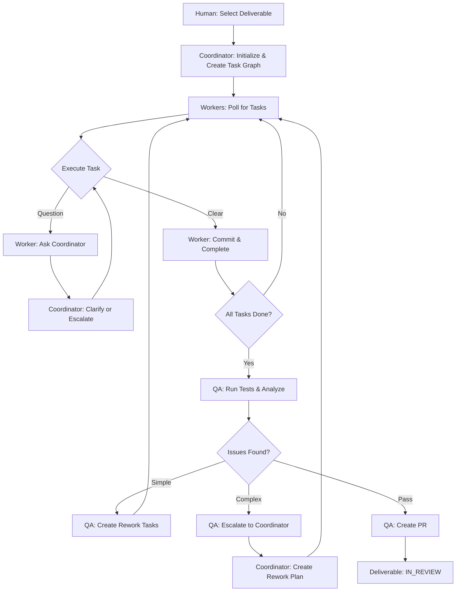
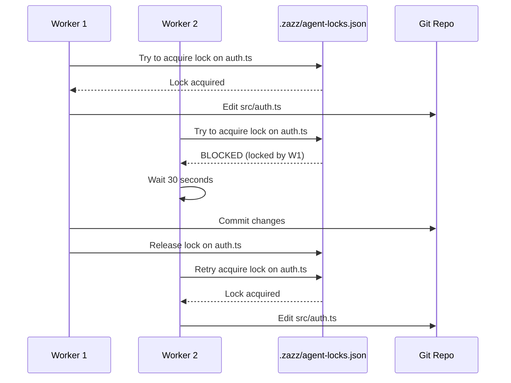

# Agent Teams and Swarms Architecture

Supplemental documentation for Zazz methodology covering agent orchestration, communication, and control mechanisms.

The Zazz workflow operates on a **SPEC-driven** foundation where a clear Deliverable Specification defines requirements, and a detailed Implementation Plan decomposes the SPEC into executable tasks. Agents work collaboratively to execute the PLAN, refining it as learning occurs.

---

## 1. Skill Types

Zazz methodology defines two types of skills:

### Rule Skills (Required)

These are **methodology requirements** that ALL agents must follow:

**zazz-board-api** (type: `rule`)
- Required by: All agents (coordinator, worker, qa, spec-builder)
- Purpose: Defines the communication API and how to use it
- Not optional—without this, agents cannot coordinate

### Role Skills

These define an agent's responsibilities:

- **coordinator-agent** - Orchestration and planning
- **worker-agent** - Task execution
- **qa-agent** - Quality verification
- **spec-builder-agent** - Requirements gathering

Each agent loads its one role skill, plus all required rule skills.

---

## 2. Overview

The Zazz Board workflow operates as an **agent swarm** where multiple LLM agents (Coordinator, Worker(s), QA) work collaboratively on a single deliverable. Each agent:
- Has **independent context** and role-specific system prompts
- Runs as a **separate LLM instance** (not sub-agents sharing context)
- Communicates via **explicit message passing**
- Operates on a **shared worktree/branch** on a single laptop or server
- Works from **shared SPEC and PLAN documents** stored in project repo/shared drive

---

## 2. Supported Agent Frameworks

The skill is designed to work with agent frameworks that support independent agent contexts:

**Recommended:**
- **Anthropic Claude** (Claude 3.5 Sonnet/Opus) via Bedrock or direct API with custom orchestration
- **LangGraph** (with any LLM) for workflow orchestration with persistent state
- **CrewAI** (with Claude, GPT-4, or local models) for role-based agent patterns
- **AutoGen** (Microsoft) for conversational multi-agent workflows
- **OpenAI Swarm** (experimental) for lightweight multi-agent handoffs

**Not Recommended (Shared Context):**
- Claude Artifacts / Extended Thinking (single context window)
- GPT-4 function calling with simulated "sub-agents"

Each agent invocation must be **independent** with distinct system prompts and memory. No shared context window.

---

## 3. Agent Roles and Responsibilities

### Coordinator Agent (Planner & Orchestrator)

**System Prompt Characteristics:**
- Strategic thinker; decomposes SPEC into PLAN with detailed task definitions
- Creates task graph respecting dependencies and parallelization
- Monitors task completion; detects blockers and escalations
- Responds to worker questions or escalates to human
- Creates rework sub-plans for complex issues
- Enforces dependency rules and file conflict avoidance
- Adapts PLAN as learning occurs during development

**Memory/Context:**
- Current deliverable ID, project code
- Approved {deliverable-name}-SPEC.md
- Working {deliverable-name}-PLAN.md with phases and steps
- Task graph (nodes, edges, status, test requirements)
- Communication log with workers and QA
- Pending escalations and decisions
- Change Notes tracking decisions made during execution

**Responsibilities:**
- Receive approved SPEC
- Decompose SPEC into detailed PLAN with task definitions
- Create task graph with dependencies (DEPENDS_ON, COORDINATES_WITH)
- Create only independent tasks initially; create dependent tasks as progress allows
- Fetch and cache Reference Architecture and OpenAPI specs
- Respond to worker questions and escalate ambiguous issues
- Monitor task progress and refine PLAN based on learning
- Create rework sub-plans when QA escalates complex issues
- Document all decisions in PLAN Change Notes
- Escalate scope changes or architecture questions to human
- Update agent-state.json heartbeat

### Worker Agent(s) (Implementers)

**System Prompt Characteristics:**
- Execution-focused; follows task instructions precisely
- Understands test-driven development; writes/runs tests for every task
- Asks Coordinator questions when prompt/AC is unclear
- Respects task dependencies and file locks
- Commits atomically after each task
- Reports completion or blockers immediately

**Memory/Context:**
- Current task (goal, instructions, AC, test requirements)
- Reference Architecture (tech stack, frameworks, patterns)
- Deliverable SPEC (for context on what's being built)
- Recent code changes and commit history
- Questions/clarifications from Coordinator

**Responsibilities:**
- Poll for tasks with status TO_DO and satisfied dependencies
- Acquire file locks before editing
- Implement per task instructions and acceptance criteria
- Execute task based on type (code, test creation, test execution)
- Create and run unit tests; create API/E2E tests as required by PLAN
- Ensure all tests pass before marking task complete
- Ask Coordinator questions if prompt is ambiguous
- Commit changes with format: `TASK-{id}: {description} [{agent_id}]`
- Update task status to COMPLETED via API
- Release file locks after commit
- Update agent-state.json heartbeat

### QA Agent (Verifier & Reviewer)

**System Prompt Characteristics:**
- Quality-focused; thoroughly validates against SPEC
- Test-driven mindset; focuses on test evidence and AC verification
- Identifies flaws: AC violations, test failures, code quality issues, security/performance gaps
- Creates detailed rework tasks with failing test evidence and clear reproduction steps
- Escalates complex issues to Coordinator for re-planning
- Ensures all commits are in place and tests passing before PR

**Memory/Context:**
- Deliverable {deliverable-name}-SPEC.md with all AC
- Implementation {deliverable-name}-PLAN.md
- All test results (unit, API, E2E, performance, security)
- Code analysis findings and evidence
- Rework tasks created and their status
- Requestor expectations and context

**Responsibilities:**
- Wait for Coordinator signal that all tasks are COMPLETED
- Review SPEC to understand all requirements and AC
- Verify each AC is met by running tests and code analysis
- Run all automated tests (unit, API, E2E, performance, security)
- Analyze code quality (performance vs thresholds, security gaps, best practices)
- Document all test evidence and AC verification
- Create rework tasks for single isolated issues with failing test evidence
- Escalate to Coordinator for complex/interdependent issues with test failure analysis
- Interact with requestor (human) to confirm deliverable meets expectations
- Ensure all files are committed before creating PR
- Create PR from template with full evidence of AC verification and test results
- Update deliverable status to IN_REVIEW
- Update agent-state.json heartbeat

---

## 5. Inter-Agent Communication Architecture

### Primary Channel: Zazz Board API

**Task Comments & Notes:**
|- Worker posts questions as task comments via API
|- Coordinator responds with decisions in same thread
- All communications timestamped and logged
- Provides audit trail for escalations

**Task Status Flags:**
- `TO_DO` – Ready to be picked up
- `IN_PROGRESS` – Agent actively working
- `BLOCKED` – Worker awaiting clarification
- `COMPLETED` – Task finished; ready for next phase
- `ESCALATED` – Requires human intervention

**Custom Fields (Optional):**
- `assigned_to_agent` – Which agent owns this task
- `awaiting_response_from` – Which agent worker is waiting for
- `escalation_reason` – Why escalated (design decision, ambiguity, etc.)
- `files_modified` – List of files changed by this task

### Secondary Channel: Shared Local State Files

For single laptop/server deployments, use file-based messaging to supplement API.

#### `.zazz/agent-state.json`

Shared state snapshot showing active agents and their current status.

```json
{
  "deliverable_id": "DEL-001",
  "project_code": "APP",
  "branch": "zazz/DEL-001",
  "task_graph_hash": "abc123xyz",
  "pending_escalations": 0,
  "agents": {
    "coordinator": {
      "status": "polling",
      "last_ping": "2026-02-19T00:42:58Z",
      "current_activity": "creating_dependent_tasks"
    },
    "worker_1": {
      "status": "executing",
      "last_ping": "2026-02-19T00:42:50Z",
      "current_activity": "task_5",
      "locked_files": ["src/auth.ts"]
    },
    "worker_2": {
      "status": "idle",
      "last_ping": "2026-02-19T00:42:30Z",
      "current_activity": null,
      "locked_files": []
    },
    "qa": {
      "status": "waiting",
      "last_ping": "2026-02-19T00:42:55Z",
      "current_activity": "waiting_for_all_tasks_completion",
      "locked_files": []
    }
  }
}
```

#### `.zazz/agent-messages.json`

Queue of inter-agent messages for rapid communication.

```json
[
  {
    "id": "msg-001",
    "from": "worker_1",
    "to": "coordinator",
    "type": "question",
    "task_id": "TASK-5",
    "content": "Should we use async/await or promises for this API call?",
    "timestamp": "2026-02-19T00:42:00Z",
    "status": "awaiting_response"
  },
  {
    "id": "msg-002",
    "from": "coordinator",
    "to": "worker_1",
    "type": "answer",
    "reply_to": "msg-001",
    "content": "Use async/await; see tech spec section 3.2 for error handling pattern.",
    "timestamp": "2026-02-19T00:42:30Z",
    "status": "acknowledged"
  },
  {
    "id": "msg-003",
    "from": "qa",
    "to": "coordinator",
    "type": "escalation",
    "task_id": null,
    "content": "Found 3 interdependent issues requiring refactor of auth flow. Need rework plan.",
    "timestamp": "2026-02-19T00:43:00Z",
    "status": "pending"
  }
]
```

#### `.zazz/agent-locks.json`

File-level locks to prevent concurrent edits and merge conflicts.

```json
{
  "locked_files": [
    {
      "path": "src/auth.ts",
      "locked_by": "worker_1",
      "task_id": "TASK-3",
      "lock_acquired": "2026-02-19T00:42:00Z",
      "lock_expires": "2026-02-19T00:52:00Z",
      "reason": "implementing JWT validation"
    },
    {
      "path": "src/middleware/cors.ts",
      "locked_by": "worker_2",
      "task_id": "TASK-7",
      "lock_acquired": "2026-02-19T00:42:15Z",
      "lock_expires": "2026-02-19T00:50:15Z",
      "reason": "adding CORS headers"
    }
  ]
}
```

#### `.zazz/audit.log`

Timestamped event log for debugging and compliance.

```
2026-02-19T00:40:00Z [MANAGER] Deliverable DEL-001 selected
2026-02-19T00:40:05Z [MANAGER] Created task graph with 12 tasks
2026-02-19T00:40:10Z [WORKER_1] Picked up TASK-1
2026-02-19T00:40:12Z [WORKER_1] Acquired lock on src/config.ts
2026-02-19T00:41:30Z [WORKER_1] Completed TASK-1, committed abc123def
2026-02-19T00:41:32Z [WORKER_1] Released lock on src/config.ts
2026-02-19T00:42:00Z [WORKER_1] Question posted for TASK-5
2026-02-19T00:42:30Z [MANAGER] Answered WORKER_1 question for TASK-5
2026-02-19T00:43:00Z [QA] Escalation: complex rework needed
```

---

## 6. Communication Polling Strategy

All agents poll for updates every **10-30 seconds**.

### Manager Polling

```
LOOP every 10 seconds:
  1. Poll task API: GET /projects/:code/deliverables/:id/tasks
  2. Check for BLOCKED tasks (worker questions)
  3. Check agent-messages.json for new questions or escalations
  4. Respond to questions or escalate to human
  5. Update agent-state.json heartbeat
  6. If all tasks COMPLETED → signal QA to start
```

### Coordinator Polling

(Same as above)

### Worker Polling

```
LOOP every 15 seconds:
  1. Check agent-messages.json for responses to my questions
  2. If BLOCKED task has response → clear BLOCKED, resume work
  3. Poll task API for tasks with status TO_DO and satisfied dependencies
  4. If task available and no file lock conflicts → pick up task
  5. Acquire file locks for files I need to edit
  6. Execute task, commit, release locks
  7. Update agent-state.json heartbeat
```

### QA Polling

```
LOOP every 20 seconds:
  1. Check agent-state.json: are all workers idle?
  2. Poll task API: are all tasks COMPLETED?
  3. If yes → start QA phase:
     a. Run tests
     b. Analyze code
     c. Create rework tasks or escalate to Coordinator
  4. If all QA checks pass → create PR
  5. Update agent-state.json heartbeat
```

---

## 7. Concurrency Control & File Conflict Avoidance

### File Lock Mechanism

**Lock Acquisition (before editing file):**

```python
def acquire_lock(file_path, agent_id, task_id, timeout_minutes=10):
    locks = read_json('.zazz/agent-locks.json')
    
    # Check if file is already locked
    for lock in locks['locked_files']:
        if lock['path'] == file_path:
            if lock_expired(lock):
                # Lock expired, reclaim it
                remove_lock(lock)
                break
            else:
                # Valid lock held by another agent
                return False, f"File locked by {lock['locked_by']} for {lock['task_id']}"
    
    # Acquire new lock
    new_lock = {
        'path': file_path,
        'locked_by': agent_id,
        'task_id': task_id,
        'lock_acquired': now(),
        'lock_expires': now() + timedelta(minutes=timeout_minutes),
        'reason': f"Working on {task_id}"
    }
    
    locks['locked_files'].append(new_lock)
    write_json('.zazz/agent-locks.json', locks)
    return True, "Lock acquired"
```

**Lock Release (after commit):**

```python
def release_lock(file_path, agent_id):
    locks = read_json('.zazz/agent-locks.json')
    locks['locked_files'] = [
        lock for lock in locks['locked_files'] 
        if not (lock['path'] == file_path and lock['locked_by'] == agent_id)
    ]
    write_json('.zazz/agent-locks.json', locks)
```

### File Conflict Avoidance Rules

**Rule 1: Single Writer per File**
- Only one agent edits a file at a time
- Enforced via `.zazz/agent-locks.json`

**Rule 2: Task Dependencies for Shared Files**
|- If Task A and Task B both edit `src/auth.ts` → create `DEPENDS_ON` relation
|- Coordinator ensures Task B only starts after Task A completes and releases lock

**Rule 3: Coordinator Reviews High-Conflict Areas**
|- If >2 tasks need to touch the same file → Coordinator creates explicit dependency chain (A → B → C)
- May ask QA to review merged changes after all tasks complete

**Rule 4: Commit Atomicity**
- Each agent commits immediately after finishing a task
- Commit message format: `TASK-{id}: {description} [{agent_id}]`
- Example: `TASK-5: Add async auth handler [worker_1]`

**Rule 5: Lock Timeout Safety**
|- If agent crashes, lock expires after timeout (default 10 min)
|- Other agents can reclaim expired locks
|- Coordinator detects missing heartbeats and reassigns tasks

---

## 8. Agent Initialization & Cleanup

### Startup (When Deliverable Selected)

**1. Coordinator Initializes:**
```
1. Human or API triggers: "Start deliverable DEL-001"
2. Coordinator reads deliverable, DED, plan from API
3. Coordinator creates `.zazz/agent-state.json` with deliverable context
4. Coordinator fetches OpenAPI spec from {API_BASE_URL}/docs/json
5. Coordinator writes spec to `.zazz/api-spec.json`
6. Coordinator creates task graph via API (POST tasks with relations)
7. Coordinator spawns or signals Worker and QA agents to start
8. Coordinator begins polling loop
```

**2. Workers Initialize:**
```
1. Read `.zazz/agent-state.json` to learn deliverable, branch, task graph
2. Fetch local AGENTS.md and tech specs
3. Initialize empty `.zazz/agent-locks.json` if not exists
4. Begin polling for tasks
```

**3. QA Initializes:**
```
1. Read deliverable acceptance criteria from API
2. Prepare test environment (install deps, setup DB, etc.)
3. Set status to "waiting" in agent-state.json
4. Wait for Manager signal (all tasks COMPLETED)
```

### Shutdown (When Deliverable Completes or Fails)

**1. Coordinator Cleanup:**
```
1. Mark deliverable status:
   - IN_REVIEW if QA passed and PR created
   - BLOCKED if escalation to human required
   - FAILED if critical error occurred
2. Update agent-state.json with final status
3. Archive logs to `.zazz/archive/DEL-001/`
4. Signal all agents to reset (set status to IDLE)
5. Coordinator resets own context
```

**2. All Agents Cleanup:**
```
1. Clear local context/memory (task details, code snippets, etc.)
2. Release all file locks for this agent
3. Remove temporary files (.zazz/tmp/)
4. Update agent-state.json status to IDLE
5. Ready for next deliverable
```

**3. Human Reviews:**
```
1. Review PR if created
2. Merge or request changes
3. Decide on next deliverable
4. Signal new Manager to start from Step 1
```

---

## 9. Monitoring and Observability

### Heartbeat / Deadlock Detection

**Heartbeat Rules:**
- Each agent updates `last_ping` in `agent-state.json` every **10 seconds**
- If agent's `last_ping` is older than threshold → assume crashed

**Timeouts:**
- **Manager timeout**: 60 seconds (Workers escalate to human if Manager unresponsive)
- **Worker timeout**: 120 seconds (Manager reassigns task)
- **QA timeout**: 120 seconds (Manager escalates to human)

**Deadlock Detection:**
- Task marked `BLOCKED` for > 5 minutes without Manager response → escalate to human
- Circular dependency detected in task graph → Manager re-plans (should not happen; indicates planning error)
- File lock held for > 2x expected task duration → Manager investigates and may force release

### Logging and Audit Trail

**All inter-agent communications logged to:**
- Zazz Board API task comments (primary, persistent)
- `.zazz/agent-messages.json` (secondary, temporary)
- `.zazz/audit.log` (timestamped events, append-only)

**Audit log includes:**
- Task creation/update/completion events
- Agent status changes (idle → executing → blocked → completed)
- File locks acquired/released
- Escalations and human decisions
- Test results and QA findings
- Git commits with task IDs

---

## 10. Error Handling & Recovery

### Agent Crash Scenarios

**If Coordinator crashes:**
```
1. Workers detect missing heartbeat (last_ping > 60 sec ago)
2. Workers mark their current tasks as BLOCKED with reason "Coordinator unavailable"
3. Workers log escalation to `.zazz/audit.log`
4. Human or failover Coordinator instance restarts
5. New Coordinator reads agent-state.json to resume deliverable
6. Coordinator reviews BLOCKED tasks and reassigns or answers
```

**If Worker crashes mid-task:**
```
1. Git commit is atomic; if not committed, changes are lost (intentional)
2. Task status remains IN_PROGRESS
3. Coordinator detects missing heartbeat (last_ping > 120 sec ago)
4. Coordinator reverts task status to TO_DO
5. Coordinator releases any file locks held by crashed worker
6. Coordinator reassigns task to available worker or spawns new worker
```

**If QA crashes:**
```
1. Partial test results may be lost
2. Coordinator detects missing heartbeat
3. Coordinator spawns new QA agent
4. New QA re-runs tests from scratch (tests should be idempotent)
```

### Conflict Resolution

**Git merge conflicts:**
```
1. Workers commit to branch; git attempts auto-merge
2. If conflict detected → Worker marks task as BLOCKED, notifies Coordinator
3. Coordinator assigns conflict resolution to QA or specialized worker
4. If unresolvable → escalate to human with conflict details
```

**Task state conflicts (race conditions):**
```
1. If two agents update same task status simultaneously → API returns 409 Conflict
2. Loser agent retries after reading latest task state
3. Coordinator resolves by checking timestamps; uses most recent valid state
4. If ambiguity → Coordinator escalates to human
```

**Lock conflicts:**
```
1. Worker tries to acquire lock for file X
2. File X already locked by another worker
3. Worker checks if tasks have DEPENDS_ON relation:
   - If yes → wait for dependency to complete
   - If no (planning error) → notify Coordinator to create dependency
4. Worker polls every 30 sec until lock released
```

---

## 11. Best Practices

### Task Design
1. **Task prompts should be self-contained** – Workers should not need to ask Coordinator basic questions
2. **Include explicit acceptance criteria** – Each criterion should be testable
3. **Provide code examples** – Show expected patterns, not just descriptions
4. **Limit task scope** – One task = one file or one coherent feature slice
5. **Declare file dependencies upfront** – List files to be edited in task prompt

### Communication
6. **Coordinator should poll frequently** – Every 10-30 seconds to catch blockers early
7. **Workers should ask questions immediately** – Don't guess; clarify unclear prompts
8. **Log all decisions** – Update task comments via API for audit trail
9. **Escalate ambiguity, don't guess** – If unclear, ask Coordinator; if Coordinator unclear, escalate to human

### Concurrency
10. **Lock timeouts should be generous** – If task takes ~5 min, set expiry to 10 min
11. **Commit frequently** – Workers commit after each task to minimize loss on crash
12. **Avoid over-parallelization** – Don't spawn 10 workers if only 3 independent tasks exist
13. **Monitor file contention** – If >2 tasks need same file, create dependencies

### Quality Assurance
14. **QA should run tests in isolation** – Use test timeouts to prevent hanging
15. **QA analyzes code, not just tests** – Check performance, security, best practices
16. **Create detailed rework tasks** – Include reproduction steps, expected vs. actual
17. **Escalate complex issues early** – Don't create 5 interdependent rework tasks; ask Coordinator to re-plan

### Reliability
18. **Agents should never auto-retry decisions** – Always escalate ambiguity
19. **Heartbeats are non-negotiable** – Update every 10 sec or risk being marked crashed
20. **Clean up on shutdown** – Release locks, archive logs, reset state
21. **Design for idempotency** – Tasks and tests should be safely re-runnable

---

## 12. Environment Variables

All agents require these environment variables:

```bash
# Zazz Board API
export ZAZZ_API_BASE_URL="http://localhost:3000"
export ZAZZ_API_TOKEN="your-api-token"

# Agent identity
export AGENT_ID="coordinator|worker_1|worker_2|qa"
export AGENT_ROLE="coordinator|worker|qa"

# LLM provider
export LLM_PROVIDER="anthropic|openai"
export LLM_API_KEY="your-llm-api-key"
export LLM_MODEL="claude-3-5-sonnet-20241022"

# Workspace
export ZAZZ_WORKSPACE="/Users/michael/Dev/my-app"
export ZAZZ_STATE_DIR="${ZAZZ_WORKSPACE}/.zazz"

# Timeouts (optional, defaults shown)
export AGENT_POLL_INTERVAL_SEC=15
export AGENT_HEARTBEAT_INTERVAL_SEC=10
export AGENT_TIMEOUT_SEC=120
export FILE_LOCK_TIMEOUT_MIN=10
```

---

## 13. Implementation Checklist

**To implement this agent swarm architecture:**

- [ ] Choose agent framework (Claude API, LangGraph, CrewAI, etc.)
- [ ] Write system prompts for Coordinator, Worker, QA roles
- [ ] Implement polling loops (10-30 sec intervals)
- [ ] Implement file lock mechanism (`.zazz/agent-locks.json`)
- [ ] Implement message queue (`.zazz/agent-messages.json`)
- [ ] Implement heartbeat monitoring (`.zazz/agent-state.json`)
- [ ] Implement audit logging (`.zazz/audit.log`)
- [ ] Create Zazz Board API client (fetch spec, CRUD tasks, post comments)
- [ ] Handle agent crash recovery (timeout detection, task reassignment)
- [ ] Add escalation paths (worker→coordinator, QA→coordinator, coordinator→human)
- [ ] Test with single deliverable, single worker
- [ ] Test with multiple workers (parallelization)
- [ ] Test with file lock conflicts (concurrent edits)
- [ ] Test with agent crashes (mid-task recovery)
- [ ] Document deployment (single laptop/server setup)

---

## 14. Future Enhancements

**Phase 2 improvements (after initial implementation):**

1. **Dynamic worker scaling** – Spawn more workers when task queue grows
2. **Specialized workers** – Frontend, backend, database workers with different skill sets
3. **Parallel QA** – Multiple QA agents review independent task groups
4. **Predictive lock acquisition** – Coordinator pre-assigns file locks based on task graph
5. **WebSocket communication** – Replace polling with real-time push notifications
6. **Distributed deployment** – Multiple laptops/servers coordinating via API (not local files)
7. **Agent performance metrics** – Track task completion time, question frequency, rework rate
8. **Human-in-loop UI** – Dashboard showing agent status, task graph, escalations

---

## Appendix: Mermaid Diagrams

### Agent Team Workflow



### Agent Heartbeat & Crash Detection

```mermaid
sequenceDiagram
    participant C as Coordinator
    participant W1 as Worker 1
    participant W2 as Worker 2
    participant Q as QA
    participant State as .zazz/agent-state.js    loop Every 10 seconds
        C->>State: Update last_ping
        W1->>State: Update last_ping
        W2->>State: Update last_ping
        Q->>State: Update last_ping
    end

    Note over W2: Worker 2 crashes

    C->>State: Check heartbeats
    C->>C: Detect W2 timeout (120s)
    C->>State: Mark W2 as CRASHED
    C->>State: Release W2 file locks
    C->>C: Reassign W2's task to W1
```

### File Lock Flow


