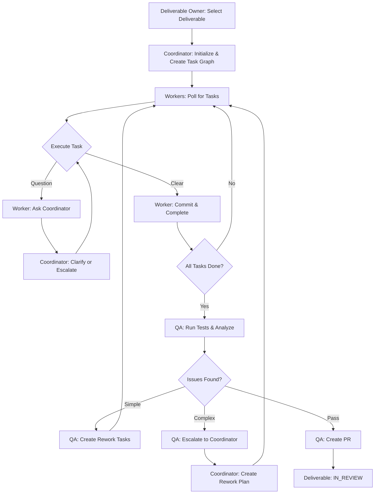
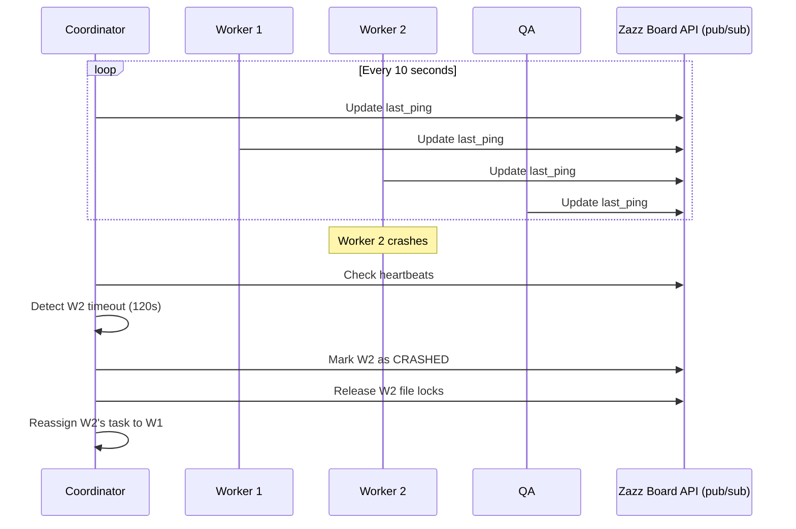
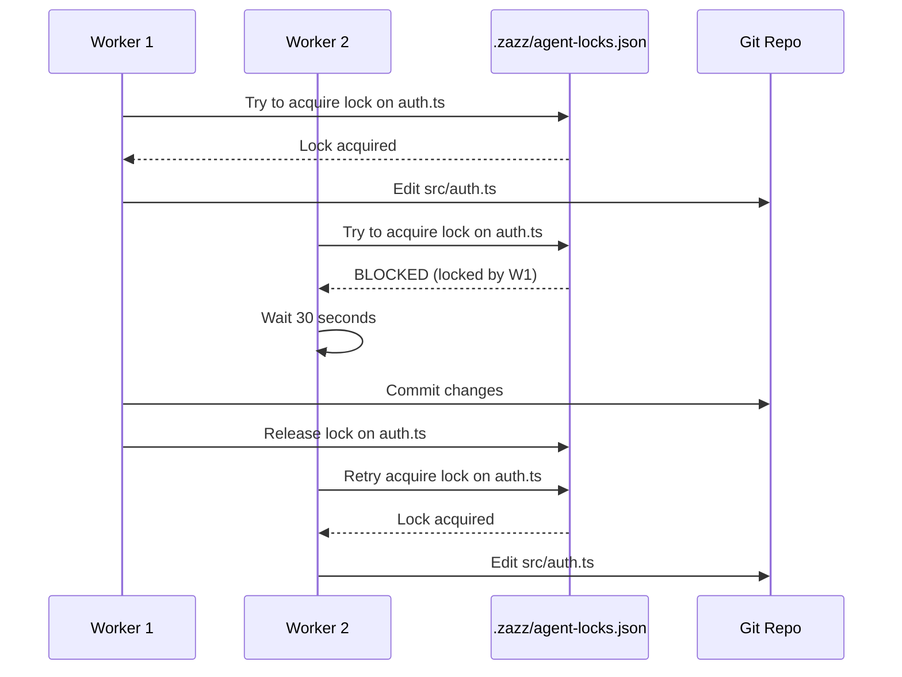

# Agent Teams and Swarms Architecture

Supplemental documentation for Zazz methodology covering agent orchestration, communication, and control mechanisms.

The Zazz workflow operates on a **SPEC-driven** foundation where a clear Deliverable Specification defines requirements, and a detailed Implementation Plan decomposes the SPEC into executable tasks. **Test-driven development (TDD)** is embedded throughout—every deliverable and task has well-defined test requirements and acceptance criteria. Agents work collaboratively to execute the PLAN, refining it as learning occurs.

---

## 1. Skill Types

Zazz methodology defines two types of skills:

### Rule Skills (Required)

These are **methodology requirements** that ALL agents must follow:

**zazz-board-api** (type: `rule`)
- Required by: All agents (planner, coordinator, worker, qa, spec-builder)
- Purpose: Defines the communication API and how to use it
- Not optional—without this, agents cannot coordinate

### Role Skills

These define an agent's responsibilities:

- **planner-agent** - One-shot SPEC decomposition into PLAN
- **coordinator-agent** - Execution coordination (task creation, handoff, adjustments)
- **worker-agent** - Task execution
- **qa-agent** - Quality verification
- **spec-builder-agent** - Requirements gathering

Each agent loads its one role skill, plus all required rule skills.

---

## 2. Overview

The Zazz Board provides two separate kanban boards: the **Deliverable Board** (for Deliverable Owner and humans) and the **Task Board** (for agents). Agents work from the Task Board; do not confuse the two. The workflow operates as an **agent swarm** where multiple LLM agents (Planner, Coordinator, Worker(s), QA) work collaboratively on a single deliverable. The Planner runs one-shot for decomposition; the Coordinator takes over once execution starts. Each deliverable has **one git worktree and branch**—all agents work against the same worktree. Each agent:
- Has **independent context** and role-specific system prompts; worker context is cleared between tasks; QA context is fresh per evaluation
- Runs as a **separate LLM instance** (not sub-agents sharing context)
- Communicates via **explicit message passing**
- Operates on the **shared worktree/branch** for that deliverable (single laptop or server)
- Works from **shared SPEC and PLAN documents** stored in the worktree

---

## 3. Supported Agent Frameworks

The methodology is designed to work with agent frameworks that support independent agent contexts:

**Recommended:**
- **Anthropic Claude** (Claude 3.5 Sonnet/Opus) via Bedrock or direct API with custom orchestration
- **LangGraph** (with any LLM) for workflow orchestration with persistent state
- **CrewAI** (with Claude, GPT-4, or local models) for role-based agent patterns
- **AutoGen** (Microsoft) for conversational multi-agent workflows
- **OpenAI Swarm** (experimental) for lightweight multi-agent handoffs

**Not Recommended (Shared Context):**
- Claude Artifacts / Extended Thinking (single context window)
- GPT-4 function calling with simulated "sub-agents"

Each agent invocation must be **independent** with distinct system prompts and memory. No shared context window.

---

## 4. Agent Roles and Responsibilities

### Planner Agent (One-Shot Decomposition)

**System Prompt Characteristics:**
- Decomposes SPEC into manageable chunks, phased and sequenced
- Assigns files to tasks using file names and conventions
- Identifies parallel sequences where tasks can run without impacting the same files
- Maps SPEC AC and test requirements to each task
- Outputs PLAN.md; does not participate in execution

**Memory/Context:**
- Approved {deliverable-name}-SPEC.md
- STANDARDS.md (for file conventions, project structure)
- Project file structure

**Responsibilities:**
- Read SPEC completely
- Decompose into phases and steps
- Assign files to tasks; identify parallel sequences
- Define DEPENDS_ON and COORDINATES_WITH
- Produce {deliverable-name}-PLAN.md
- **Trigger:** Invoked when Owner requests a plan (e.g., after SPEC approval)

### Coordinator Agent (Execution Orchestrator)

**System Prompt Characteristics:**
- Takes over once execution starts (after plan approval)
- Creates tasks from PLAN via API; hands out tasks to workers
- Monitors task completion; detects blockers and escalations
- Responds to worker questions or escalates to Deliverable Owner
- Creates rework tasks from QA content
- Adjusts PLAN when change mechanism invoked; documents in Change Notes

**Memory/Context:**
- Current deliverable ID, project code
- Approved {deliverable-name}-PLAN.md (from Planner)
- Task graph (nodes, edges, status, test requirements)
- Communication log with workers and QA
- Pending escalations and decisions
- Change Notes tracking decisions made during execution

**Responsibilities:**
- Subscribe to plan approval events; create tasks from PLAN via API
- Hand out tasks to workers; add follow-on tasks as prerequisites complete
- Monitor task progress; adjust PLAN when warranted (document in Change Notes)
- Create rework tasks when QA provides content
- Document all decisions in PLAN Change Notes
- Escalate scope changes or architecture questions to Deliverable Owner
- Update heartbeat via Zazz Board API (pub/sub)

### Worker Agent(s) (Implementers)

**System Prompt Characteristics:**
- Execution-focused; follows task instructions precisely
- Understands test-driven development; writes/runs tests for every task
- Asks Deliverable Owner questions when prompt/AC is unclear
- Respects task dependencies and file locks
- Commits atomically after each task
- Reports completion or blockers immediately

**Memory/Context:**
- Current task (goal, instructions, AC, test requirements)
- Sequence of tasks that do not have parallelizable nodes; allows more efficient single-agent implementation on a set of related tasks
- STANDARDS.md (tech stack, frameworks, patterns)
- Deliverable SPEC (for context on what's being built)
- Recent code changes and commit history

**Responsibilities:**
- Poll for tasks with status READY
- Acquire file locks before editing
- Implement per task instructions and acceptance criteria
- Execute task based on type (code, test creation, test execution)
- Create and run unit tests; create API/E2E tests as required by PLAN
- Ensure all tests pass before signaling ready for QA
- Ask Deliverable Owner questions if prompt is ambiguous
- Commit changes with format: `TASK-{id}: {description} [{agent_id}]`
- Signal "ready for QA" (update task status to QA via API); locks transfer to task—worker does not release them
- Update heartbeat via Zazz Board API (pub/sub)

### QA Agent (Verifier & Reviewer)

**System Prompt Characteristics:**
- Quality-focused; thoroughly validates against SPEC
- Test-driven mindset; focuses on test evidence and AC verification
- Identifies flaws: AC violations, test failures, code quality issues, security/performance gaps
- Creates detailed rework tasks with failing test evidence and clear reproduction steps
- Escalates complex issues to Coordinator for re-planning
- Ensures all commits are in place and tests passing before PR

**Memory/Context:**
- **Fresh context per evaluation**—each task evaluation and final deliverable review start with cleared context; no accumulation across evaluations
- Deliverable {deliverable-name}-SPEC.md with all AC
- Implementation {deliverable-name}-PLAN.md
- All test results (unit, API, E2E, performance, security)
- Code analysis findings and evidence
- Rework tasks created and their status
- Deliverable Owner expectations and context

**Responsibilities:**
- Wait for Coordinator signal that all tasks are COMPLETED
- Review SPEC to understand all requirements and AC
- Verify each AC is met by running tests and code analysis
- Run all automated tests (unit, API, E2E, performance, security)
- Analyze code quality (performance vs thresholds, security gaps, best practices)
- Document all test evidence and AC verification
- Create rework tasks for single isolated issues with failing test evidence
- Escalate to Coordinator for complex/interdependent issues with test failure analysis
- Interact with Deliverable Owner to confirm deliverable meets expectations
- Ensure all files are committed before creating PR
- Create PR from template with full evidence of AC verification and test results
- Update deliverable status to IN_REVIEW

---

## 5. Inter-Agent and Deliverable Owner Communication Architecture

### Primary Channel (MVP): Terminal Deliverable Owner↔Agent Interaction

**MVP interaction model:**
- Deliverable Owner and agents coordinate primarily through terminal prompts and responses
- Decisions made in terminal interaction are summarized and posted to Task Board task notes/comments
- Task notes/comments serve as the durable audit trail while API orchestration is maturing

### Target Channel: Zazz Board API

**Task Comments & Notes (target state):**
- Worker posts questions as task comments via API
- Deliverable Owner responds with decisions in same thread
- All communications timestamped and logged
- Provides audit trail for escalations

**Task Status Flags:**
- `TO_DO` – Ready to be picked up
- `IN_PROGRESS` – Agent actively working
- `BLOCKED` – Worker awaiting clarification (state; task stays in context, no Blocked column on board)
- `COMPLETED` – Task finished; ready for next phase

**Custom Fields (Optional):**
- `assigned_to_agent` – Which agent owns this task
- `files_modified` – List of files changed by this task

### Slack Channel (When Supported)

When the framework supports Slack integration:
- **Only the Coordinator agent has a Slack account** — Workers and QA do not have their own Slack accounts
- **All agent-to-Owner communication flows through the Coordinator** — Worker questions, QA escalations, and status updates are relayed to the Coordinator; the Coordinator posts to Slack and relays Owner responses back to the originating agent
- This design minimizes the number of Slack accounts to maintain (one per Coordinator instance)


#### `.zazz/audit.log`

Timestamped event log for debugging and compliance.

```
2026-02-19T00:40:00Z [COORDINATOR] Deliverable DEL-001 selected
2026-02-19T00:40:05Z [COORDINATOR] Created task graph with 12 tasks
2026-02-19T00:40:10Z [WORKER_1] Picked up TASK-1
2026-02-19T00:40:12Z [WORKER_1] Acquired lock on src/config.ts
2026-02-19T00:41:30Z [WORKER_1] Completed TASK-1, committed abc123def
2026-02-19T00:41:32Z [WORKER_1] Released lock on src/config.ts
2026-02-19T00:42:00Z [WORKER_1] Question posted for TASK-5
2026-02-19T00:42:30Z [COORDINATOR] Answered WORKER_1 question for TASK-5
2026-02-19T00:43:00Z [QA] Escalation: complex rework needed
```

---

## 6. Communication Polling Strategy

All agents poll for updates every **10-30 seconds**.
This section describes **target-state API-driven orchestration**. In MVP mode, coordination can be terminal-first, with important interaction outcomes posted to board task notes/comments.

### Coordinator Polling

```
LOOP every 10 seconds:
  1. Poll task API: GET /projects/:code/deliverables/:id/tasks
  2. Check for BLOCKED tasks (worker questions)
  3. Check pub/sub (Zazz Board API) for new questions or escalations
  4. Respond to questions or escalate to Deliverable Owner
  5. Update heartbeat via Zazz Board API (pub/sub)
  6. If all tasks COMPLETED → signal QA to start
```


### Worker Polling

```
LOOP every 15 seconds:
  1. Check pub/sub (Zazz Board API) for responses to my questions
  2. If BLOCKED task has response → clear BLOCKED, resume work
  3. Poll task API for tasks with status TO_DO and satisfied dependencies
  4. If task available and no file lock conflicts → pick up task
  5. Acquire file locks for files I need to edit
  6. Execute task, commit, release locks
  7. Update heartbeat via Zazz Board API (pub/sub)
```

### QA Polling

```
LOOP every 20 seconds:
  1. Check pub/sub (Zazz Board API): are all workers idle?
  2. Poll task API: are all tasks COMPLETED?
  3. If yes → start QA phase:
     a. Run tests
     b. Analyze code
     c. Create rework tasks or escalate to Coordinator
  4. If all QA checks pass → create PR
  5. Update heartbeat via Zazz Board API (pub/sub)
```

---

## 7. Concurrency Control & File Conflict Avoidance

### Shared Worktree

Each deliverable has one git worktree and branch. All agents (Coordinator, Workers, QA) work in the same worktree. File locks are **task-level** (tied to the task and its rework chain, not the worker); locks are held until QA signs off. The Coordinator minimizes file overlap and uses DEPENDS_ON when tasks must share files. When a worker is blocked by a file locked by another task (in QA or rework), the task shows **blocked** status—displayed on both the **task card** (Task Board) and **task node** (Task Graph) with a yellow outline. Workers are released when ready for QA; the task is not complete until QA signs off. Rework task content is authored by QA so any worker can fix without prior context.

### File Lock Mechanism (Task-Level)

Locks are tied to the **task** (and its rework chain), not the worker. When a worker signals "ready for QA," locks transfer to the task and are held until QA signs off. Rework tasks inherit the same locks as the original task. **Blocked display**: When a worker is blocked by a file locked by another task (in QA or rework), show blocked clearly on both task card and task node (yellow outline).

**Lock Acquisition (before editing file):**

```python
def acquire_lock(file_path, agent_id, task_id, timeout_minutes=10):
    locks = read_json('.zazz/agent-locks.json')
    
    # Check if file is already locked
    for lock in locks['locked_files']:
        if lock['path'] == file_path:
            if lock_expired(lock):
                # Lock expired, reclaim it
                remove_lock(lock)
                break
            else:
                # Valid lock held by another agent
                return False, f"File locked by {lock['locked_by']} for {lock['task_id']}"
    
    # Acquire new lock
    new_lock = {
        'path': file_path,
        'locked_by': agent_id,
        'task_id': task_id,
        'lock_acquired': now(),
        'lock_expires': now() + timedelta(minutes=timeout_minutes),
        'reason': f"Working on {task_id}"
    }
    
    locks['locked_files'].append(new_lock)
    write_json('.zazz/agent-locks.json', locks)
    return True, "Lock acquired"
```

**Lock Release (when QA signs off):**

Locks are released when QA signs off on the task (or its final rework), not when the worker commits. The worker transfers lock ownership to the task when signaling ready for QA.

```python
def release_locks_for_task(task_id):
    """Called when QA signs off on task. Releases all locks held by that task."""
    locks = read_json('.zazz/agent-locks.json')
    locks['locked_files'] = [
        lock for lock in locks['locked_files'] 
        if lock['task_id'] != task_id
    ]
    write_json('.zazz/agent-locks.json', locks)
```

### File Conflict Avoidance Rules

**Rule 1: Single Writer per File**
- Only one agent edits a file at a time
- Enforced via `.zazz/agent-locks.json`

**Rule 2: Task Dependencies for Shared Files**
- If Task A and Task B both edit `src/auth.ts` → create `DEPENDS_ON` relation
- Coordinator ensures Task B only starts after Task A completes and releases lock

**Rule 3: Coordinator Reviews High-Conflict Areas**
- If >2 tasks need to touch the same file → Coordinator creates explicit dependency chain (A → B → C)
- May ask QA to review merged changes after all tasks complete

**Rule 4: Commit Atomicity**
- Each agent commits immediately after finishing a task
- Commit message format: `TASK-{id}: {description} [{agent_id}]`
- Example: `TASK-5: Add async auth handler [worker_1]`

**Rule 5: Lock Timeout Safety**
- If agent crashes, lock expires after timeout (default 10 min)
- Other agents can reclaim expired locks
- Coordinator detects missing heartbeats and reassigns tasks

---

## 8. Agent Initialization & Cleanup

### Startup (When Deliverable Selected)

**1. Coordinator Initializes:**
```
1. Deliverable Owner or API triggers: "Start deliverable DEL-001"
2. Coordinator reads deliverable, SPEC, and PLAN from API
3. Coordinator publishes deliverable context via Zazz Board API (pub/sub)
4. Coordinator fetches OpenAPI spec from {API_BASE_URL}/docs/json
5. Coordinator writes spec to `.zazz/api-spec.json`
6. Coordinator creates task graph via API (POST tasks with relations)
7. Coordinator spawns or signals Worker and QA agents to start
8. Coordinator begins polling loop
```

**2. Workers Initialize:**
```
1. Subscribe to pub/sub (Zazz Board API) for deliverable, branch, task graph
2. Fetch local AGENTS.md and tech specs
3. Initialize empty `.zazz/agent-locks.json` if not exists
4. Begin polling for tasks
```

**3. QA Initializes:**
```
1. Read deliverable acceptance criteria from API
2. Prepare test environment (install deps, setup DB, etc.)
3. Set status to "waiting" via Zazz Board API (pub/sub)
4. Wait for Coordinator signal (all tasks COMPLETED)
```

### Shutdown (When Deliverable Completes or Fails)

**1. Coordinator Cleanup:**
```
1. Mark deliverable status:
   - IN_REVIEW if QA passed and PR created
   - BLOCKED if escalation to Deliverable Owner required
   - FAILED if critical error occurred
2. Publish final status via Zazz Board API (pub/sub)
3. Archive logs to `.zazz/archive/DEL-001/`
4. Signal all agents to reset (set status to IDLE)
5. Coordinator resets own context
```

**2. All Agents Cleanup:**
```
1. Clear local context/memory (task details, code snippets, etc.)
2. Release all file locks for this agent
3. Remove temporary files (.zazz/tmp/)
4. Update status to IDLE via Zazz Board API (pub/sub)
5. Ready for next deliverable
```

**3. Deliverable Owner (Final Acceptance & PR Review):**
```
1. Perform final acceptance that deliverable meets expectations
2. Review PR if created
3. Merge or request changes
4. Decide on next deliverable
5. Signal Coordinator to start from Step 1
```

---

## 9. Monitoring and Observability

### Heartbeat / Deadlock Detection

**Heartbeat Rules:**
- Each agent updates `last_ping` via Zazz Board API (pub/sub) every **10 seconds**
- If agent's `last_ping` is older than threshold → assume crashed

**Timeouts:**
- **Coordinator timeout**: 60 seconds (Workers escalate to Deliverable Owner if Coordinator unresponsive)
- **Worker timeout**: 120 seconds (Coordinator reassigns task)
- **QA timeout**: 120 seconds (Coordinator escalates to Deliverable Owner)

**Deadlock Detection:**
- Task marked `BLOCKED` for > 5 minutes without Coordinator response → escalate to Deliverable Owner
- Circular dependency detected in task graph → Coordinator re-plans (should not happen; indicates planning error)
- File lock held for > 2x expected task duration → Coordinator investigates and may force release

### Logging and Audit Trail

**All inter-agent communications logged to:**
- Zazz Board API task comments (primary, persistent)
- Zazz Board API pub/sub (agent state, heartbeat, agent-to-agent messages)
- `.zazz/audit.log` (timestamped events, append-only)

**Audit log includes:**
- Task creation/update/completion events
- Agent status changes (idle → executing → blocked → completed)
- File locks acquired/released
- Escalations and Deliverable Owner decisions
- Test results and QA findings
- Git commits with task IDs

---

## 10. Error Handling & Recovery

### Agent Crash Scenarios

**If Coordinator crashes:**
```
1. Workers detect missing heartbeat (last_ping > 60 sec ago via pub/sub)
2. Workers mark their current tasks as BLOCKED with reason "Coordinator unavailable"
3. Workers log escalation to `.zazz/audit.log`
4. Deliverable Owner or failover Coordinator instance restarts
5. New Coordinator reads deliverable context from API (pub/sub) to resume
6. Coordinator reviews BLOCKED tasks and reassigns or answers
```

**If Worker crashes mid-task:**
```
1. Git commit is atomic; if not committed, changes are lost (intentional)
2. Task status remains IN_PROGRESS
3. Coordinator detects missing heartbeat (last_ping > 120 sec ago)
4. Coordinator reverts task status to TO_DO
5. Coordinator releases any file locks held by crashed worker
6. Coordinator reassigns task to available worker or spawns new worker
```

**If QA crashes:**
```
1. Partial test results may be lost
2. Coordinator detects missing heartbeat
3. Coordinator spawns new QA agent
4. New QA re-runs tests from scratch (tests should be idempotent)
```

### Conflict Resolution

**Git merge conflicts:**
```
1. Workers commit to branch; git attempts auto-merge
2. If conflict detected → Worker marks task as BLOCKED, notifies Coordinator
3. Coordinator assigns conflict resolution to QA or specialized worker
4. If unresolvable → escalate to Deliverable Owner with conflict details
```

**Task state conflicts (race conditions):**
```
1. If two agents update same task status simultaneously → API returns 409 Conflict
2. Loser agent retries after reading latest task state
3. Coordinator resolves by checking timestamps; uses most recent valid state
4. If ambiguity → Coordinator escalates to Deliverable Owner
```

**Lock conflicts:**
```
1. Worker tries to acquire lock for file X
2. File X already locked by another worker
3. Worker checks if tasks have DEPENDS_ON relation:
   - If yes → wait for dependency to complete
   - If no (planning error) → notify Coordinator to create dependency
4. Worker polls every 30 sec until lock released
```

---

## 11. Best Practices

### Task Design
1. **Task prompts should be self-contained** – Workers should not need to ask Coordinator basic questions
2. **Include explicit acceptance criteria** – Each criterion should be testable (TDD: if it can't be tested, it isn't well-specified)
3. **Include test requirements** – Specify what tests to create and run per task; no task complete until tests pass
4. **Provide code examples** – Show expected patterns, not just descriptions
5. **Limit task scope** – One task = one file or one coherent feature slice
6. **Declare file dependencies upfront** – List files to be edited in task prompt

### Communication
7. **Coordinator should poll frequently** – Every 10-30 seconds to catch blockers early
8. **Workers should ask questions immediately** – Don't guess; clarify unclear prompts
9. **Log all decisions** – Update task comments via API for audit trail
10. **Escalate ambiguity, don't guess** – If unclear, ask Coordinator; if Coordinator unclear, escalate to Deliverable Owner

### Concurrency
11. **Lock timeouts should be generous** – If task takes ~5 min, set expiry to 10 min
12. **Commit frequently** – Workers commit after each task to minimize loss on crash
13. **Avoid over-parallelization** – Don't spawn 10 workers if only 3 independent tasks exist
14. **Monitor file contention** – If >2 tasks need same file, create dependencies

### Quality Assurance (TDD)
15. **QA should run tests in isolation** – Use test timeouts to prevent hanging
16. **QA verifies via test evidence** – Base conclusions on test results, not assumptions
17. **Create detailed rework tasks** – Include failing test that demonstrates the issue; fix verified when test passes
18. **Escalate complex issues early** – Don't create 5 interdependent rework tasks; ask Coordinator to re-plan

### Reliability
19. **Agents should never auto-retry decisions** – Always escalate ambiguity
20. **Heartbeats are non-negotiable** – Update every 10 sec or risk being marked crashed
21. **Clean up on shutdown** – Release locks, archive logs, reset state
22. **Design for idempotency** – Tasks and tests should be safely re-runnable

---

## 12. Environment Variables

All agents require these environment variables:

```bash
# Zazz Board API
export ZAZZ_API_BASE_URL="http://localhost:3000"
export ZAZZ_API_TOKEN="your-api-token"

# Agent identity
export AGENT_ID="coordinator|worker_1|worker_2|qa"
export AGENT_ROLE="coordinator|worker|qa"

# LLM provider
export LLM_PROVIDER="anthropic|openai"
export LLM_API_KEY="your-llm-api-key"
export LLM_MODEL="claude-3-5-sonnet-20241022"

# Workspace
export ZAZZ_WORKSPACE="/Users/michael/Dev/my-app"
export ZAZZ_STATE_DIR="${ZAZZ_WORKSPACE}/.zazz"

# Timeouts (optional, defaults shown)
export AGENT_POLL_INTERVAL_SEC=15
export AGENT_HEARTBEAT_INTERVAL_SEC=10
export AGENT_TIMEOUT_SEC=120
export FILE_LOCK_TIMEOUT_MIN=10
```

---

## 13. Implementation Checklist

**To implement this agent swarm architecture:**

- [ ] Choose agent framework (Claude API, LangGraph, CrewAI, etc.)
- [ ] Write system prompts for Coordinator, Worker, QA roles
- [ ] Implement polling loops (10-30 sec intervals)
- [ ] Implement file lock mechanism (`.zazz/agent-locks.json`)
- [ ] Implement pub/sub via Zazz Board API (agent state, heartbeat, agent-to-agent messages)
- [ ] Implement audit logging (`.zazz/audit.log`)
- [ ] Create Zazz Board API client (fetch spec, CRUD tasks, post comments)
- [ ] Handle agent crash recovery (timeout detection, task reassignment)
- [ ] Add escalation paths (worker→coordinator, QA→coordinator, coordinator→Deliverable Owner)
- [ ] Test with single deliverable, single worker
- [ ] Test with multiple workers (parallelization)
- [ ] Test with file lock conflicts (concurrent edits)
- [ ] Test with agent crashes (mid-task recovery)
- [ ] Document deployment (single laptop/server setup)

---

## 14. Future Enhancements

**Phase 2 improvements (after initial implementation):**

1. **Dynamic worker scaling** – Spawn more workers when task queue grows
2. **Specialized workers** – Frontend, backend, database workers with different skill sets
3. **Parallel QA** – Multiple QA agents review independent task groups
4. **Predictive lock acquisition** – Coordinator pre-assigns file locks based on task graph
5. **WebSocket communication** – Replace polling with real-time push notifications
6. **Distributed deployment** – Multiple laptops/servers coordinating via API (not local files)
7. **Agent performance metrics** – Track task completion time, question frequency, rework rate
8. **Deliverable Owner-in-loop UI** – Dashboard showing agent status, task graph, escalations

---

## Appendix: Mermaid Diagrams

### Agent Team Workflow



### Agent Heartbeat & Crash Detection



### File Lock Flow


