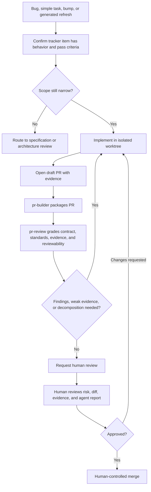
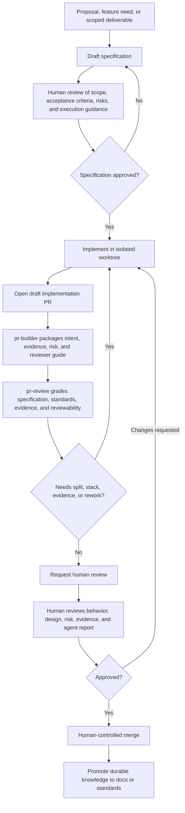

# Human-in-the-Loop PR Review Strategy for Agent-Generated Code

## Executive Summary

Agentic development moves the bottleneck from code production to review. An agent can
produce a plausible 100-file pull request faster than a human can understand whether the
change is correct, safe, maintainable, and worth merging.

This strategy was not developed in isolation. It incorporates patterns from public
agentic-development and generated-code review guidance. Warp Terminal is the strongest
process analogue: it separates specification, automated review, human approval, and
change-category routing. Additional public sources inform the supporting guardrails for
AI-assisted review, generated-code accountability, maintainer protection, objective
checks, and evidence requirements.

The Zazz strategy is:

1. Define intent before implementation.
2. Package every PR with evidence and reviewer guidance.
3. Use agents to grade PRs against the governing contract and repo standards.
4. Decompose broad agent output before formal human review.
5. Route review depth by change category, blast radius, and risk.
6. Preserve human approval and merge authority.

Humans remain the gatekeepers. Agents make that possible by preparing the work, checking
it against standards, surfacing risk, and reducing the amount of cold diff archaeology a
human reviewer must perform.

Core rules:

- No formal human review without clear intent, evidence, and reviewer guidance.
- `pr-builder` packages PR context; `pr-review` grades the PR against the governing
  specification, tracker contract, evidence, and repo standards.
- Bugs and simple tasks can take a fast path when the tracker item is a sufficient
  intent contract.
- New features and broad deliverables require the specification itself to receive human
  review before implementation starts.
- Broad agent-generated diffs must pass a decomposition gate before review.
- A stack is useful when it creates coherent review units. It is not useful when it turns
  one unreviewable PR into dozens of tiny PRs.
- A clean agent review means "ready for human attention," not "ready to merge."
- Humans approve, request changes, reject, merge, and own final product risk.

## The Core Problem

Traditional review guidance assumes humans are the limiting factor on both sides: humans
write code, humans review code, and PR size is constrained by human effort. Agentic
development breaks that balance. Generating code is cheap; building justified confidence
is still expensive.

The failure modes are predictable:

- One PR touches too many files, concepts, layers, or owners.
- Generated or mechanical files hide semantic behavior changes.
- Agent-generated tests are numerous but shallow, mock-heavy, or tied to private
  implementation details.
- Reviewers cannot tell whether the PR follows the approved intent.
- Architecture, data, security, migration, or rollback risk is buried inside a broad
  implementation diff.
- Human reviewers become the cleanup crew for unshaped agent throughput.

The strategy is not "make every PR tiny." The strategy is to make every review unit
honest: a human should be able to understand the intent, inspect the important parts of
the diff, trust the evidence, and make a real approval decision.

## Review Inputs

Every review needs three inputs.

### Intent Contract

The intent contract is the source of truth for what the PR is trying to do.

Use:

- an approved deliverable specification for feature, architecture, refactor, or
  multi-layer work
- an approved feature or architecture document when the PR implements a slice of a larger
  direction
- a tracker item for narrow bugs or simple tasks, when it states the broken behavior or
  requested change and the pass criteria

If a narrow bug turns into a feature defect, missed feature behavior, incomplete feature
implementation, broad refactor, data model change, architecture change, or cross-service
redesign, stop and route the work through feature, architecture, or deliverable
specification before implementation continues.

### Repo Standards

Repo-specific review policy belongs under `<DOCS_ROOT>/standards/`, indexed by
`<DOCS_ROOT>/standards/index.yaml`.

Standards should be discoverable by path, language, service, domain, or activity. Common
tags include:

- `frontend`
- `browser-client`
- `accessibility`
- `api`
- `backend`
- `database`
- `migration`
- `auth`
- `security`
- `integration`
- `generated`
- `testing`

The quality of agent review depends on the quality of the standards. A standard such as
"write good tests" gives an agent nothing concrete to grade. Useful standards name:

- expected implementation patterns
- forbidden shortcuts
- required evidence
- domain-specific edge cases
- examples of acceptable implementation
- examples that require escalation
- generated-file and mechanical-change rules
- test quality expectations

Standards should capture the kinds of project-specific expectations a principal engineer
or senior engineer would otherwise repeat in PR comments. Examples:

- which API return codes to use for validation failures, missing resources, auth failures,
  conflicts, rate limits, and unexpected errors
- accepted error response shapes and logging rules
- desired database access patterns, repository boundaries, transaction handling, and
  connection lifecycle rules
- requirements for parameterized SQL queries and prohibited string-concatenated SQL
- migration, backfill, rollback, and compatibility expectations
- browser-client state, accessibility, destructive-action, and loading/error handling
  patterns
- dependency, generated-code, and feature-flag rules

### Evidence

Evidence explains what was proven and what still needs human judgment.

Evidence can include:

- test commands and results
- screenshots or videos
- API or CLI output
- migration checks
- generated-file reproduction commands
- schema or snapshot diffs
- before/after behavior notes
- rollback or monitoring notes
- explicit explanation for missing automated coverage

Evidence must match the risk. A screenshot may support a UI claim; it does not prove API
contract compatibility. A unit test may prove a helper; it does not prove a workflow.

## Agent-Assisted Review

AI review is required reviewer-assist infrastructure for agentic development. It is not a
replacement for human approval.

During draft PR cleanup, the review agent should catch the issues a senior reviewer would
otherwise spend time repeating: wrong API status code, inconsistent error shape,
incorrect database access pattern, unsafe SQL construction, missing transaction handling,
weak regression test, unnecessary abstraction, or deviation from local architecture.
That only works when those expectations are documented as standards the agent can load.

The `pr-review` skill should run before formal human review and may run again when a
human reviewer wants a second pass. It should load:

1. `AGENTS.md` to resolve the docs root and repo workflow.
2. The governing specification, feature document, architecture document, or tracker item.
3. The PR diff.
4. The PR evidence.
5. Relevant standards selected from `<DOCS_ROOT>/standards/index.yaml`.

The review agent should produce structured output:

- **Detected facts**: changed files, touched APIs, migrations, generated artifacts,
  tests added, commands run, missing evidence.
- **Contract grading**: whether the PR satisfies the specification, acceptance criteria,
  or tracker contract.
- **Standards grading**: which standards apply and whether the PR follows them.
- **Risk inference**: why the facts affect review depth.
- **Reviewability assessment**: whether the PR can be reviewed as submitted.
- **Recommendation**: keep whole, split, stack, escalate, request evidence, or return to
  planning.
- **Human attention map**: files, concepts, and decisions that deserve the deepest human
  review.

The review agent should look especially for:

- scope drift
- unrelated edits
- weak or duplicate tests
- generated tests that only confirm the implementation
- irrelevant test cases added to inflate coverage without proving a real requirement or
  risk
- unnecessary abstraction
- duplicated local patterns
- missing edge cases
- hidden data, auth, security, or operational risk
- broad diffs without a decomposition rationale

The agent may recommend readiness. It must not approve, mark ready on behalf of the
owner, merge, or override a human reviewer.

## Decomposition Gate

The decomposition gate is the heart of the strategy. When an agent creates a broad diff,
the first question is not "can a reviewer power through this?" The first question is
"what review units would let humans make honest decisions?"

A broad PR should remain draft until it has:

- a governing intent contract
- an evidence map
- an agent review report
- a decomposition rationale
- a reviewer guide by file group, risk area, or stack branch

Use these signals to decide whether the work should stay whole, become a stack, split
into independent PRs, or return to planning:

- number of concepts a reviewer must hold at once
- number of architectural layers touched
- whether foundation work is mixed with consumers
- whether generated or mechanical files obscure semantic changes
- whether security, auth, data, migration, or operational risk is mixed with routine work
- whether each proposed review unit has its own acceptance criteria and evidence
- whether a human reviewer can understand the change without trusting the generator

## Decomposition Strategy

Decompose by review concern, not by file count.

Recommended order:

1. **Separate mechanical from semantic work.** Formatting, generated clients, lockfiles,
   codemods, generated migrations, and other deterministic output should not obscure
   behavior changes.
2. **Separate foundation from consumers.** Schema, API contracts, shared types, feature
   flags, and service abstractions should be reviewed before broad caller or UI changes.
3. **Separate risk boundaries.** Security, auth, permissions, migrations, billing,
   irreversible operations, and background jobs need explicit review focus.
4. **Separate refactors from behavior changes.** Broad refactors discovered during
   implementation usually signal that the deliverable needs re-planning or a separate
   preparatory PR.
5. **Use vertical slices when independently meaningful.** A vertical slice works when it
   has its own acceptance criteria, evidence, and product value.
6. **Use horizontal slices when layer risk differs.** Migration, repository, service, API,
   and UI layers often need different reviewers and evidence.
7. **Cap stack complexity.** A stack should normally be a handful of PRs with a clear
   order and review story. If honest decomposition creates dozens of PRs, the deliverable
   is too large and should become multiple deliverables.

A broad generated PR may stay whole only when the reviewer can validate it objectively.
Examples:

- deterministic generated artifact refresh
- generated code from an approved source contract
- mechanical codemod with a reproduction command
- formatting-only or lint-only changes
- generated snapshot updates with focused behavior tests

In those cases, human review should focus on the source contract, generation command,
integration impact, and whether any semantic changes are mixed into the mechanical diff.

## Stacked PRs

Stacked PRs are one decomposition tool. They are useful when ordered review makes the
work easier to understand and safer to merge.

Use stacked PRs when:

- one deliverable crosses natural layers such as schema, service, API, UI, and rollout
- foundation decisions need early human feedback
- each branch has a clear purpose, evidence story, and review boundary
- each branch can be reviewed without understanding all later branches in full detail
- the team has a merge procedure for dependent PRs

Avoid stacked PRs when:

- the change is already reviewable as one PR
- each PR only makes sense as "part 1 of a function"
- the stack exists only so the agent can continue coding before the design is settled
- CI or branch protection cannot handle dependent PRs
- the lower branch is volatile enough to invalidate upper branches repeatedly
- decomposition would create a swarm of tiny PRs with more coordination cost than review
  value

Every PR in a stack needs human sign-off before merge. Stacking reduces context load; it
does not remove the human gate.

For command-level stack workflow, use the `gh-stack` skill and
[docs/using-gh-stack.md](using-gh-stack.md).

## Review Workflow

### Simple Bugs And Tasks

Use this path for narrow bugs, dependency bumps, generated refreshes, small configuration
changes, and simple tasks where the tracker item is a sufficient intent contract.

### Features And Deliverables

Use this path when the work changes product behavior, crosses system layers, carries
architecture or data risk, or needs explicit acceptance criteria before implementation.

## Draft, Ready, And Merge Expectations

### Before Draft PR

The author or agent should complete:

- implementation from the approved intent contract
- self-review of the diff
- removal of unrelated edits
- local or CI-equivalent checks where practical
- test evidence or explanation for missing evidence
- initial stack or decomposition plan if the diff is broad

### Draft PR

Draft PRs are for shaping and cleanup before formal review.

Expected automation and agent support:

- `pr-builder` creates or refreshes title, body, evidence, risk, and reviewer guide.
- Objective checks run early.
- `pr-review` runs as an author-side senior-engineer hygiene pass against the governing
  contract, evidence, and repo standards.
- Missing context, evidence, standards coverage, or decomposition rationale is flagged.

The author should address critical and important findings before requesting review.

### Ready For Review

Before requesting human review, the PR should have:

- passing required checks or a documented failure reason
- no unresolved critical agent findings
- evidence section completed
- clear reviewer guidance
- recommended review tier and rationale
- stack map and parent assumptions when stacked
- decomposition rationale for broad diffs

### Before Merge

Before merge, the PR should have:

- required human approvals for its tier
- no unresolved critical or important review comments
- up-to-date base, merge queue, or equivalent validation
- rollback or monitoring notes when operational risk exists

## Review Tiers

### Automated Tier

Low-risk changes where checks and agent review can do most verification before a lighter
human review.

Examples:

- docs-only edits
- deterministic generated-file refreshes
- formatting-only changes
- dependency patch bumps within an approved policy
- mechanical changes with strong test evidence

This tier does not mean auto-merge or unattended approval.

### Standard Tier

Normal application or service logic changes.

Requirements:

- passing checks
- `pr-review` first pass
- evidence section complete
- one human approval

### Critical Tier

Changes where failure can cause production incidents, data loss, security exposure,
broken external contracts, or broad downstream rework.

Requirements:

- named owner or CODEOWNER approval
- `pr-review` first pass
- stronger evidence and regression coverage
- additional reviewer or domain lead when blast radius is high

### Large Exception

A PR that exceeds the normal review budget but cannot reasonably be split.

Requirements:

- explicit explanation for why it cannot be split
- reviewer consent before expecting full review
- review map by file group or concept
- files requiring deepest human attention
- stronger tests and runtime evidence

Large exceptions should be rare. "The agent already wrote it this way" is not a valid
reason.

## Risk Signals

Assign risk from a combination of:

- **Path category**: auth, migrations, public APIs, infrastructure, shared packages, or
  other sensitive areas.
- **Change type**: behavior, contract, data shape, permissions, deployment wiring,
  retries, error handling, rollback paths, or feature flags.
- **Blast radius**: affected services, browser clients, jobs, external consumers, or user
  workflows.
- **Complexity**: state transitions, async races, cross-service side effects, or logic
  that is hard to test.
- **Churn and fragility**: recent changes, known bug history, flaky tests, brittle mocks,
  or unclear ownership.
- **Observability and rollback**: whether failures are easy to detect, isolate, and roll
  back.
- **Evidence quality**: whether tests and runtime evidence match the introduced risk.

Default critical-path categories:

- authentication and authorization
- sensitive data and privacy
- external contracts
- persistence and migrations
- infrastructure and deployment
- shared libraries and platform packages
- money, compliance, or customer commitments
- browser-client critical paths
- service critical paths

Each repo should map these categories to concrete standards, CODEOWNERS, and labels.

## Testing And Regression Policy

Testing prevents agent-generated code from becoming review theater. A PR should prove
that the intent contract is satisfied.

Agent-generated tests often fail by being too busy rather than too sparse: many cases,
low signal, and conditions that do not map to real requirements or risk. Review should
reward tests that prove behavior, not tests that merely increase count or coverage.

For bug fixes:

- include a regression test that would have failed before the fix and passes after it
- if automated regression coverage is not practical, explain why and provide stronger
  manual or runtime evidence
- treat "fixed without regression coverage" as an exception

Test planning should prefer meaningful coverage over test volume:

- choose the lowest layer that proves the behavior
- add higher-level tests when the bug crosses boundaries
- cover realistic field edge cases
- avoid irrelevant permutations that do not represent a requirement, defect, boundary, or
  realistic failure mode
- assert observable behavior or stable contracts rather than private mechanics
- avoid mock-only tests that merely confirm collaborators were called
- reuse existing fixtures and stronger nearby tests when they already prove the behavior

For API defects, prefer automated API-level regression tests over manual request
screenshots. Manual API tools can provide evidence, but future regression prevention
requires an automated check when practical.

For bugs and simple tasks, the tracker item should include:

- observed behavior
- expected behavior
- reproduction steps or diagnostic evidence
- acceptance criteria
- test layer and command
- realistic edge cases to cover
- validation evidence required in the PR
- rollback or mitigation notes when operational risk exists
- documented exception and approver if no automated regression test is added

## Provenance And Trust Notes

If AI-assisted development is the default, requiring "AI-assisted" disclosure on every PR
adds noise. The review process should assume agents may have produced, modified,
reviewed, or tested the change.

Instead, disclose information that changes review depth, evidence expectations, or trust
boundaries:

- implementation source: approved specification, issue/tracker contract, or ad hoc prompt
- whether the author reviewed the final diff and accepts responsibility
- copied external snippets or generated code from outside the repo
- agent-generated tests and whether their assertions were reviewed
- autonomous run versus guided session versus manual follow-up edit
- uncertain assumptions, generated migrations, generated schemas, generated clients, or
  model-inferred behavior

Review should be based on risk, evidence, and ownership, not on whether a human or agent
typed the first draft.

## Human Reviewer Expectations

Human reviewers should focus on:

- Is this the right change for the problem?
- Does it preserve system contracts?
- Does it follow repo standards?
- Does it fit local architecture and ownership boundaries?
- Are tests meaningful and edge cases realistic?
- Are failure modes and rollback clear?
- Are there security, data, privacy, or operational risks?
- Is the PR reviewable as submitted?
- Does the agent review report separate facts from risk inference?
- Does the risk tier recommendation make sense?

Humans should not spend review time on:

- formatting
- import ordering
- trivial lint issues
- generated output consistency when deterministic checks can verify it
- template omissions that automation can catch
- reconstructing an agent session from an unshaped diff

## Metrics

Track these per team and per service:

- PRs opened per week by workflow type
- median and 75th percentile review turnaround by risk tier
- percentage of PRs converted into stacks during draft review
- percentage of broad PRs returned to planning or decomposition
- time to first review
- time from review requested to merge
- number of human review rounds
- number of agent findings fixed before human review
- number of risk-tier escalations and overrides
- post-merge defects by PR size and risk tier
- revert rate
- percentage of PRs with complete evidence
- percentage of bug fixes with regression tests
- percentage of `pr-review` findings later judged false positive or missed risk

Do not set a formal first-response SLA before the pilot. Measure first, then set
realistic targets for standard and critical PRs.

The goal is not simply faster merges. The goal is fewer overloaded reviews, fewer risky
rubber-stamps, and better signal for where human attention is needed.

## Rollout Plan

### Phase 1: Baseline PR Shape

- Update PR templates with intent contract, risk tier, evidence, provenance/trust notes,
  and reviewer guide fields.
- Define initial critical-path categories in standards, CODEOWNERS, or both.
- Start measuring review time, review rounds, draft-stage findings, stack usage, and bug
  regression coverage.

### Phase 2: Standards And Agent Review

- Create or improve `<DOCS_ROOT>/standards/index.yaml`.
- Add standards for architecture, testing, service boundaries, security, generated
  artifacts, and risk-tier heuristics.
- Add author-side `pr-review` for draft PRs.
- Require no unresolved critical agent findings before human review.
- Track false positives and false negatives from `pr-review`.

### Phase 3: Decomposition Gate

- Require decomposition rationale for broad agent-generated diffs.
- Add PR template fields for file-group review maps and stack maps.
- Require split, stack, or large-exception rationale before formal review.
- Pilot return-to-planning for PRs that are too broad to review honestly.

### Phase 4: Risk-Tiered Routing

- Route automated, standard, critical, and large-exception PRs differently.
- Require explicit human owners for critical paths.
- Define minimum human review expectations after checks and `pr-review` pass.

### Phase 5: Stack Pilot

- Use GH-stack for dependent PR branches where a stack improves reviewability.
- Require each stack branch to have its own purpose, evidence, and review boundary.
- Add cleanup and merge procedures so stacks do not become long-lived branch chains.

### Phase 6: Continuous Calibration

- Review false positives and false negatives from `pr-review`.
- Sample automated-tier approvals for quality and missed risk.
- Adjust critical-path definitions.
- Tune standards and review-shape guidance based on defect and review data.
- Set realistic first-response targets only after observing pilot data.

## Open Decisions

- Which repo-specific paths map to critical-path categories?
- Which complexity and churn signals are practical to collect automatically?
- Which provenance and trust notes should be required?
- What is the minimum human review expectation for automated-tier PRs after checks and
  `pr-review` pass?
- What is the normal maximum stack size before a deliverable should be split?
- After piloting the process, what first-response targets are realistic for standard and
  critical PRs?

## Reference Patterns

These external patterns are included only where they directly shape a review rule in this
document:

Warp is the primary process analogue. The other sources provide supporting guardrails.

- Warp separates specification, automated review, and human approval, and treats PRs
  differently by category and blast radius. Zazz applies the same shape: bugs and simple
  tasks can be fast-tracked from a strong tracker item, while new features require the
  specification to be reviewed before implementation begins.
- OpenHands demonstrates a triggerable automated PR review pass that posts feedback to
  GitHub and can be customized with repo-specific review guidance. Zazz adopts that as an
  author-side reviewer, not as approval authority.
- Coder requires disclosure, human-owned PRs, manual verification, and evidence for
  primarily AI-authored contributions. Zazz applies this as the minimum bar before an
  agent-generated PR consumes human reviewer time.
- LLVM and the Linux kernel frame generated contributions as acceptable only when the
  human submitter understands and can defend the work. Zazz adopts their maintainer
  protection principle: generated work may receive extra scrutiny, lower priority, or
  rejection when it is too large, unclear, unverified, or extractive.
- GitHub's AI-generated code review guidance reinforces practical checks: run tests and
  static analysis first, verify intent and architecture fit, scrutinize dependencies and
  licensing, and use AI review only as a pre-human assistive pass.
- Trunk shows how objective code-quality checks can annotate PRs before human review.
  Zazz treats those checks as early gates, not substitutes for product review.

Sources:

- Warp interactive code review docs: https://docs.warp.dev/agent-platform/local-agents/interactive-code-review
- Warp GitHub Actions agent docs: https://docs.warp.dev/agent-platform/cloud-agents/integrations/github-actions
- OpenHands PR review docs: https://docs.openhands.dev/sdk/guides/github-workflows/pr-review
- Coder AI Contribution Guidelines: https://coder.com/docs/about/contributing/AI_CONTRIBUTING
- LLVM AI Tool Use Policy: https://llvm.org/docs/AIToolPolicy.html
- Linux Kernel Guidelines for Tool-Generated Content: https://docs.kernel.org/process/generated-content.html
- GitHub guide to reviewing AI-generated code: https://docs.github.com/en/copilot/tutorials/review-ai-generated-code
- Trunk GitHub Action: https://github.com/trunk-io/trunk-action
