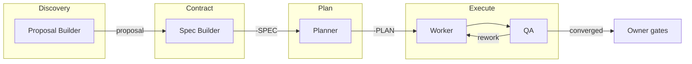
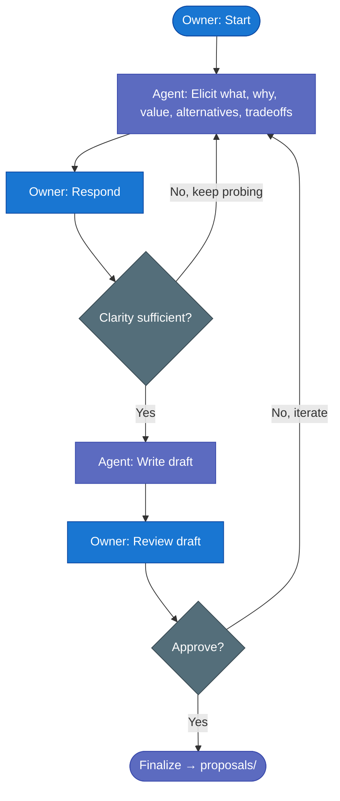
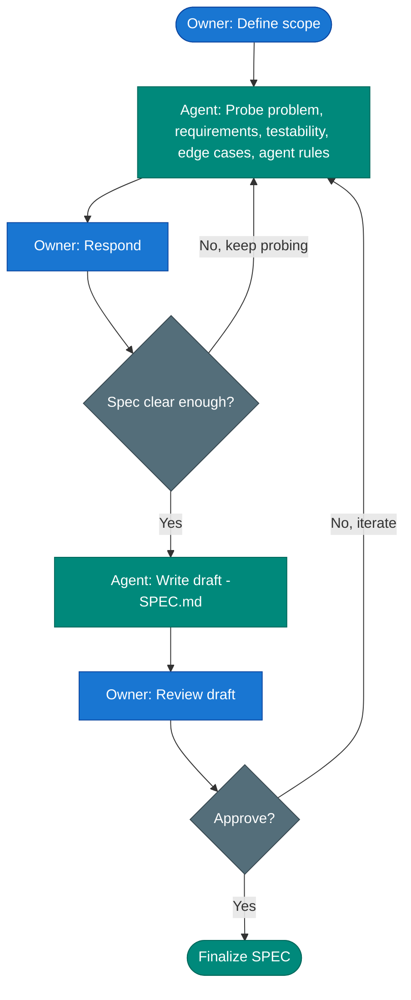
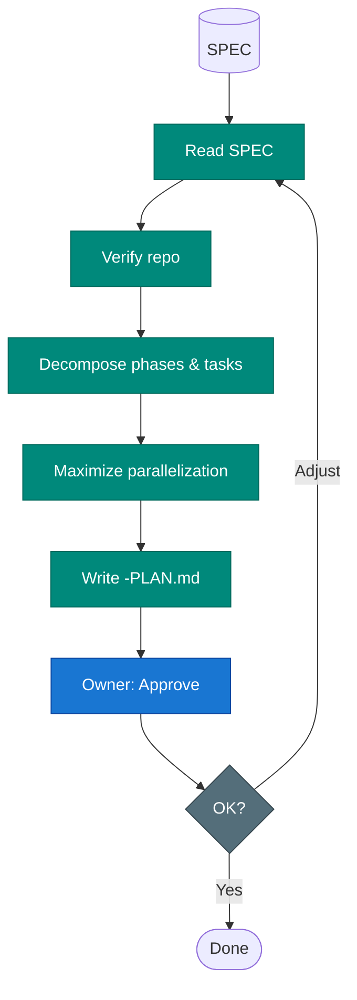
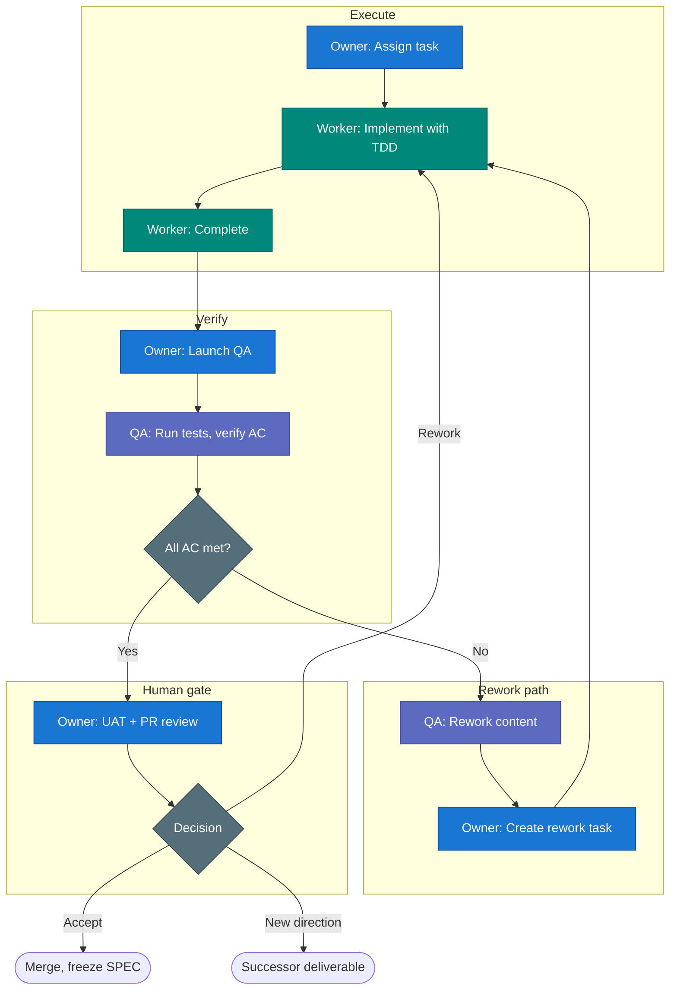

# The Zazz Framework

Zazz is a spec-driven framework for delivering software with humans and AI agents. Long-lived feature requirements are implemented through deliverables and validated through iterative QA convergence.

---

## At a Glance


| Concept                       | Summary                                                                       |
| ----------------------------- | ----------------------------------------------------------------------------- |
| **Desired-state convergence** | Work iterates until implementation aligns with the specification              |
| **Document flow**             | Proposal (optional) → SPEC (required) → PLAN (optional) → build/validate loop. Proposal process is optional. |
| **Specification model**       | Feature requirements (capability over time) + deliverable SPEC (execution contract per increment). Other docs: proposals, plans, standards. |
| **Agent roles**               | Proposal builder, Spec builder, Planner, Worker, QA                           |
| **Human gates**               | UAT and PR review after convergence, before merge                             |
| **Flexibility**               | Process-only, skills-assisted, or service-assisted (Zazz Board)               |


**Document scope:** This defines philosophy and operating model—not API contracts, schemas, or tool syntax. Those live in skills and project docs.

**Specification model:** The convergence model centers on two spec types. *Feature requirements* describe the capability over time (what we're building, why). *Deliverable SPEC* is the execution contract for one increment (what gets built in this deliverable). A feature may have many deliverables; each deliverable has its own SPEC. Proposals, plans, and standards are supporting documents.

**Worktree and branch:** One worktree per active deliverable. Worktree name = branch name (slashless). This keeps deliverable execution isolated and traceable. Compatible with staged integration or direct-to-main.

**Context engineering:** Load the least necessary context per role and step. Agents operate with focused context—Planner reads SPEC, Worker reads task prompt, QA reads SPEC and test matrix. Prefer runtime-native planning and orchestration; use the framework for contracts and boundaries, not to duplicate harness capabilities.

---

## Agent Flow Diagrams

These diagrams show how humans and agents collaborate at each stage. **Intent:** clarify who does what, when handoffs occur, and where iteration vs. linear flow applies.

### End-to-End Flow




*Proposal (optional) and Spec are iterative dialogues. Planner is linear. Worker/QA is a convergence loop.*

---

### 1. Proposal Builder — Exploratory Dialogue (Optional)

**Intent:** Produce a proposal that informs decisions without committing. The proposal process is optional—skip it when scope is already clear. The agent facilitates; the owner provides judgment. The dialogue is iterative—no fixed sequence of questions.

*Flow: Initiate → Iterative dialogue (loop until ready) → Draft & gate*




*Output: proposal in `proposals/` (no -PROP suffix; directory implies type). Optional process. Non-authoritative; informs the SPEC that follows.*

---

### 2. Spec Builder — Execution Contract Dialogue

**Intent:** Produce a SPEC that is complete enough for Planner, Worker, and QA to operate without guessing. Agent probes; owner responds. Iterative until spec is sufficiently clear.

*Flow: Scope → Iterative dialogue (loop until ready) → Draft & gate*




*Output: `-SPEC.md`. Execution contract; read-only during planning and implementation.*

---

### 3. Planner — Decomposition Pipeline

**Intent:** Transform an approved SPEC into an execution-ready PLAN. Linear pipeline: read, verify, decompose, parallelize, write. No iteration—single pass with optional owner adjustment.




*Output: `-PLAN.md`. Guides Worker; Owner coordinates execution.*

---

### 4. Worker, QA, and Owner — Convergence Loop

**Intent:** Implement toward the SPEC, verify against it, and converge. Worker builds; QA validates and drives rework when gaps exist. Owner coordinates and gates the final merge.




*Loop until convergence. Human gates occur after convergence, before merge.*

---

## Document Flow

| Stage              | Artifact    | Purpose                                                                                                                       |
| ------------------ | ----------- | ----------------------------------------------------------------------------------------------------------------------------- |
| **Proposal**       | `proposals/{name}.md` | Optional. Clarify options, tradeoffs, recommendation before committing. May attach to feature, deliverable, or both. Non-authoritative. No -PROP suffix; directory implies type. |
| **Specification**  | `-SPEC`     | Desired state and acceptance contract; central convergence target                                                             |
| **Plan**           | `-PLAN`     | Execution decomposition; may be document or runtime-internal                                                                  |
| **Build/validate** | Code, tests | Worker implements; QA verifies; loop until convergence                                                                        |


Spec-builder creates baseline; QA refines during execution; Owner reconciles into feature requirements on closure.

---

## Directory Structure

The framework requires `standards/`, `proposals/`, `features/`, and `deliverables/` under a configured docs root. Root location is flexible: `.zazz/`, `docs/`, or project-defined.

### Example Layout

```
.zazz/
├── standards/
│   ├── index.yaml          # Discoverability for agents
│   ├── testing.md
│   ├── coding-style.md
│   └── architecture.md
├── proposals/
│   ├── agent-session-hardening.md
│   └── delegated-review-flow.md
├── features/
│   ├── task-graph.md       # Feature key = file name (kebab-case)
│   └── agent-auth.md
└── deliverables/
    ├── auth-session-hardening-SPEC.md                    # Flat: SPEC only
    └── ZAZZ-142-auth-session-hardening/
        ├── ZAZZ-142-auth-session-hardening-SPEC.md
        └── ZAZZ-142-auth-session-hardening-PLAN.md       # Directory: SPEC + PLAN
```

### Naming Conventions


| Artifact           | Convention                                        | Example                                       |
| ------------------ | ------------------------------------------------- | --------------------------------------------- |
| Feature            | `features/{feature-key}.md`                       | `features/task-graph.md`                      |
| Proposal           | `proposals/{name}.md`                             | `proposals/agent-session-hardening.md`        |
| Deliverable (flat) | `deliverables/{base-name}-SPEC.md`                | `deliverables/auth-session-hardening-SPEC.md` |
| Deliverable (dir)  | `deliverables/{base-name}/*-SPEC.md`, `*-PLAN.md` | `ZAZZ-142-auth-session-hardening/`            |
| Standards index    | `standards/index.yaml`                            | Required for agent discoverability            |


### Example `standards/index.yaml`

```yaml
- file: testing.md
  summary: TDD, unit/integration/E2E patterns
  applies: all deliverables
- file: coding-style.md
  summary: Linting, formatting, naming
  applies: all code changes
- file: architecture.md
  summary: Layering, API contracts, data flow
  applies: deliverables touching architecture
```

---

## Core Entities

```
Project → Feature → Milestone → Deliverable → Task
         (optional layers)
```


| Entity          | Description                                                                                            |
| --------------- | ------------------------------------------------------------------------------------------------------ |
| **Project**     | Long-lived product/application context; may span repos                                                 |
| **Feature**     | Long-lived capability; has one evolving feature requirements doc; receives many deliverables over time |
| **Milestone**   | Group of deliverables due by a date; often spans features. Example: a release. Framework does not prescribe release process. |
| **Deliverable** | Bounded unit of value; one SPEC, optional PLAN; one repo, one worktree                                 |
| **Task**        | Smallest execution unit; agents execute at task granularity. Planner decomposes; Worker implements; Owner assigns. |


**Adoption:** Start with Project → Deliverable → Task. Add Feature and Milestone when you need capability or portfolio coordination.

**Variants:** Each alternative implementation gets its own deliverable identity and worktree. Human review selects one or triggers a synthesis deliverable.

---

## Human Checkpoints

| Checkpoint    | Purpose                                         |
| ------------- | ----------------------------------------------- |
| **UAT**       | Validate delivered behavior meets expectations  |
| **PR review** | Gate for code integration and release readiness |


**Outcomes:** Accept and close | Bounded rework (same deliverable) | Successor deliverable | Select among variants | Synthesis deliverable

---

## Adoption

You can adopt Zazz at three levels:

| Level | What you use | When it fits |
|-------|--------------|--------------|
| **Process-only** | Framework philosophy and document flow | Apply the process manually; no tools required |
| **Skills-assisted** | Process + `zazz-skills` | Use agent skills to facilitate proposal, spec, plan, worker, and QA workflows |
| **Service-assisted** | Process + skills + Zazz Board | Add Board to organize and manage relationships across proposals, features, and deliverables |

Start with process; add skills and Board as needed.

### By Framework Layer

| Layer          | Scope                                                                                   |
| -------------- | --------------------------------------------------------------------------------------- |
| **Execution**  | Deliverable → Task; SPEC/PLAN; skip Feature/Milestone                                   |
| **Capability** | Add Feature + feature-linked deliverables                                               |
| **Portfolio**  | Add Milestone; date-driven coordination of deliverables toward a shared delivery target |

---

## Zazz Board (Optional)

Zazz Board is optional tooling that adds a system of record and control surface for the framework. The framework is fully usable without it—process-only and skills-assisted adoption require no Board. When you add Board, you get:

**Relationship management.** Track how proposals, features, deliverables, and milestones connect. Which proposal informed which feature? Which deliverables belong to a milestone? Proposal-to-feature, proposal-to-deliverable, and milestone-to-deliverable links are explicit and inspectable. No need to overload the filesystem with relationship metadata.

**Live operational visibility.** See deliverable and task progress as agents execute. Kanban boards, task graphs, and dependency views. Know when deliverables are ready for UAT, PR review, rework, or closure. Feature- and milestone-level project views as the board evolves.

**Task and deliverable lifecycle.** Create and manage deliverables and tasks via API. Task relations (`DEPENDS_ON`, `COORDINATES_WITH`), task readiness checks, status workflows. Agents sync through the Board; humans see the same truth.

**Concurrency control.** File locks for shared-state safety when multiple workers touch the same deliverable. Acquire, heartbeat, release. Reduces merge conflicts and edit collisions.

**Human review support.** Variant selection, successor deliverables, rework tracking—all in an explicit interface instead of scattered notes.

Board integrates with `zazz-skills` via the `zazz-board-api` skill. Agents use the Board API for task/deliverable lifecycle, graph inspection, and locking. The framework remains the source of truth for process; Board is the accelerator for teams that want stronger coordination and visibility.

---

## Collaboration

Prefer runtime-native locking when the harness guarantees isolation. Use Board API file locks when shared-state safety is needed across workers.

---

**Framework maturity:** Pre-1.0 working draft `0.8.1`