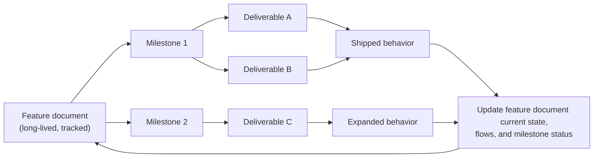
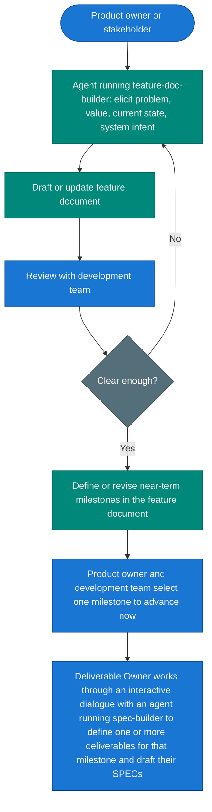

# The Zazz Framework

Zazz is an opinionated, spec-driven framework for delivering software with humans and AI agents. It separates long-lived product knowledge from short-lived execution contracts so teams can move quickly without losing the "why" behind the system.

The framework is intentionally **feature-first** in its conceptual model: define the long-lived capability and its milestone evolution before creating the bounded deliverables that implement it. Deliverables are execution slices of a feature, not the primary home of product intent.

The framework is also intentionally **git-native**. It relies heavily on built-in Git and GitHub functionality for both repository work and document lifecycle management: worktrees are a core execution requirement, durable docs live in the repository, draft PRs are the preferred way to share in-progress proposals/feature documents/standards, and final PR review is the approval path that promotes those docs into shared project truth.

## Table of Contents

- [Value Proposition](#value-proposition)
- [At a Glance](#at-a-glance)
- [Humans, Agents, and Skills](#humans-agents-and-skills)
- [Core Principles](#core-principles)
- [Git-Native Collaboration](#git-native-collaboration)
- [Document Root](#document-root)
- [Opinionated Docs Layout](#opinionated-docs-layout)
- [Proposals](#proposals)
- [Features and Feature Documents](#features-and-feature-documents)
  - [Why feature documents matter](#why-feature-documents-matter)
  - [Product-owner success criteria in feature documents](#product-owner-success-criteria-in-feature-documents)
  - [Feature Documents Are Living Documents](#feature-documents-are-living-documents)
  - [Milestones and deliverables](#milestones-and-deliverables)
  - [Recommended Feature Document Contents](#recommended-feature-document-contents)
  - [Example `features/index.yaml`](#example-featuresindexyaml)
  - [Feature Doc Builder Skill](#feature-doc-builder-skill)
  - [Feature Definition Flow](#feature-definition-flow)
- [Ownership Roles](#ownership-roles)
- [Skill Operating Modes](#skill-operating-modes)
- [Repo-Specific Skill Extensions](#repo-specific-skill-extensions)
- [Agent Authority and Owner Gates](#agent-authority-and-owner-gates)
  - [Where agents may operate autonomously](#where-agents-may-operate-autonomously)
  - [Where owner-controlled gates remain mandatory](#where-owner-controlled-gates-remain-mandatory)
  - [Practical rule](#practical-rule)
- [Standards and `AGENTS.md`](#standards-and-agentsmd)
  - [`AGENTS.md` Strategy](#agentsmd-strategy)
  - [What a repo `AGENTS.md` must contain](#what-a-repo-agentsmd-must-contain)
  - [Example `standards/index.yaml`](#example-standardsindexyaml)
- [Deliverables and Worktrees](#deliverables-and-worktrees)
  - [Acceptance Criteria and TDD](#acceptance-criteria-and-tdd)
  - [Default framework position: keep deliverables local](#default-framework-position-keep-deliverables-local)
  - [One worktree per deliverable](#one-worktree-per-deliverable)
  - [Durable knowledge must be promoted](#durable-knowledge-must-be-promoted)
- [Execution Model](#execution-model)
- [Core Entities](#core-entities)
- [Human Checkpoints](#human-checkpoints)
- [Adoption](#adoption)
- [Source of Truth and Reference Implementation](#source-of-truth-and-reference-implementation)
- [Zazz Board](#zazz-board)
- [Collaboration](#collaboration)

## Value Proposition

Zazz is opinionated because the framework is designed to help teams **build the right software, build it correctly, build it efficiently, and keep it maintainable and expandable over time**.

In explicit terms, the framework provides:

- **A durable structure for defining the right software to build.** Proposals, feature documents, milestones, and SPECs organize the product's purpose, current behavior, future direction, and execution intent so teams stay aligned on what the software is for and what it must do.
- **A delivery model for building that software correctly.** Explicit acceptance criteria, TDD, standards alignment, QA loops, and review gates exist so teams can verify that the implementation matches the intended functionality and is built using maintainable, expandable engineering patterns.
- **A framework for building efficiently without losing quality.** Once the right context is approved, the execution skills can operate in a launch-and-leave mode that reduces supervision overhead while still escalating at real decision or approval boundaries.
- **A system that preserves maintainability and future expansion.** Standards, disciplined execution contracts, and upstream documentation updates help ensure the software can be understood, maintained, and extended as capabilities grow.

The skills, roles, document model, and opinionated workflow are means to that end. They are not the value proposition by themselves. Their purpose is to make those outcomes repeatable across features, deliverables, and teams.

The framework is opinionated on purpose. The goal is not arbitrary restriction; the goal is to reduce ambiguity, improve consistency across repos and teams, and make the desired outcomes more repeatable for both humans and agents.

All framework markdown documents live under a repo-relative docs root declared in the repo's `AGENTS.md`. In most repos, the docs root will be either `.zazz/` or `docs/` at the root of the monorepo.

The default mental model is one software project in one monorepo. If a product spans multiple repositories, it is reasonable to introduce a shared docs/framework repo or package so the same standards, features, and skills can be consumed across repos. That is an extension pattern, not the default assumption.

This repository is the canonical source of truth for the framework document and the Zazz skills. Copies of the framework or skills that live in consuming repos, including [zazz-board](https://github.com/zazzcode/zazz-board), may lag behind. Changes should land here first and then be propagated outward.

[zazz-board](https://github.com/zazzcode/zazz-board) is the reference implementation of the framework and actively dogfoods it.

---

## At a Glance

| Concept | Summary |
| ------- | ------- |
| **Desired-state convergence** | Work iterates until implementation, tests, and review evidence align with the specification |
| **Git-native model** | Worktrees, branches, draft PRs, and final PR review are core framework mechanisms for both code and durable docs |
| **Docs root** | The repo's `AGENTS.md` declares the repo-relative directory that contains framework markdown documents |
| **Tracked docs** | `standards/`, `features/`, and `proposals/` are tracked, shared, and continuously updated with the application |
| **Transient docs** | `deliverables/` contains per-deliverable execution artifacts and is usually local/untracked by default |
| **Specification model** | Feature document for capability over time plus Deliverable SPEC (`-SPEC`) for one increment |
| **Verification model** | TDD and explicit acceptance criteria are core mechanisms for proving the software was built correctly and delivers the intended functionality |
| **Execution flow** | Proposal (optional) -> feature document (optional but recommended for long-lived features) -> SPEC (required) -> PLAN (optional) -> build/validate loop -> PR/UAT gate |
| **Skills** | `proposal-builder`, `feature-doc-builder`, `spec-builder`, `planner`, `worker`, `qa`, optional `pr-builder`, optional companion utility skills such as `zazz-board-api` and draft `jira-api` |
| **Skill modes** | Some skills are interactive and human-in-the-loop; others are designed for mostly autonomous execution once inputs are approved |
| **Autonomy value** | Approved context should let agents converge on a verified solution with minimal supervision, improving delivery efficiency without dropping quality |
| **Organization value** | The framework gives teams an opinionated structure for defining what the product does, why it exists, and how it can evolve over time |
| **Authority model** | Agents may work autonomously inside approved contracts; owners retain approval, scope, sign-off, and merge authority |
| **Merge authority** | Agents may prepare and verify PRs, but final approval and merge are always reserved to the Deliverable Owner or another authorized human reviewer |
| **Human gates** | UAT and PR review after convergence, before merge |
| **Source of truth** | This repository is canonical for framework and skill definitions; downstream copies may lag |
| **Reference implementation** | [zazz-board](https://github.com/zazzcode/zazz-board) dogfoods the framework, skills, and document model |

**Document scope:** This file defines framework philosophy, document contracts, and operating model. API syntax, route details, and tool-specific commands belong in skills and project docs.

**Reading order:** Understand feature documents first, then Deliverables/SPECs. The feature is the durable product concept; the deliverable is the bounded execution increment.

## Humans, Agents, and Skills

The framework distinguishes three different things that are easy to blur together if the wording is loose:

- **Human actors**: Product Owner, Project Owner, Deliverable Owner, stakeholders, and reviewers
- **Agent actors**: the runtime AI agents that execute work or facilitate dialogue
- **Skills**: the capability packages loaded into an agent's context, such as `feature-doc-builder`, `spec-builder`, `worker`, or `qa`

The important model is:

- a human interacts with an agent
- the agent may be running one or more skills
- the skill shapes how that agent behaves and what artifact it is trying to produce

So, for example:

- the **Deliverable Owner** is the human actor
- the **agent** is the runtime actor in the dialogue
- `spec-builder` is the **skill** guiding that agent's behavior during SPEC authoring

This document sometimes uses skill names as shorthand for the agents operating with those skills. When precision matters, interpret phrases like "`spec-builder` drafts the SPEC" as "an agent running the `spec-builder` skill drafts the SPEC through dialogue with the relevant human."

---

## Core Principles

1. **Acceptance criteria and TDD are central, not optional.** Value is clarified through explicit success criteria, then validated through tests and review evidence. If work cannot be described in verifiable terms, it is not ready.
2. **Durable knowledge lives in tracked docs.** `proposals/`, `features/`, and `standards/` are shared repository knowledge. Proposals and features preserve product understanding over time; standards preserve the required engineering patterns for how the software must be built.
3. **Feature intent comes before execution slices.** Define the long-lived capability, its value, and its milestone evolution before breaking work into deliverables whenever the work is part of an enduring feature.
4. **Execution contracts are per increment.** A deliverable SPEC and optional PLAN define one bounded slice of work. They are not the permanent home for product narrative.
5. **Git primitives are part of the framework.** Use branches, worktrees, draft PRs, review comments, and final PR approval as standard collaboration mechanisms for both code and durable docs.
6. **The framework is opinionated about both product definition and engineering structure.** Proposals, feature documents, milestones, and SPECs define what the software should do and why; standards define how it must be built so it remains maintainable and expandable over time.
7. **Launch-and-leave execution is a design goal.** Once the approved context exists, planning, implementation, verification, and PR packaging should require minimal supervision until a real decision or approval boundary is reached.
8. **Agents load only the context they need.** `index.yaml` files exist to help agents decide what to read instead of loading every standard or feature document into context.
9. **PR merge authority stays with an authorized human.** Agents may create draft PRs, update PR bodies, and provide verification evidence, but they must never approve or merge PRs on their own.
10. **One worktree per active deliverable.** Execution should happen in isolated worktrees so implementation state, branch history, and transient deliverable files stay scoped to one increment.
11. **Durable knowledge moves upstream.** When a deliverable changes the product, update the relevant feature document and standards so the long-lived docs reflect the shipped system.

---

## Git-Native Collaboration

Zazz is designed to work with native Git and GitHub collaboration primitives instead of inventing a parallel document-management system.

Framework expectations:

- use one worktree per active deliverable or document effort
- keep durable docs in the repository so branches, commits, PR comments, and merge history become part of the document audit trail
- use **draft PRs** to share in-progress proposals, feature document revisions, and standards updates that are still being shaped
- use **final PR review** to approve and merge durable docs once they are ready to become shared project truth
- treat PR approval and merge as human-controlled gates; agents may prepare and verify PRs but must not merge them
- treat worktrees as both an isolation mechanism and a recovery mechanism; if an execution path proves wrong, the worktree can be abandoned without polluting the main line of work
- treat Git history as the durable change log for proposals, feature documents, standards, and committed execution artifacts

Required review pattern for durable docs:

1. Create or revise the doc in a branch/worktree.
2. Open a draft PR while the document is still being discussed.
3. Iterate in the PR using comments, suggestions, and follow-up commits.
4. Mark the PR ready for review once the proposal, feature document, or standards change is decision-ready.
5. Merge when approved so the repository reflects the new shared truth.

Recovery pattern:

- if a worktree's implementation path goes in the wrong direction or fails review, abandon that worktree rather than forcing it forward
- revisit the governing proposal, feature document, SPEC, or PLAN as appropriate
- open a new branch/worktree with the corrected approach once the contract is clarified

---

## Document Root

The framework requires a single docs-root declaration in the repo's `AGENTS.md`.

Recommended values:

- `.zazz` at the monorepo root
- `docs` at the monorepo root
- another repo-relative docs directory when needed

Rules:

- The value is a **relative path within the repository**.
- All framework markdown and index files resolve relative to this root.
- Skills and agents should refer to framework docs through this declared root rather than hardcoding `.zazz`.

Examples:

- `Framework docs root: .zazz`
- `Framework docs root: docs`
- `Framework docs root: packages/platform-docs`

When the application spans multiple repos, point the relevant repo or shared package at the directory that contains the framework docs. The important contract is that the path is repo-relative and stable for that repo.

---

## Opinionated Docs Layout

The framework is opinionated about the directory shape under the declared docs root.

Required long-lived directories:

- `proposals/`
- `standards/`
- `features/`

Required execution directory:

- `deliverables/`

Recommended layout:

```text
<DOCS_ROOT>/
├── standards/
│   ├── index.yaml
│   ├── testing.md
│   ├── coding-style.md
│   └── architecture.md
├── features/
│   ├── index.yaml
│   └── role-based-access-control.md
├── deliverables/
│   ├── role-management-ui-SPEC.md
│   └── role-management-ui-PLAN.md
└── proposals/
    └── role-management-options.md
```

The tree above shows **`deliverables/` with the flat layout** (the option for projects that use neither the Zazz-style nor Jira-style subdirectory convention for deliverable files).

A **project** adopts **one** deliverable file-layout mode—do not mix:

1. **Neither** — flat only: `{slug}-SPEC.md` / `{slug}-PLAN.md` under `deliverables/`.
2. **Zazz Board** — subdirectory layout: `deliverables/{deliverable-code}/{slug}-SPEC.md` (and `-PLAN.md`); sync paths via **zazz-board-api**; folder name = board deliverable code.
3. **Jira** — **same subdirectory layout** as Zazz: `deliverables/{issue-key}/{slug}-SPEC.md` (and `-PLAN.md`); folder name = Jira issue key (e.g. `PROJ-453`).

Zazz and Jira are **alternatives** (different `{id}` in the same pattern), not two folder schemes used together in one project.

This deliverable file-layout choice is related to, but not identical to, the repo's broader work-tracking system.
A repo may also use an external tracker for PR-facing links or issue management, such as:

- Zazz Board
- Jira
- Avaza
- another tracker
- no external tracker beyond local deliverable docs

That broader tracking declaration belongs in the repo's `AGENTS.md`.
It tells skills how PRs, QA artifacts, and deliverable references should be anchored.
Live integration with those systems, when present, belongs in companion utility skills rather than in the framework doc itself.

Naming conventions:

| Artifact | Convention | Example |
| ------- | ---------- | ------- |
| **Docs root** | repo-relative path declared in `AGENTS.md` | `.zazz`, `docs` |
| **Feature document** | `features/{feature-key}.md` | `role-based-access-control.md` |
| **Features index** | `features/index.yaml` | `features/index.yaml` |
| **Standards index** | `standards/index.yaml` | `standards/index.yaml` |
| **Deliverable SPEC** | `deliverables/{slug}-SPEC.md` (flat under `deliverables/`) | `role-management-ui-SPEC.md` |
| **Deliverable PLAN** | `deliverables/{slug}-PLAN.md` (same directory as its SPEC) | `role-management-ui-PLAN.md` |
| **Deliverable SPEC / PLAN (subdirectory)** | **Zazz or Jira** (not both): `deliverables/{id}/{slug}-SPEC.md` and `…/{slug}-PLAN.md`, slug-only files inside. `{id}` = Zazz **deliverable code** (board path sync) **or** Jira **issue key** (same convention, no board sync). | `deliverables/ZAZZ-142/role-management-ui-SPEC.md` — Jira: same pattern with issue-key folder |
| **Proposal** | `proposals/{name}.md` | `role-management-options.md` |

**Deliverable layout:** See the three modes under the layout tree (**neither** / **Zazz** / **Jira**). **Jira** reuses the **Zazz subdirectory convention**; only the folder name (issue key vs board code) changes. When using Zazz Board, `dedFilePath` / `specFilepath` must match the SPEC on disk. The `spec-builder` and `planner` skills describe agent steps; `zazz-board-api` applies only to Zazz Board.

**Examples** (same fictional deliverable, slug `role-management-ui`; **pick the block that matches your project mode**):

```text
# Neither — flat
.zazz/deliverables/role-management-ui-SPEC.md
.zazz/deliverables/role-management-ui-PLAN.md
```

```text
# Zazz Board — deliverable code ZAZZ-142 (path sync via zazz-board-api)
# Jira projects: same layout; folder is the issue key (e.g. PROJ-453/) instead of ZAZZ-142/
.zazz/deliverables/ZAZZ-142/role-management-ui-SPEC.md
.zazz/deliverables/ZAZZ-142/role-management-ui-PLAN.md
```

`proposals/`, `standards/`, and `features/` are expected to be tracked in Git. `deliverables/` must exist in each worktree and should stay local unless the team explicitly wants canonical deliverable artifacts checked in.

Keep `features/` flat by default. Introduce per-feature subdirectories only if the project later discovers a real need for multiple durable artifacts per feature.

---

## Proposals

Proposal documents are the framework's exploratory, pre-commitment decision artifacts.

They live under:

- `<DOCS_ROOT>/proposals/`

Use a proposal when a team still needs to evaluate why to proceed, which approach to choose, what tradeoffs are acceptable, or what risks and constraints must be understood before feature definition or execution commitment.

Proposal scope may be:

- feature-oriented
- deliverable-oriented
- joint, when the decision spans both feature and deliverable concerns

Proposal docs are durable and are expected to be tracked in Git. The required collaboration pattern is:

1. draft the proposal in `<DOCS_ROOT>/proposals/`
2. open a **draft PR** to share it while the proposal is still being discussed
3. refine the proposal through comments, commits, and stakeholder feedback
4. finalize and merge the PR once the proposal is approved
5. use the approved proposal as input to the next authoring session, typically with an agent running `feature-doc-builder`, `spec-builder`, or both

Proposal docs do not replace feature documents or SPECs. They help a team decide what should move forward and on what basis.

---

## Features and Feature Documents

The feature document is a core framework concept.

A feature document is a **long-lived, continuously maintained document** for one application capability. It explains:

- why the capability exists
- who it serves
- what is live today
- how the capability works at a high level
- which milestones have been completed or planned
- which deliverables have advanced that capability

The primary audiences are:

- product owner
- project owner
- stakeholders
- developers onboarding to the project
- anyone using the repo as a current source of product and user-facing behavior

A feature document is not an execution doc. It does not replace a deliverable SPEC. Instead:

- **Feature document** = capability over time, the why, the current state, and the milestone roadmap/history
- **Deliverable SPEC** = execution contract for one increment

### Why feature documents matter

- They preserve product intent beyond any single deliverable.
- They keep milestone history and current functionality in one place.
- They make onboarding faster because a new developer can understand the shipped feature without reconstructing it from old PRs.
- They help stakeholders see what is already live, what is next, and why work is being prioritized.
- They can double as accurate source material for user documentation when kept current.

### Product-owner success criteria in feature documents

The Product Owner should define the success signals for the feature and its milestones. At the feature document level, these are usually not low-level implementation acceptance criteria yet. They are feature-level statements of value and milestone outcomes such as:

- what user or business problem is solved
- what new capability exists after a milestone ships
- what should be true of the system when the milestone is complete

These feature-level success criteria inform later deliverable acceptance criteria. They should be concrete enough to guide decomposition, but they do not replace deliverable-level TDD and execution detail.

### Feature Documents Are Living Documents

Feature documents must evolve with the software. After each milestone lands:

- update the feature document's current-state sections so they describe what is actually live now
- update milestone status to reflect what was completed
- revise introductory and functional sections when the shipped behavior changes
- keep future milestone sections forward-looking but clearly separated from current behavior

The goal is that the feature document always describes the current application as shaped by the most recent completed milestones.

Milestones are also living planning elements inside the feature document. Teams do not need to define the entire milestone roadmap up front. In many cases, a feature document may begin with only one near-term milestone and one or two forward-looking milestones. Additional milestones may be added later as:

- new feature needs are discovered
- follow-on capabilities become clearer
- shipped milestones change what the next most valuable increment should be
- technical or product learning changes the roadmap

The important rule is that the milestone model lives in the feature document and is revised there as the feature evolves.

### Milestones and deliverables

- A **feature** can span many milestones.
- A **milestone** is a meaningful increment of that feature and may contain multiple deliverables.
- A **deliverable** is one bounded execution slice that advances a milestone or handles a standalone need.
- Teams may define only the next one, two, or three milestones at a time. The framework does not require a complete long-range milestone map before execution begins.
- Not every deliverable requires a feature document. Bugs, chores, maintenance, migration work, and other non-feature increments may go straight to SPEC.

Relationship model:



### Recommended Feature Document Contents

A feature document should include:

- feature title and short summary
- current or active milestone plus the next likely milestones when known
- introduction / why this feature exists
- current state of shipped behavior
- feature-level success criteria and milestone outcome criteria
- key concepts or domain model
- important user and system flows
- milestone overview table
- milestone sections that summarize delivered and planned increments
- links or references to related deliverables where useful

The exact headings can vary by project, but those concepts should be present.

### Example `features/index.yaml`

The features index exists for discovery. It lets agents and humans quickly identify which feature doc is relevant without loading every feature document.

```yaml
features:
  - key: role-based-access-control
    file: role-based-access-control.md
    domain: authentication, authorization, account management
    current_milestone: M1 complete
    current_state: >
      Backend RBAC model is live. Role management UI is not yet shipped.
    purpose: >
      Defines why RBAC exists, what is live today, and the milestone roadmap
      for role management across backend and frontend.
```

The specific text can vary, but the index should give enough information for an agent to decide whether the feature document belongs in context.

### Feature Doc Builder Skill

The framework includes a dedicated skill for authoring and evolving feature documents:

- `feature-doc-builder`

Its purpose is to work with a product owner, project owner, or stakeholders to define:

- why the feature is necessary
- what value it adds
- what the system does today
- what the system should do at a feature level
- how the feature should evolve across milestones

It may also ingest transcripts or meeting notes to create or refresh a feature document draft.

`feature-doc-builder` is intentionally different from `spec-builder`:

- `feature-doc-builder` is feature-level, long-lived, and milestone-oriented
- `spec-builder` is deliverable-level, execution-oriented, and implementation-contract-focused

### Feature Definition Flow

This is the recommended flow when a team is defining or revising a long-lived feature:



The key idea is that the feature document is not just written once. It is refined through owner/stakeholder input and development-team review, then updated as milestones ship.

Another key idea is that milestones are defined within the feature document, not produced as a separate one-time decomposition artifact. The feature document owns the milestone roadmap. When a team is ready to execute, the product owner and development team select one milestone to advance. The Deliverable Owner then works through an interactive dialogue with an agent running the `spec-builder` skill to break that milestone into one or more deliverables and draft the corresponding SPECs.

---

## Ownership Roles

Zazz distinguishes ownership by decision scope. These are responsibility roles, not necessarily different humans.

One person may hold multiple roles in a smaller team.

| Role | Primary scope | Typical responsibilities |
| ---- | ------------- | ------------------------ |
| **Product Owner** | Application and feature value | Owns feature intent, business/domain value, feature documents, milestone direction, and feature-level success criteria |
| **Project Owner** | Engineering project and delivery system | Owns repo/process/framework conventions, implementation-facing priorities, and delivery structure |
| **Deliverable Owner** | One bounded execution increment | Usually a software developer, tech lead, or other technical owner. Owns deliverable scope, deliverable acceptance criteria, implementation clarifications during execution, and final acceptance/rejection |

Rule of thumb:

- the **Product Owner** answers "What should the application do and why?"
- the **Project Owner** answers "How should this software project be organized and delivered?"
- the **Deliverable Owner** answers "What exactly is in scope for this increment, what are the acceptance criteria, how will we know it is done, and is this PR ready to approve and merge?"

These roles often overlap in practice. The same person may be Product Owner, Project Owner, and Deliverable Owner. In some teams, a technical product owner may also serve as Deliverable Owner.

---

## Skill Operating Modes

Not every skill should behave the same way in human collaboration.

| Mode | Skills | Expected operating style |
| ---- | ------ | ------------------------ |
| **Interactive / human-in-the-loop** | `proposal-builder`, `feature-doc-builder`, `spec-builder`, often `pr-builder` | These skills are expected to facilitate dialogue, ask follow-up questions, iterate drafts with humans, and help shape the artifact through conversation |
| **Autonomous execution** | `planner`, `worker`, `qa`, `qa-frontend`, `qa-backend`, `coordinator` | These skills are expected to run mostly independently once approved inputs exist, escalating only when they hit a real decision gate, ambiguity, or approval boundary |
| **Companion utility** | `zazz-board-api`, draft `jira-api` | These skills are not human-facing workflows on their own; they support other skills with tracker/API capability and authoritative external context when available |

"Launch-and-leave" is a good informal description for the autonomous execution class, and it is a real framework value proposition. The expectation is not zero human interaction. The expectation is minimal interruption once the skill has the approved context it needs.

Interactive skills should optimize for dialogue quality and artifact clarity. Autonomous skills should optimize for execution quality, truthful state, TDD discipline, and the ability to iterate toward a verified final solution before escalating.

In this section and elsewhere, the skill names are shorthand for agents operating with those skills in context.

---

## Repo-Specific Skill Extensions

Framework skills are intended to stay reusable across many repositories, but real application repos often need a small amount of repo-specific guidance for how a skill should behave in that environment.

The framework supports that through an optional companion directory:

```text
.agents/
├── skills/
│   └── <skill-name>/SKILL.md
└── skill-extensions/
    └── <skill-name>/EXTENSION.md
```

Use this mechanism when a repo needs to add application-specific or harness-specific guidance without forking the base framework skill.

Typical examples:

- preferred agent harness capabilities available in that repo
- repo-specific commands, wrappers, or verification flows
- local escalation rules or evidence expectations
- project-specific cautions that refine how a shared framework skill should be applied

Rules:

- base skills under `.agents/skills/` remain the canonical framework-owned contract
- repo-specific guidance lives in `.agents/skill-extensions/<skill-name>/EXTENSION.md`
- the extension is additive guidance, not a silent replacement for the base skill
- the extension should stay concise and point to repo-local references or scripts when it grows
- repo-specific extensions must not quietly weaken framework safety or authority boundaries

Recommended skill behavior:

1. Read the base skill first.
2. Check for `.agents/skill-extensions/<skill-name>/EXTENSION.md`.
3. If it exists, read it immediately after the base skill.
4. Treat it as friendly repo-specific guidance for how that skill should be applied in the current application.

Why the framework prefers a companion extension directory:

- it keeps the shared base skill easy to sync from the framework source of truth
- it avoids cluttering `AGENTS.md` with large skill-by-skill exceptions
- it lets each repo add local nuance without pretending those details belong in every downstream user of the framework

This pattern is especially useful for execution skills such as `worker`, `qa`, and `coordinator`, where the available agent harness, board wrappers, or validation tools may vary by repository.

---

## Agent Authority and Owner Gates

The framework is designed to maximize safe agent autonomy without removing owner accountability.

### Where agents may operate autonomously

Agents are expected to work with minimal supervision when they are operating inside an already approved contract or clearly delegated task, including:

- drafting and revising proposals, feature documents, and SPECs during interactive authoring sessions
- producing a PLAN from an approved SPEC
- implementing code from an approved SPEC and PLAN
- running tests, performing QA verification, and generating rework content
- preparing PR titles, bodies, verification evidence, and manual test instructions
- updating transient execution state such as task status, notes, blockers, and local deliverable artifacts

### Where owner-controlled gates remain mandatory

Owner approval or another authorized human decision remains mandatory at these boundaries:

- approving a proposal as the basis for moving into feature-document and/or SPEC work
- approving feature-document direction, milestone framing, and major feature-scope changes
- approving the SPEC as the authoritative execution contract
- approving the PLAN when the project/team expects an explicit planning gate
- resolving ambiguities or scope changes that materially alter the approved contract
- providing sign-off for acceptance criteria marked as owner-reviewed
- approving the PR for integration
- merging the PR

### Practical rule

Use agents to do the work. Use the Deliverable Owner or another authorized human to approve the contract, accept the result, and authorize merge.

This is the framework's intended balance:

- maximum autonomy inside approved boundaries
- explicit human control at approval, acceptance, and merge boundaries

---

## Standards and `AGENTS.md`

Standards are long-lived, tracked implementation rules. They should live beside `features/` under the same declared docs root.

Standards are **not** the place to describe product functionality, feature intent, or user-facing behavior. Their purpose is to define the engineering patterns, structural rules, and implementation constraints that make the software maintainable, consistent, and expandable over time.

Use this distinction:

- `proposals/`, `features/`, and `deliverable SPECs` describe what the software should do and why
- `standards/` describes how the software should be built

The key contract is:

- `AGENTS.md` must point agents to `<DOCS_ROOT>/standards/index.yaml`
- agents should read the standards index first
- agents should then load only the standards whose paths or activities match the task
- agents should **not** inject every standard document into context by default
- `AGENTS.md` itself should stay lean and should not duplicate large sections of standards content

This is how the framework manages context without requiring every task to load the entire project's standards corpus.

### `AGENTS.md` Strategy

Every repo using the framework should have a real `AGENTS.md` at its repo root.

This repo defines the framework contract for what that file must contain and provides an example template:

- `templates/AGENTS.md`

That template is an example starter, not the live `AGENTS.md` for this repo.

If you want a concrete real-world repo-level `AGENTS.md` in practice, use the reference implementation:

- [zazz-board](https://github.com/zazzcode/zazz-board)

### What a repo `AGENTS.md` must contain

At minimum, a repo-level `AGENTS.md` must tell agents:

- what the repo's framework docs root is
- where `<DOCS_ROOT>/standards/index.yaml` lives
- that the standards index is the discovery surface for selective context loading
- where `<DOCS_ROOT>/features/index.yaml` lives when feature context matters
- whether `<DOCS_ROOT>/deliverables/` is local/untracked or committed in that repo
- what work-tracking system the repo uses for deliverables, tickets, and PR context
- the repo's worktree / branch policy

The standards index is mandatory. The features index is also expected in repos that use feature documents.

The tracking declaration should be concise but explicit. For example, it should clarify whether the repo uses:

- Zazz Board
- Jira
- Avaza
- another external tracker
- no external tracker beyond local deliverable docs

When relevant, it should also say whether that system affects:

- deliverable folder naming
- required IDs or URLs in PRs
- how agents should anchor SPEC, PLAN, QA, and PR references

This declaration does not require live tracker integration.
It simply tells agents which system is authoritative for PR-facing references and review context.
When a repo later adds live integration, that capability should be exposed through a companion utility skill such as `zazz-board-api` or a future Jira-style integration skill.

Best-practice principle:

- `AGENTS.md` is a concise routing layer
- `standards/index.yaml` drives selective standards discovery
- standards documents hold the detailed implementation guidance, not product requirements

This separation is intentional. It keeps agent entry-point context small and reduces duplication drift.

### Example `standards/index.yaml`

```yaml
standards:
  - file: http-layer-guide.md
    applies_to:
      paths:
        - backend/src/http_api/
      activities:
        - creating or modifying HTTP endpoints
        - defining request/response schemas
        - wiring routes and auth decorators
    purpose: >
      Prescriptive patterns for the HTTP layer: route structure, schema design,
      documentation, auth usage, and error handling.

  - file: service-layer-guide.md
    applies_to:
      paths:
        - backend/src/svc/
      activities:
        - creating or modifying business logic functions
        - adding domain exceptions or types
    purpose: >
      Patterns for service-layer design, dependency injection, domain
      boundaries, and error handling.

  - file: data-layer-sproc-examples.md
    companion_to: data-layer-guide.md
    applies_to:
      paths:
        - backend/src/data/sprocs/
      activities:
        - writing a new stored procedure wrapper
    purpose: >
      Complete examples referenced by the main data-layer guide.
```

Index structure expectations:

- `file`: relative filename inside `standards/`
- `applies_to.paths`: repo paths governed by the standard
- `applies_to.activities`: work types covered by the standard
- `purpose`: enough detail for an agent to decide relevance without opening the file
- `companion_to` (optional): indicates a standard that should usually be loaded with another one

---

## Deliverables and Worktrees

Deliverables are the execution layer of the framework.

- Every active deliverable must have a SPEC.
- A PLAN is optional, but once a team decides a deliverable needs explicit planning, that PLAN becomes part of the authoritative execution contract.
- Deliverable artifacts live under `<DOCS_ROOT>/deliverables/`.

### Acceptance Criteria and TDD

Acceptance criteria and TDD are core framework mechanisms for ensuring value delivery.

Framework expectations:

- the Product Owner defines feature-level value and milestone outcomes in the feature document
- the Deliverable Owner defines explicit deliverable acceptance criteria in the SPEC
- each deliverable acceptance criterion must be testable or clearly marked for owner sign-off
- the implementation loop should use TDD wherever applicable
- QA validates against both the SPEC and the supporting test evidence

This is the framework's main protection against building the wrong thing, building something unverifiable, or shipping work that does not produce real value.

They work together with standards:

- acceptance criteria and TDD prove the deliverable does the right thing
- standards help ensure it is built the right way

### Default framework position: keep deliverables local

In practice, deliverable docs are often more useful as **worktree-local execution artifacts** than as long-lived repo content. They change frequently, can be highly agent-specific, and tend to clutter the shared repository when every in-flight deliverable is committed.

So the framework default is:

- keep `standards/` and `features/` tracked
- keep `deliverables/` present in each worktree
- keep deliverable files untracked by default via worktree-local ignore configuration

Examples of acceptable mechanisms:

- `.git/info/exclude`
- an equivalent worktree-local exclude file in a shared-bare/worktree setup

The important idea is not the exact Git plumbing. The important idea is that deliverables are usually **local execution docs**, while feature documents and standards are **shared durable knowledge**.

Teams may still choose to commit deliverable docs when they want a canonical audit trail in Git. The framework allows that. The framework default simply biases toward keeping transient execution clutter out of the shared history.

### One worktree per deliverable

Required operating model:

- one active deliverable per worktree
- one branch per worktree
- worktree name matches the branch or deliverable slug where practical
- do not use `/` in branch names
- use flat branch names so the branch name can map cleanly to a sibling worktree directory

This keeps execution isolated and makes it easy to keep local deliverable docs alongside the code they govern.

Explicit framework rule:

- `feature/rbac` is not an acceptable Zazz branch name
- `docs/reorg-mw1` is not an acceptable Zazz branch name
- use `feature-rbac` or `docs-reorg-mw1` instead

Branch names such as `feature/rbac` are valid Git refs, but they imply nested path segments when reused as worktree directory names. Because Zazz standardizes on sibling worktrees under one container directory, flat names are required:

- `feature-rbac`
- `docs-reorg-mw1`
- `deliverable-zazz-142-role-management-ui`

It also provides a clean rollback boundary for human review. If a deliverable implementation goes down the wrong path, fails review, or reveals that the contract itself needs revision, the worktree can be abandoned and the team can return to the governing docs:

- revisit the proposal if the approach or justification is wrong
- revisit the feature document if the feature intent or milestone framing is wrong
- revisit the SPEC and PLAN if the execution contract is wrong or incomplete

This is one of the practical benefits of the framework's git-native design: incorrect execution paths can be discarded cleanly without confusing the durable project history or forcing a bad implementation to keep moving forward.

For detailed setup guidance, see [worktree-setup.md](worktree-setup.md).

### Durable knowledge must be promoted

If a deliverable changes the product, the final knowledge should not stay trapped in a local SPEC or PLAN. Promote the durable outcome into:

- the relevant feature document
- any impacted standards
- other long-lived project docs as needed

That is how the framework avoids stale onboarding docs and stale product descriptions.

---

## Execution Model

Document flow:

| Stage | Artifact | Purpose |
| ----- | -------- | ------- |
| **Proposal** | `proposals/{name}.md` | Optional. Explore whether or how to proceed before feature definition or execution commitment; use a draft PR to collaborate while the proposal is still in progress |
| **Feature definition** | `features/{feature-key}.md` | Long-lived capability doc: why, what is live, system-level intent, milestone roadmap, future direction, and feature-level success criteria |
| **Specification** | `-SPEC` | Required execution contract for one deliverable, including explicit acceptance criteria and verification expectations |
| **Plan** | `-PLAN` | Optional execution decomposition for implementation |
| **Build / validate** | code, tests, QA evidence | An agent running `worker` implements with TDD where applicable; an agent running `qa` verifies against acceptance criteria and evidence until convergence |
| **Review package** | PR title/body, manual test plan | Reviewer-facing packaging of what changed and how to validate it |

Execution relationship:

```mermaid
flowchart LR
    P["Proposal\n(optional)"] --> FB["Agent running\nfeature-doc-builder"]
    P --> SB["Agent running\nspec-builder"]
    FB --> F["Feature document\n(optional for bugs/chores)"]
    F --> M["Milestones live inside the feature document"]
    M --> SM["Owner/team select one milestone to advance"]
    SM --> SB
    P --> FB
    SB --> SPEC["Deliverable SPEC"]
    SPEC --> PL["Agent running\nplanner"]
    PL --> PLAN["PLAN\n(optional)"]
    SPEC --> W["Agent running\nworker"]
    PLAN --> W
    W --> QA["Agent running\nqa"]
    QA --> PR["Agent running\npr-builder\n(optional)"]
    PR --> G["Owner UAT + PR review"]
    G --> U["Merge + update feature document / standards"]
```



Notes:

- A deliverable may be created without a feature document when the work is a bug, chore, migration, or other non-feature slice.
- A feature may drive many deliverables over time.
- Milestones are defined and maintained inside the feature document.
- Teams do not need to define every future milestone up front; the feature document may start with only the next few meaningful milestones.
- Execution advances one selected milestone at a time.
- The Deliverable Owner works through an interactive dialogue with an agent running the `spec-builder` skill to decompose that selected milestone into one or more deliverables and draft their SPECs.
- The feature document is typically created or updated before milestone-specific SPECs are written.

---

## Core Entities

```text
Project -> Feature -> Milestone -> Deliverable -> Task
         (optional layers)
```

| Entity | Description |
| ------ | ----------- |
| **Project** | Long-lived product or application context; default assumption is one monorepo |
| **Feature** | Long-lived capability with one feature document that evolves over time |
| **Milestone** | Named increment of a feature or release target; may span multiple deliverables |
| **Deliverable** | Bounded unit of execution with one SPEC and optional PLAN |
| **Task** | Smallest execution unit; an agent running `planner` decomposes, an agent running `worker` implements, and the relevant owner coordinates |

**Adoption path:** Start with Deliverable -> Task if needed. Add Feature and Milestone when the product needs durable capability tracking and stakeholder-visible roadmap/history.

**Variants:** Each alternative implementation gets its own deliverable identity and worktree. Human review selects one or triggers a synthesis deliverable.

---

## Human Checkpoints

| Checkpoint | Purpose |
| ---------- | ------- |
| **UAT** | Validate delivered behavior meets expectations |
| **PR review** | Gate for code integration and release readiness |

Framework rule:

- agents may prepare, verify, and update PRs, but PR approval and merge are always reserved to the Deliverable Owner or another authorized human reviewer

Outcomes:

- accept and close
- bounded rework in the same deliverable
- successor deliverable
- select among variants
- synthesis deliverable

---

## Adoption

You can adopt Zazz at three levels:

| Level | What you use | When it fits |
| ----- | ------------ | ------------ |
| **Process-only** | Framework philosophy and document flow | Apply the process manually; no tools required |
| **Skills-assisted** | Process + `zazz-skills` | Use skills to facilitate proposal, feature requirements, spec, plan, implementation, QA, and PR packaging |
| **Service-assisted** | Process + skills + [zazz-board](https://github.com/zazzcode/zazz-board) | Add Board to organize relationships and execution state across features, milestones, deliverables, and tasks |

By framework layer:

| Layer | Scope |
| ----- | ----- |
| **Execution** | Deliverable -> Task with SPEC/PLAN |
| **Capability** | Add feature documents and feature-linked deliverables |
| **Portfolio** | Add Milestones for roadmap and release coordination |

---

## Source of Truth and Reference Implementation

This repo is the canonical source of truth for:

- the framework document
- the skill definitions
- the intended document model and naming conventions

Other repos may contain copies of these files for convenience or local execution, but those copies are downstream artifacts and may be out of date. When there is a conflict, treat this repo as authoritative.

[zazz-board](https://github.com/zazzcode/zazz-board) remains the reference implementation and dogfooding app for the framework.

## Zazz Board

Zazz Board is optional tooling and the framework's reference implementation.

It provides:

- relationship management across proposals, features, milestones, deliverables, and tasks
- live operational visibility while agents execute
- task graphs, readiness checks, and dependency views
- shared-state coordination such as file locking
- explicit human control points for review, rework, and successor deliverables

[zazz-board](https://github.com/zazzcode/zazz-board) dogfoods the framework: the app is built using the same framework docs, skills, and delivery model it provides to other repos.

The framework is still fully usable without Zazz Board. Board is an accelerator and reference implementation, not a prerequisite for the framework.

---

## Collaboration

Prefer runtime-native isolation and planning features when the harness supports them. Use [zazz-board](https://github.com/zazzcode/zazz-board) coordination and file locking when multiple workers share mutable state.

---

**Framework maturity:** Pre-1.0 working draft `0.8.1`
