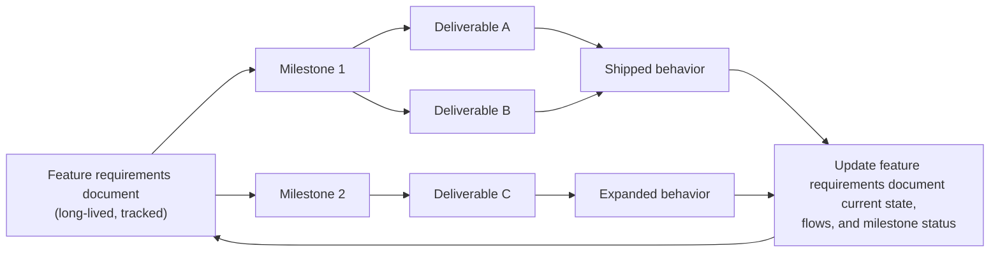
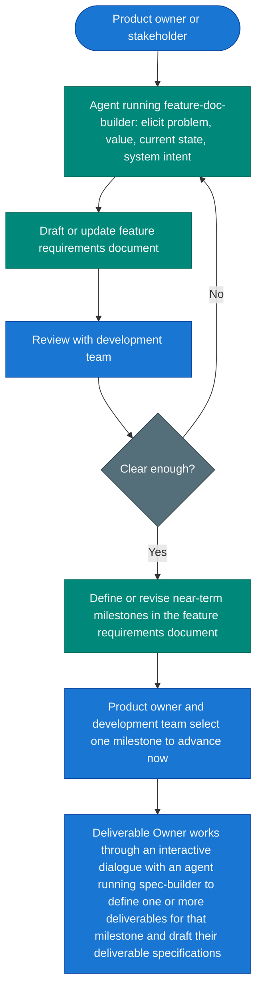

# The Zazz Methodology

Zazz is an opinionated, spec-driven methodology for collaborative software delivery by builders and AI agents. It separates long-lived product knowledge from short-lived execution contracts — deliverable specifications — so teams can move quickly without losing the "why" behind the system.

Zazz is a **methodology** that includes a document framework, skills, and tooling. The methodology is the umbrella: it defines how to structure features, milestones, deliverables, and specifications; how to organize human and agent collaboration; and how to verify that the right software was built correctly. The document framework is a component within the methodology — it defines the durable document model, naming conventions, and file layout that give the methodology a consistent on-disk shape. Skills and tooling implement the methodology's opinions in practice.

The methodology is intentionally **project-first** in its conceptual model: start with a top-level `project.md` that explains the software's value proposition, purpose, and major capabilities. Under that project context, proposals and feature requirements documents act as sibling durable artifacts, while milestones live inside feature requirements documents and deliverables remain bounded execution slices.

The methodology is also intentionally **git-native**. Durable planning and product documents are version-controlled in Git and reviewed through the team's normal branch and PR workflow. GitHub is a common example, but the methodology is agnostic to which Git hosting platform or review tooling a team uses. Git worktrees are a required part of the methodology because they provide the isolation, recovery, and bounded execution model the document framework depends on.

## Table of Contents

- [Value Proposition](#value-proposition)
- [At a Glance](#at-a-glance)
- [Humans, Agents, and Skills](#humans-agents-and-skills)
- [Core Principles](#core-principles)
- [Git-Native Collaboration](#git-native-collaboration)
- [Document Root](#document-root)
- [Hierarchy](#hierarchy)
- [Opinionated Docs Layout](#opinionated-docs-layout)
- [Project Document (`project.md`)](#project-document-projectmd)
- [Proposals](#proposals)
- [Features and Feature Requirements Documents](#features-and-feature-requirements-documents)
  - [Why feature requirements documents matter](#why-feature-requirements-documents-matter)
  - [Product-owner success criteria in feature requirements documents](#product-owner-success-criteria-in-feature-requirements-documents)
  - [Feature Requirements Documents Are Living Documents](#feature-requirements-documents-are-living-documents)
  - [Milestones and deliverables](#milestones-and-deliverables)
  - [Recommended Feature Requirements Document Contents](#recommended-feature-requirements-document-contents)
  - [Example `features/index.yaml`](#example-featuresindexyaml)
  - [Feature Doc Builder Skill](#feature-doc-builder-skill)
  - [Feature Definition Flow](#feature-definition-flow)
- [Architecture Documents](#architecture-documents)
  - [Why architecture documents matter](#why-architecture-documents-matter)
  - [Project-level and feature-level architecture](#project-level-and-feature-level-architecture)
  - [Recommended Architecture Document Contents](#recommended-architecture-document-contents)
  - [Example `architecture/index.yaml`](#example-architectureindexyaml)
- [Ownership Roles](#ownership-roles)
- [Skill Operating Modes](#skill-operating-modes)
- [Agent Authority and Owner Gates](#agent-authority-and-owner-gates)
  - [Where agents may operate autonomously](#where-agents-may-operate-autonomously)
  - [Where owner-controlled gates remain mandatory](#where-owner-controlled-gates-remain-mandatory)
  - [Practical rule](#practical-rule)
- [Agent Execution Discipline](#agent-execution-discipline)
- [Standards and `AGENTS.md`](#standards-and-agentsmd)
  - [`AGENTS.md` Strategy](#agentsmd-strategy)
  - [What a repo `AGENTS.md` must contain](#what-a-repo-agentsmd-must-contain)
  - [Example `standards/index.yaml`](#example-standardsindexyaml)
- [Deliverables and Worktrees](#deliverables-and-worktrees)
  - [Acceptance Criteria and TDD](#acceptance-criteria-and-tdd)
  - [Default methodology position: durable docs in Git, execution artifacts declared per repo](#default-methodology-position-durable-docs-in-git-execution-artifacts-declared-per-repo)
  - [Required: isolated worktree execution](#required-isolated-worktree-execution)
  - [Stacked branches inside one worktree](#stacked-branches-inside-one-worktree)
  - [Durable knowledge must be promoted](#durable-knowledge-must-be-promoted)
- [Execution Model](#execution-model)
- [Core Entities](#core-entities)
- [Human Checkpoints](#human-checkpoints)
- [Adoption](#adoption)
- [Source of Truth and Reference Implementation](#source-of-truth-and-reference-implementation)
- [Zazz Board](#zazz-board)
- [Collaboration](#collaboration)

## Value Proposition

Zazz is opinionated because the methodology is designed to help teams **build the right software, build it correctly, build it efficiently, and keep it maintainable and expandable over time**.

In explicit terms, the methodology provides:

- **A durable structure for defining the right software to build.** `project.md`, proposals, feature requirements documents, milestones, and deliverable specifications organize the product's purpose, current behavior, future direction, and execution intent so teams stay aligned on what the software is for and what it must do.
- **A delivery model for building that software correctly.** Explicit acceptance criteria, TDD, standards alignment, QA loops, and review gates exist so teams can verify that the implementation matches the intended functionality and is built using maintainable, expandable engineering patterns.
- **A methodology for building efficiently without losing quality.** Once the right context is approved, the execution skills can operate in a launch-and-leave mode that reduces supervision overhead while still escalating at real decision or approval boundaries.
- **A system that preserves maintainability and future expansion.** Standards, disciplined execution contracts, and upstream documentation updates help ensure the software can be understood, maintained, and extended as capabilities grow.

The skills, roles, document model, and opinionated workflow are means to that end. They are not the value proposition by themselves. Their purpose is to make those outcomes repeatable across projects, features, deliverables, and teams.

The methodology is opinionated on purpose. The goal is not arbitrary restriction; the goal is to reduce ambiguity, improve consistency across repos and teams, and make the desired outcomes more repeatable for builders and AI agents.

All methodology markdown documents live under a repo-relative docs root resolved by repo policy. In most repos, that root will be either `.zazz/` or `docs/` at the root of the monorepo. The repo should explain the resolution rule in `AGENTS.md`, whether that means declaring the path directly or declaring how to resolve it from an environment variable. Methodology skills should live under `.agents/skills/` so they stay reusable and AI-tool agnostic.

The default mental model is one software project in one monorepo. If a product spans multiple repositories, it is reasonable to introduce a shared docs/methodology repo or package so the same standards, features, and skills can be consumed across repos. That is an extension pattern, not the default assumption.

This repository is the canonical source of truth for the methodology document and the Zazz skills. Copies of the methodology or skills that live in consuming repos, including [zazz-board](https://github.com/zazzcode/zazz-board), may lag behind. Changes should land here first and then be propagated outward.

[zazz-board](https://github.com/zazzcode/zazz-board) is the reference implementation of the methodology and actively dogfoods it.

---

## At a Glance

| Concept | Summary |
| ------- | ------- |
| **Desired-state convergence** | Work iterates until implementation, tests, and review evidence align with the deliverable specification |
| **Git-native model** | Durable docs are version-controlled in Git, reviewed through branches and PRs, and executed through the methodology's required worktree model |
| **Docs root** | The repo's policy resolves the repo-relative directory that contains methodology markdown documents, usually documented in `AGENTS.md` |
| **Top-level durable doc** | `project.md` captures the project purpose, value proposition, and major established capabilities |
| **Tracked docs** | `project.md`, `standards/`, `features/`, `architecture/`, and `proposals/` are the durable, continuously maintained documents and should be tracked in Git |
| **Specification storage** | Every deliverable has a deliverable specification; when stored on disk, those files live under `<DOCS_ROOT>/specifications/`. When not committed in Git, specification documents may be ignored locally, mirrored externally, or stored in an application such as Zazz Board, according to repo policy |
| **Specification model** | Feature requirements document for capability over time plus deliverable specification for one increment |
| **Verification model** | TDD and explicit acceptance criteria are core mechanisms for proving the software was built correctly and delivers the intended functionality |
| **Execution flow** | `project.md` -> proposal (optional) -> feature requirements document (optional but recommended for long-lived features) -> architecture document (optional, paired with feature) -> deliverable specification (required, contains implementation guidance including prescriptive execution sequence) -> agent executes directly -> build/validate loop -> PR/UAT gate |
| **Skills** | `proposal-builder`, `feature-doc-builder`, `architecture-doc-builder`, `spec-builder`, `qa`, optional `pr-builder`, optional companion utility skills such as `zazz-board-api`, `gh-stack`, and draft `jira-api` |
| **Skill modes** | Some skills are interactive and human-in-the-loop; others are designed for mostly autonomous execution once inputs are approved |
| **Autonomy value** | Approved context should let agents converge on a verified solution with minimal supervision, improving delivery efficiency without dropping quality |
| **Organization value** | The methodology gives teams an opinionated structure for defining what the product does, why it exists, and how it can evolve over time |
| **Authority model** | Agents may work autonomously inside approved contracts; owners retain approval, scope, sign-off, and merge authority |
| **Merge authority** | Agents may prepare and verify PRs, but final approval and merge are always reserved to the Deliverable Owner or another authorized human reviewer |
| **Human gates** | UAT and PR review after convergence, before merge |
| **Source of truth** | This repository is canonical for methodology and skill definitions; downstream copies may lag |
| **Reference implementation** | [zazz-board](https://github.com/zazzcode/zazz-board) dogfoods the methodology, skills, and document model |

**Document scope:** This file defines methodology philosophy, document contracts, and operating model. API syntax, route details, and tool-specific commands belong in skills and project docs.

**Reading order:** Start with `project.md`, then any relevant proposal and feature requirements document, then the deliverable specification. The project defines the product, the feature requirement defines capability evolution, and the deliverable defines one bounded execution increment.

## Humans, Agents, and Skills

The methodology distinguishes three different things that are easy to blur together if the wording is loose:

- **Human actors**: Product Owner, Project Owner, Deliverable Owner, stakeholders, and reviewers
- **Agent actors**: the runtime AI agents that execute work or facilitate dialogue
- **Skills**: the capability packages loaded into an agent's context, such as `feature-doc-builder`, `spec-builder`, or `qa`

The important model is:

- a human interacts with an agent
- the agent may be running one or more skills
- the skill shapes how that agent behaves and what artifact it is trying to produce

So, for example:

- the **Deliverable Owner** is the human actor
- the **agent** is the runtime actor in the dialogue
- `spec-builder` is the **skill** guiding that agent's behavior during specification authoring

This document sometimes uses skill names as shorthand for the agents operating with those skills. When precision matters, interpret phrases like "`spec-builder` drafts the deliverable specification" as "an agent running the `spec-builder` skill drafts the deliverable specification through dialogue with the relevant human."

---

## Core Principles

1. **Acceptance criteria and TDD are central, not optional.** Value is clarified through explicit success criteria, then validated through tests and review evidence. If work cannot be described in verifiable terms, it is not ready.
2. **Durable knowledge lives in tracked docs.** `project.md`, `proposals/`, `features/`, and `standards/` are shared repository knowledge. They preserve product understanding, active decisions, and engineering rules over time.
3. **Project context comes before execution slices.** Start from `project.md`, then use proposals and feature requirements documents to clarify why and how the product should evolve before breaking work into deliverables whenever the work is part of an enduring capability.
4. **Execution contracts are per increment.** A deliverable specification defines one bounded slice of work. It is the executable contract that contains both intent and implementation guidance, replacing the old specification + plan split. It is not the permanent home for product narrative.
5. **Git primitives are part of the methodology.** Use branches, worktrees, PRs, review comments, and final PR approval as standard collaboration mechanisms for both code and durable docs.
6. **The methodology is opinionated about both product definition and engineering structure.** `project.md`, proposals, feature requirements documents, milestones, and specifications define what the software should do and why; standards define how it must be built so it remains maintainable and expandable over time.
7. **Launch-and-leave execution is a design goal.** Once the approved context exists, planning, implementation, verification, and PR packaging should require minimal supervision until a real decision or approval boundary is reached.
8. **Agents load only the context they need.** `index.yaml` files exist to help agents decide what to read instead of loading every standard or feature requirements document into context.
9. **PR merge authority stays with an authorized human.** Agents may create draft PRs, update PR bodies, and provide verification evidence, but they must never approve or merge PRs on their own.
10. **Use isolated execution contexts.** Active deliverable execution happens in worktrees so implementation state, branch history, and transient execution artifacts stay isolated from the integration branch and from unrelated work.
11. **Durable knowledge moves upstream.** When a deliverable changes the product, update `project.md`, the relevant feature requirements document, and any impacted standards so the long-lived docs reflect the shipped system.

---

## Git-Native Collaboration

Zazz is designed to work with native Git collaboration primitives instead of inventing a parallel document-management system.

Methodology expectations:

- keep durable docs in the repository so branches, commits, PR comments, and merge history become part of the durable document audit trail
- use **draft PRs** to share in-progress proposals, feature requirements document revisions, and standards updates that are still being shaped
- use **final PR review** to approve and merge durable docs once they are ready to become shared project truth
- treat PR approval and merge as human-controlled gates; agents may prepare and verify PRs but must not merge them
- treat worktrees as the required isolation and recovery mechanism for active deliverable execution; if an execution path proves wrong, the worktree can be abandoned without polluting the main line of work
- treat Git history as the durable change log for `project.md`, proposals, feature requirements documents, and standards
- remember that GitHub is only a common example; GitLab, Bitbucket, Forgejo, and other Git-based review systems fit the same methodology model

Required review pattern for durable docs:

1. Create or revise the doc in a dedicated branch and worktree.
2. Open a draft PR while the document is still being discussed.
3. Iterate in the PR using comments, suggestions, and follow-up commits.
4. Mark the PR ready for review once the proposal, feature requirements document, or standards change is decision-ready.
5. Merge when approved so the repository reflects the new shared truth.

Recovery pattern:

- if a worktree's implementation path goes in the wrong direction or fails review, abandon that worktree rather than forcing it forward
- revisit the governing proposal, feature requirements document, or specification as appropriate
- open a new branch/worktree with the corrected approach once the contract is clarified

---

## Document Root

The document framework requires a single docs-root resolution rule for each repo.

Recommended values:

- `.zazz` at the monorepo root
- `docs` at the monorepo root
- another repo-relative docs directory when needed

Rules:

- The value is a **relative path within the repository**.
- All methodology markdown and index files resolve relative to this root.
- `AGENTS.md` should document the rule clearly, either by declaring the path directly or by declaring how to resolve it from an environment variable.
- Skills and agents should refer to methodology docs through this resolved root rather than hardcoding `.zazz`.

Examples:

- `Methodology docs root: .zazz`
- `Methodology docs root: docs`
- `Methodology docs root: packages/platform-docs`
- `Methodology docs root comes from <ENV_VAR>, which resolves to a repo-relative path such as docs or .zazz`

When the application spans multiple repos, point the relevant repo or shared package at the directory that contains the methodology docs. The important contract is that the path is repo-relative and stable for that repo.

---

## Hierarchy

The document framework's default hierarchy is:

```text
project.md
├── proposals/
├── features/
│   └── milestones
│       └── deliverables
│           └── deliverable specifications
│               └── tasks
└── architecture/
    └── architecture documents (paired with feature requirements documents)
```

On disk, these durable docs live under `<DOCS_ROOT>/`, for example `<DOCS_ROOT>/project.md`, `<DOCS_ROOT>/proposals/`, and `<DOCS_ROOT>/features/`.

Interpretation:

- `project.md` is the top-level durable document for the software project.
- proposals and feature requirements documents are sibling artifact families under the project.
- milestones live inside feature requirements documents.
- deliverables are execution increments associated with one milestone, or with standalone non-feature work.
- tasks are the smallest execution units inside a deliverable.

This hierarchy matters because the methodology treats each layer differently:

- `project.md` explains why the software project exists, what value it creates, and which capabilities are already established.
- proposals explore uncertain solution space before the team commits to a direction.
- feature requirements documents describe durable capability intent and milestone evolution.
- architecture documents describe the system design and technical shape that makes each feature real; they are paired with feature requirements documents.
- deliverable specifications define bounded execution contracts.
- tasks are short-lived implementation units, not durable product-definition artifacts.

Not every layer is required for every change. Bugs, chores, and small maintenance slices may go straight to a deliverable specification. But when the work changes the shape of the product, the methodology expects the higher-level context to exist first.

---

## Opinionated Docs Layout

The document framework is opinionated about the directory shape under the declared docs root.

Each document type in the methodology is expected to justify its existence through the problem it solves. The methodology does not introduce artifacts just to create ceremony. Each artifact exists because it addresses a different coordination need: project context, solution exploration, durable capability definition, implementation guidance, or bounded execution.

Required long-lived artifacts:

- `project.md`
- `proposals/`
- `standards/`
- `features/`
- `architecture/`

Execution artifacts:

- `specifications/` when the repo keeps local deliverable specification files on disk
- optional external tracking or storage systems such as Zazz Board when the project chooses to use them

Recommended layout:

```text
<DOCS_ROOT>/
├── project.md
├── standards/
│   ├── index.yaml
│   ├── testing.md
│   ├── coding-style.md
│   └── architecture.md
├── proposals/
│   ├── role-management-options.md
│   └── research/
│       └── role-management-options/
├── features/
│   ├── index.yaml
│   └── role-based-access-control.md
├── architecture/
│   ├── index.yaml
│   └── role-based-access-control-architecture.md
└── specifications/                  <- optional local execution artifacts
│   └── role-management-ui.md
```

`project.md` is intentionally at the top of the docs root, not under `features/` or `proposals/`.

Recommended responsibilities:

- `project.md` captures the software project's value proposition, business need, constraints, and major established capabilities
- `proposals/` contains durable exploratory documents that help the team work through uncertain solutions
- `features/` contains long-lived feature requirements documents plus `features/index.yaml`
- `architecture/` contains architecture documents paired with feature requirements documents, plus `architecture/index.yaml`
- `standards/` contains implementation rules plus `standards/index.yaml`
- `specifications/` is the on-disk home for deliverable specification files when the repo keeps execution artifacts locally

### Specification storage modes

The document framework supports four common ways teams handle deliverable specification files on disk and in tooling:

1. **Local ignored specifications** - `<DOCS_ROOT>/specifications/` exists in the repo or worktree, is usually ignored, and deliverable specification docs are treated as local execution artifacts.
2. **Committed specifications** - deliverable specification docs are kept under `<DOCS_ROOT>/specifications/` and tracked in Git because the team intentionally wants a Git-native audit trail for execution artifacts.
3. **Externally mirrored specifications** - the repo still has a declared specification storage policy, but the team also mirrors, tracks, or stores deliverable specifications in an external system such as the Zazz Board application.
4. **External-only specifications** - deliverable specifications live in an external system such as the Zazz Board application, `<DOCS_ROOT>/specifications/` may be absent, and `AGENTS.md` declares where agents should read or update the execution contract.

The methodology's general guideline is:

- keep `project.md`, `proposals/`, `features/`, `architecture/`, and `standards/` tracked in Git or another Git-based service because they are durable, continuously maintained documents
- keep the specification storage policy explicit in the repo's `AGENTS.md`
- allow deliverable specification files under `<DOCS_ROOT>/specifications/` to be ignored locally, committed intentionally, mirrored externally, or absent on disk when the repo stores specifications in an application such as Zazz Board
- treat external systems such as Zazz Board as optional integrations, not methodology requirements

If a team adopts one deliverable specification file-layout mode on disk, do not mix modes inside a single repo:

1. **Flat local files** — `{slug}.md` under `specifications/`
2. **Tracker-key subdirectories** — `specifications/{id}/{slug}.md`, where `{id}` may be a Zazz Board deliverable code or a Jira issue key
3. **No durable on-disk specification files** - the repo treats execution artifacts as external or ephemeral and documents that policy explicitly in `AGENTS.md`

This specification file-layout choice is related to, but not identical to, the repo's broader work-tracking system.
A repo may also use an external tracker for PR-facing links or issue management, such as:

- Zazz Board
- Jira
- Avaza
- another tracker
- no external tracker beyond local specification docs

That broader tracking declaration belongs in the repo's `AGENTS.md`.
It tells skills how PRs, QA artifacts, and deliverable references should be anchored.
Live integration with those systems, when present, belongs in companion utility skills rather than in the methodology doc itself.

Naming conventions:

| Artifact | Convention | Example |
| ------- | ---------- | ------- |
| **Project document** | `project.md` at docs root | `project.md` |
| **Docs root** | repo-relative path resolved by repo policy and documented in `AGENTS.md` | `.zazz`, `docs` |
| **Proposal** | `proposals/{name}.md` | `role-management-options.md` |
| **Feature requirements document** | `features/{feature-key}.md` | `role-based-access-control.md` |
| **Features index** | `features/index.yaml` | `features/index.yaml` |
| **Standards index** | `standards/index.yaml` | `standards/index.yaml` |
| **Architecture document** | `architecture/{feature-key}-architecture.md` | `role-based-access-control-architecture.md` |
| **Architecture index** | `architecture/index.yaml` | `architecture/index.yaml` |
| **Deliverable specification** | `specifications/{slug}.md` when stored locally on disk | `role-management-ui.md` |
| **Deliverable specification (subdirectory)** | `specifications/{id}/{slug}.md` when using tracker-key folders | `specifications/ZAZZ-142/role-management-ui.md` |

Because deliverable specifications live under `specifications/`, filenames do not need an uppercase suffix. Use clear deliverable slugs such as `role-management-ui.md`.

**Examples** (same fictional deliverable, slug `role-management-ui`; pick the block that matches your project mode):

```text
# Flat local files
.zazz/specifications/role-management-ui.md
```

```text
# Tracker-key subdirectory
.zazz/specifications/ZAZZ-142/role-management-ui.md
```

Keep `features/` flat by default. Introduce per-feature subdirectories only if the project later discovers a real need for multiple durable artifacts per feature.

---

## Project Document (`project.md`)

`project.md` is the methodology's top-level durable document.

### Why `project.md` exists

`project.md` exists to solve the "what is this software project, and why does it exist?" problem. Without it, teams are forced to reconstruct product purpose from scattered proposals, feature requirements documents, tickets, PRs, and tribal knowledge.

Its value is that it gives the project one durable home for:

- the software's value proposition
- the business or operational need it serves
- key constraints and shaping assumptions
- major established capabilities that are already part of the product story

`project.md` should stay stable enough to orient new readers, but live enough to evolve when the project's durable shape changes.

### Recommended `project.md` contents

A strong `project.md` should usually include:

- a short description of what the software is and who it is for
- the core value proposition or business need
- the major durable capabilities or product areas that define the project
- important constraints, context, or boundary assumptions
- links to the most relevant feature requirements documents when helpful

`project.md` is not a roadmap, not a proposal, not a deliverable contract, and not an implementation guide. Its purpose is durable orientation.

---

## Proposals

Proposal documents are the methodology's exploratory, pre-commitment decision artifacts.

They live under:

- `<DOCS_ROOT>/proposals/`

Use a proposal when a team still needs to evaluate why to proceed, which approach to choose, what tradeoffs are acceptable, or what risks and constraints must be understood before feature definition or execution commitment.

Proposal scope may be:

- feature-oriented
- deliverable-oriented
- joint, when the decision spans both feature and deliverable concerns

### Why proposals exist

Proposals exist to solve uncertainty before the team commits to a direction. Their job is to create a place to compare options, examine tradeoffs, surface risks, and make recommendations while the answer is still legitimately in question.

Their value is that they keep exploration out of documents that need to be more durable or more authoritative. A proposal absorbs uncertain thinking so the later feature requirements document or specification can be clearer and more decisive.

Proposal docs are durable and are expected to be tracked in Git. They sit beside feature requirements documents in the hierarchy, not underneath them. Their job is to help the team work through options before the team decides to author or revise a feature requirements document or specification.

Not every feature requirements document needs a proposal. Use one when it improves decision quality; skip it when the direction is already clear.

The recommended collaboration pattern is:

1. draft the proposal in `<DOCS_ROOT>/proposals/`
2. open a **draft PR** to share it while the proposal is still being discussed
3. refine the proposal through comments, commits, and stakeholder feedback
4. finalize and merge the PR once the proposal is approved
5. use the approved proposal as input to the next authoring session, typically with an agent running `feature-doc-builder`, `spec-builder`, or both

Proposal docs do not replace feature requirements documents or specifications. They help a team decide what should move forward and on what basis.

---

## Features and Feature Requirements Documents

The feature requirements document is a core methodology concept.

A feature requirements document is a **long-lived, continuously maintained document** for one application capability. It explains:

- why the capability exists
- who it serves
- what is live today
- how the capability works at a high level
- which milestones have been completed or planned
- which deliverables have advanced that capability

The primary audiences are:

- product owner
- project owner
- stakeholders
- developers onboarding to the project
- anyone using the repo as a current source of product and user-facing behavior

A feature requirements document is not an execution doc. It does not replace a deliverable specification. Instead:

- **Feature requirements document** = capability over time, the why, the current state, and the milestone roadmap/history
- **Deliverable specification** = execution contract for one increment

### Why feature requirements documents matter

Feature requirements documents exist to solve the "how does this capability evolve over time?" problem. A project needs a durable home for capability-level intent that is too important to leave inside transient deliverables, but too specific to belong in `project.md`.

- They preserve product intent beyond any single deliverable.
- They keep milestone history and current functionality in one place.
- They make onboarding faster because a new developer can understand the shipped feature without reconstructing it from old PRs.
- They help stakeholders see what is already live, what is next, and why work is being prioritized.
- They can double as accurate source material for user documentation when kept current.

### Product-owner success criteria in feature requirements documents

The Product Owner should define the success signals for the feature and its milestones. At the feature requirements level, these are usually not low-level implementation acceptance criteria yet. They are feature-level statements of value and milestone outcomes such as:

- what user or business problem is solved
- what new capability exists after a milestone ships
- what should be true of the system when the milestone is complete

These feature-level success criteria inform later deliverable acceptance criteria. They should be concrete enough to guide decomposition, but they do not replace deliverable-level TDD and execution detail.

### Feature Requirements Documents Are Living Documents

Feature requirements documents must evolve with the software. After each milestone lands:

- update the feature requirements document's current-state sections so they describe what is actually live now
- update milestone status to reflect what was completed
- revise introductory and functional sections when the shipped behavior changes
- keep future milestone sections forward-looking but clearly separated from current behavior

The goal is that the feature requirements document always describes the current application as shaped by the most recent completed milestones.

Milestones are also living planning elements inside the feature requirements document. Teams do not need to define the entire milestone roadmap up front. In many cases, a feature requirements document may begin with only one near-term milestone and one or two forward-looking milestones. Additional milestones may be added later as:

- new feature needs are discovered
- follow-on capabilities become clearer
- shipped milestones change what the next most valuable increment should be
- technical or product learning changes the roadmap

The important rule is that the milestone model lives in the feature requirements document and is revised there as the feature evolves.

### Milestones and deliverables

- A **feature** can span many milestones.
- A **milestone** is a meaningful increment of that feature and may contain multiple deliverables.
- A **deliverable** is one bounded execution slice that advances a milestone or handles a standalone need.
- Teams may define only the next one, two, or three milestones at a time. The methodology does not require a complete long-range milestone map before execution begins.
- Not every deliverable requires a feature requirements document. Bugs, chores, maintenance, migration work, and other non-feature increments may go straight to a deliverable specification.

Relationship model:



### Recommended Feature Requirements Document Contents

A feature requirements document should include:

- feature title and short summary
- current or active milestone plus the next likely milestones when known
- introduction / why this feature exists
- current state of shipped behavior
- feature-level success criteria and milestone outcome criteria
- key concepts or domain model
- important user and system flows
- milestone overview table
- milestone sections that summarize delivered and planned increments
- links or references to related deliverables where useful

The exact headings can vary by project, but those concepts should be present.

### Example `features/index.yaml`

The features index exists for discovery. It lets builders and AI agents quickly identify which feature requirements document is relevant without loading every feature requirements document.

```yaml
features:
  - key: role-based-access-control
    file: role-based-access-control.md
    domain: authentication, authorization, account management
    current_milestone: M1 complete
    current_state: >
      Backend RBAC model is live. Role management UI is not yet shipped.
    purpose: >
      Defines why RBAC exists, what is live today, and the milestone roadmap
      for role management across backend and frontend.
```

The specific text can vary, but the index should give enough information for an agent to decide whether the feature requirements document belongs in context.

### Feature Doc Builder Skill

The methodology includes a dedicated skill for authoring and evolving feature requirements documents:

- `feature-doc-builder`

The skill name remains `feature-doc-builder` for compatibility, but the canonical artifact term in the methodology is **feature requirements document**.

Its purpose is to work with a product owner, project owner, or stakeholders to define:

- why the feature is necessary
- what value it adds
- what the system does today
- what the system should do at a feature level
- how the feature should evolve across milestones

It may also ingest transcripts or meeting notes to create or refresh a feature requirements document draft.

`feature-doc-builder` is intentionally different from `spec-builder`:

- `feature-doc-builder` is feature-level, long-lived, and milestone-oriented
- `architecture-doc-builder` is system-level, technical-design-oriented, and paired with feature requirements documents
- `spec-builder` is deliverable-level, execution-oriented, and implementation-contract-focused

### Feature Definition Flow

This is the recommended flow when a team is defining or revising a long-lived feature:



The key idea is that the feature requirements document is not just written once. It is refined through owner/stakeholder input and development-team review, then updated as milestones ship.

Another key idea is that milestones are defined within the feature requirements document, not produced as a separate one-time decomposition artifact. The feature requirements document owns the milestone roadmap. When a team is ready to execute, the product owner and development team select one milestone to advance. The Deliverable Owner then works through an interactive dialogue with an agent running the `spec-builder` skill to break that milestone into one or more deliverables and draft the corresponding deliverable specifications.

---

## Architecture Documents

Architecture documents are the methodology's durable technical-design artifacts. They live under:

- `<DOCS_ROOT>/architecture/`

They explain how the system is or should be shaped so the product intent in `project.md` and the feature requirements documents can be built, maintained, and expanded. They are not a replacement for standards, which define broad engineering rules, and they are not a replacement for deliverable specifications, which define one bounded execution contract.

### Why architecture documents matter

Architecture documents solve the "how does this system fit together over time?" problem. Without them, important technical decisions often stay trapped in old PRs, one-off deliverable specifications, implementation comments, or the memory of the person who happened to build the first version.

Their value is that they give the team a durable place for:

- system boundaries and module ownership
- data model direction and integration contracts
- major technical decisions and their rationale
- per-milestone technical sequencing for long-lived features
- risks, constraints, and open technical questions
- diagrams that explain structure, flows, and dependencies

This matters especially in agent-assisted delivery because agents can execute quickly once a deliverable specification is approved. The architecture document keeps that speed pointed at the right technical shape. It gives `spec-builder`, implementation agents, and `qa` a stable design source so each deliverable does not accidentally optimize for the nearest local pattern while drifting away from the intended system design.

### Project-level and feature-level architecture

Architecture documents can exist at more than one level:

- **Project-level architecture** describes the broad system shape for the whole software project: major services, modules, data stores, runtime boundaries, integration patterns, and cross-cutting decisions that affect many features.
- **Feature-level architecture** is paired with a feature requirements document and describes how one durable capability should be implemented or evolved across milestones.

Both kinds of documents live under `<DOCS_ROOT>/architecture/`. A simple repo may start with one project-level architecture document. A larger repo may use one project-level document plus one feature-level architecture document for each complex feature.

Feature-level architecture should usually be created or updated before milestone-specific deliverable specifications are written when the work introduces new module boundaries, new data contracts, meaningful integration behavior, non-trivial migration paths, or technical tradeoffs that will affect more than one deliverable.

### Recommended Architecture Document Contents

An architecture document should usually include:

- architecture title and scope
- related `project.md`, proposal, and feature requirements document links
- current technical state
- target technical shape
- module, service, or package boundaries
- data model and API contract direction
- important diagrams or sequence flows
- per-milestone technical plan when paired with a feature
- risks, constraints, and open technical questions
- decisions made and decisions deferred

The exact headings can vary by project. The important rule is that architecture documents preserve durable design reasoning and technical direction, while deliverable specifications stay focused on one increment of execution.

### Example `architecture/index.yaml`

The architecture index exists for discovery. It lets builders and AI agents identify which architecture documents may be relevant without loading every design document into context.

```yaml
architecture:
  - key: project-architecture
    file: project-architecture.md
    scope: project
    domain: application structure, services, persistence, deployment
    purpose: >
      Defines the broad system architecture, major boundaries, cross-cutting
      decisions, and technical constraints for the project.

  - key: role-based-access-control
    file: role-based-access-control-architecture.md
    scope: feature
    feature: role-based-access-control
    domain: authentication, authorization, account management
    purpose: >
      Defines the RBAC module boundaries, data model direction, authorization
      checks, migration path, and per-milestone technical sequencing.
```

The index should give enough information for an agent to decide whether an architecture document belongs in context for the current task.

---

## Ownership Roles

Zazz distinguishes ownership by decision scope. These are responsibility roles, not necessarily different humans.

One person may hold multiple roles in a smaller team.

| Role | Primary scope | Typical responsibilities |
| ---- | ------------- | ------------------------ |
| **Product Owner** | Application and feature value | Owns feature intent, business/domain value, feature requirements documents, milestone direction, and feature-level success criteria |
| **Project Owner** | Engineering project and delivery system | Owns repo/process/methodology conventions, implementation-facing priorities, and delivery structure |
| **Deliverable Owner** | One bounded execution increment | Usually a software developer, tech lead, or other technical owner. Owns deliverable scope, deliverable acceptance criteria, implementation clarifications during execution, and final acceptance/rejection |

Rule of thumb:

- the **Product Owner** answers "What should the application do and why?"
- the **Project Owner** answers "How should this software project be organized and delivered?"
- the **Deliverable Owner** answers "What exactly is in scope for this increment, what are the acceptance criteria, how will we know it is done, and is this PR ready to approve and merge?"

These roles often overlap in practice. The same person may be Product Owner, Project Owner, and Deliverable Owner. In some teams, a technical product owner may also serve as Deliverable Owner.

---

## Skill Operating Modes

Not every skill should behave the same way in human collaboration.

| Mode | Skills | Expected operating style |
| ---- | ------ | ------------------------ |
| **Interactive / human-in-the-loop** | `proposal-builder`, `feature-doc-builder`, `architecture-doc-builder`, `spec-builder`, often `pr-builder` | These skills are expected to facilitate dialogue, ask follow-up questions, iterate drafts with humans, and help shape the artifact through conversation |
| **Autonomous execution** | `qa`, `qa-frontend`, `qa-backend` | These skills are expected to run mostly independently once approved inputs exist, escalating only when they hit a real decision gate, ambiguity, or approval boundary |
| **Companion utility** | `zazz-board-api`, `gh-stack`, draft `jira-api` | These skills are not human-facing workflows on their own; they support other skills with tracker/API capability, stacked PR workflows, or authoritative external context when available |

"Launch-and-leave" is a good informal description for the autonomous execution class, and it is a real methodology value proposition. The expectation is not zero human interaction. The expectation is minimal interruption once the skill has the approved context it needs.

Interactive skills should optimize for dialogue quality and artifact clarity. Autonomous skills should optimize for execution quality, truthful state, TDD discipline, and the ability to iterate toward a verified final solution before escalating.

In this section and elsewhere, the skill names are shorthand for agents operating with those skills in context.

---

## Agent Authority and Owner Gates

The methodology is designed to maximize safe agent autonomy without removing owner accountability.

### Where agents may operate autonomously

Agents are expected to work with minimal supervision when they are operating inside an already approved contract or clearly delegated task, including:

- drafting and revising proposals, feature requirements documents, architecture documents, and specifications during interactive authoring sessions
- implementing code from an approved deliverable specification (agents execute directly without needing a worker skill wrapper)
- running tests, performing QA verification, and generating rework content
- preparing PR titles, bodies, verification evidence, and manual test instructions
- updating transient execution state such as task status, notes, blockers, and local deliverable artifacts

### Where owner-controlled gates remain mandatory

Owner approval or another authorized human decision remains mandatory at these boundaries:

- approving a proposal as the basis for moving into feature-requirements, architecture, and/or specification work
- approving feature-requirements direction, milestone framing, and major feature-scope changes
- approving architecture direction and system design for active milestones
- approving the deliverable specification as the authoritative execution contract
- resolving ambiguities or scope changes that materially alter the approved contract
- providing sign-off for acceptance criteria marked as owner-reviewed
- approving the PR for integration
- merging the PR

### Practical rule

Use agents to do the work. Use the Deliverable Owner or another authorized human to approve the contract, accept the result, and authorize merge.

This is the methodology's intended balance:

- maximum autonomy inside approved boundaries
- explicit human control at approval, acceptance, and merge boundaries

---

## Agent Execution Discipline

The methodology expects agents to behave with disciplined scope awareness and verification habits. These rules reduce wasted work, prevent out-of-scope edits, and keep branch footprints minimal.

### Verify scope before acting

Before editing files, running linters, or applying auto-fixes, determine what the current branch actually changes.

```bash
# Show exactly which files differ between this branch and the base branch
git diff <base-branch> --stat
```

Rules:

- if a file does not appear in that diff, it is out of scope for edits
- if running the full test suite shows a failure in an unmodified file, the branch likely changed a shared dependency (fixture, import, config) that the test relies on; treat the failure as in-scope until proven otherwise
- for stacked branches, scope formatting, linting, and fixes to the current slice only; do not auto-fix parent-slice files unless the user explicitly asks to change that lower branch

### Integration branch invariant

The methodology assumes the integration branch is always green. There are no pre-existing test failures on the base branch.

Rules:

- do not dismiss a failure as "pre-existing" or "unrelated" without proving the branch did not cause it
- if the base branch has a known exception, the repo `AGENTS.md` must document it explicitly; otherwise assume green

### Concurrent work awareness

Developers may edit files while an agent is working. This is normal.

Rules:

- do not treat concurrent developer edits as corruption, agent failure, or a reason to improvise a recovery plan
- if a file changes unexpectedly, ask whether the developer changed it
- verify assumptions before acting on them

### Command shape discipline

Approval friction is real. Reusing the same command shapes across a session reduces interruptions.

Guidelines:

- prefer a small, stable set of command wrappers
- batch related work into fewer commands when possible
- if a command must be rerun with a slightly different target, keep the wrapper and argument order the same
- do not vary wrappers casually just because a command is technically equivalent

### Edit documents in place

When creating or updating durable docs, preserve continuity.

Rules:

- edit documents in place; do not delete and recreate a document as a shortcut because it loses useful continuity and costs more context than a targeted edit
- if a document needs to be recreated as a variant, copy it first and edit the copy; delete the original only when the user explicitly asks for deletion
- once an item is resolved, mark it as `Implemented`, `Done`, `Rejected`, or `Deferred`; do not keep arguing the resolved decision
- remove obsolete recommendations after implementation, or rewrite them as completed actions

### Database and environment safety

Treat shared state as sensitive by default.

Rules:

- never drop, recreate, truncate, or bulk-delete database state as a troubleshooting shortcut
- never run destructive reset or rebuild commands because an error message is confusing
- never assume a failing command means the database or environment is corrupt
- if a destructive action might be needed, stop and ask the user; any command that could destroy shared state must be given to the user for manual execution
- prefer logs, configuration checks, connection checks, and read-only queries before any recovery step

---

## Standards and `AGENTS.md`

Standards are long-lived, tracked implementation rules. They should live beside `features/` under the same declared docs root.

Standards are **not** the place to describe product functionality, feature intent, or user-facing behavior. Their purpose is to define the engineering patterns, structural rules, and implementation constraints that make the software maintainable, consistent, and expandable over time.

### Why standards exist

Standards exist to solve the "how should this software be built?" problem. Without them, builders and AI agents default to whatever nearby pattern they happen to see, even when the surrounding code is legacy, inconsistent, or already known to be undesirable.

Their value is that they turn implementation expectations into explicit shared rules instead of informal convention.

Use this distinction:

- `project.md`, `proposals/`, `features/` (feature requirements documents), and `deliverable specifications` describe what the software should do and why
- `standards/` describes how the software should be built

The key contract is:

- `AGENTS.md` must point agents to `<DOCS_ROOT>/standards/index.yaml`
- agents should read the standards index first
- agents should then load only the standards whose paths or activities match the task
- agents should **not** inject every standard document into context by default
- `AGENTS.md` itself should stay lean and should not duplicate large sections of standards content

This is how the methodology manages context without requiring every task to load the entire project's standards corpus.

### `AGENTS.md` Strategy

`AGENTS.md` exists to solve the "how do I enter this repo correctly?" problem. Its job is routing, not deep policy. It tells agents where the durable docs live, which indexes to use for selective loading, what tracking model the repo uses, and what execution constraints matter before work begins.

Every repo using the methodology should have a real `AGENTS.md` at its repo root.

This repo defines the methodology contract for what that file must contain and provides an example template:

- `templates/AGENTS.md`

That template is an example starter, not the live `AGENTS.md` for this repo.

If you want a concrete real-world repo-level `AGENTS.md` in practice, use the reference implementation:

- [zazz-board](https://github.com/zazzcode/zazz-board)

### What a repo `AGENTS.md` must contain

At minimum, a repo-level `AGENTS.md` must tell agents:

- what the repo's methodology docs root is
- where `<DOCS_ROOT>/project.md` lives
- where `<DOCS_ROOT>/standards/index.yaml` lives
- that the standards index is the discovery surface for selective context loading
- where `<DOCS_ROOT>/features/index.yaml` lives when feature context matters
- where `<DOCS_ROOT>/architecture/index.yaml` lives when architecture context matters
- whether `<DOCS_ROOT>/specifications/` is local/untracked, committed, or backed by Zazz Board in that repo
- what work-tracking system the repo uses for deliverables, tickets, and PR context
- the repo's worktree / branch policy

The standards index is mandatory. The features index is expected in repos that use feature requirements documents. The architecture index is expected in repos that maintain project-level or feature-level architecture documents.

The tracking declaration should be concise but explicit. For example, it should clarify whether the repo uses:

- Zazz Board
- Jira
- Avaza
- another external tracker
- no external tracker beyond local specification docs

When relevant, it should also say whether that system affects:

- specification folder naming
- required IDs or URLs in PRs
- how agents should anchor specification, QA, and PR references

This declaration does not require live tracker integration.
It simply tells agents which system is authoritative for PR-facing references and review context.
When a repo later adds live integration, that capability should be exposed through a companion utility skill such as `zazz-board-api` or a future Jira-style integration skill.

Best-practice principle:

- `AGENTS.md` is a concise routing layer
- `standards/index.yaml` drives selective standards discovery
- standards documents hold the detailed implementation guidance, not product requirements

This separation is intentional. It keeps agent entry-point context small and reduces duplication drift.

### Example `standards/index.yaml`

```yaml
standards:
  - file: http-layer-guide.md
    applies_to:
      paths:
        - backend/src/http_api/
      activities:
        - creating or modifying HTTP endpoints
        - defining request/response schemas
        - wiring routes and auth decorators
    purpose: >
      Prescriptive patterns for the HTTP layer: route structure, schema design,
      documentation, auth usage, and error handling.

  - file: service-layer-guide.md
    applies_to:
      paths:
        - backend/src/svc/
      activities:
        - creating or modifying business logic functions
        - adding domain exceptions or types
    purpose: >
      Patterns for service-layer design, dependency injection, domain
      boundaries, and error handling.

  - file: data-layer-sproc-examples.md
    companion_to: data-layer-guide.md
    applies_to:
      paths:
        - backend/src/data/sprocs/
      activities:
        - writing a new stored procedure wrapper
    purpose: >
      Complete examples referenced by the main data-layer guide.
```

Index structure expectations:

- `file`: relative filename inside `standards/`
- `applies_to.paths`: repo paths governed by the standard
- `applies_to.activities`: work types covered by the standard
- `purpose`: enough detail for an agent to decide relevance without opening the file
- `companion_to` (optional): indicates a standard that should usually be loaded with another one

---

## Deliverables and Worktrees

Deliverables are the execution layer of the methodology.

- Every active deliverable must have a deliverable specification that serves as the execution contract, replacing the old specification + plan split.
- The deliverable specification contains both the intent and implementation guidance (including execution sequence) for one bounded increment.
- Deliverable specification files may have local working copies under `<DOCS_ROOT>/specifications/`, may be committed intentionally, may be mirrored into an external system such as Zazz Board, or may be stored only in an application such as Zazz Board when the repo declares an external-only workflow.

### Why deliverables exist

Deliverables exist to solve the "what exactly are we building right now?" problem. They create a bounded execution contract for one increment of work so implementation, QA, and review can converge on a clear scope.

Their value is precision and boundedness. They let the team isolate one unit of execution without overloading `project.md`, proposals, or feature requirements documents with short-lived implementation detail.

### Acceptance Criteria and TDD

Acceptance criteria and TDD are core methodology mechanisms for ensuring value delivery.

Methodology expectations:

- the Product Owner defines feature-level value and milestone outcomes in the feature requirements document
- the Deliverable Owner defines explicit deliverable acceptance criteria in the deliverable specification
- each deliverable acceptance criterion must be testable or clearly marked for owner sign-off
- the implementation loop should use TDD wherever applicable
- QA validates against both the deliverable specification and the supporting test evidence

This is the methodology's main protection against building the wrong thing, building something unverifiable, or shipping work that does not produce real value.

They work together with standards:

- acceptance criteria and TDD prove the deliverable does the right thing
- standards help ensure it is built the right way

### Default methodology position: durable docs in Git, execution artifacts declared per repo

In practice, deliverable specification docs are transient execution artifacts, not long-lived product-definition docs. They change frequently, can be highly agent-specific, and tend to clutter the shared repository when every in-flight deliverable specification is committed.

So the methodology default is:

- keep `project.md`, `standards/`, `proposals/`, `features/`, and `architecture/` tracked in Git or another Git-based service
- declare in `AGENTS.md` whether `<DOCS_ROOT>/specifications/` is ignored locally, committed, externally mirrored, or absent on disk in that repo
- use local deliverable specification files as execution working copies when they are helpful
- use an external system such as Zazz Board only when that repo chooses to integrate one

Examples of acceptable mechanisms:

- `.git/info/exclude`
- an equivalent worktree-local exclude file in a shared-bare/worktree setup
- committed deliverable specification docs under `<DOCS_ROOT>/specifications/`
- an external system such as Zazz Board for deliverable metadata, files, diagrams, task state, or related execution assets

The important idea is not the exact Git plumbing. The important idea is that `project.md`, proposals, feature requirements documents, architecture documents, and standards are **shared durable knowledge**, while deliverable specifications are usually **transient execution docs**.

Teams may choose local ignored specifications, committed specifications, external mirroring, or external-only specification storage in an application such as Zazz Board. The methodology allows these modes, but the repo must declare the policy clearly so agents do not guess.

### Required: isolated worktree execution

Worktrees are required by the methodology. The normal operating model is a single isolated worktree lane for one active deliverable:

- one active deliverable per worktree in the normal case
- one branch per worktree in the normal case; one checked-out branch at a time when using a stack
- worktree name matches the branch or deliverable slug where practical
- do not use `/` in branch names
- use flat branch names so the branch name can map cleanly to a sibling worktree directory

This keeps ordinary execution isolated and makes it easy to keep local deliverable specification docs alongside the code they govern. It improves safety, reviewability, and recovery, especially when multiple builders or AI agents are working in parallel.

The methodology's default unit of isolation is the deliverable worktree. Do not create multiple worktrees for the same active deliverable just because multiple agents are participating. Parallel task execution for one deliverable should still happen inside that single deliverable worktree, with file coordination handled through the repo coordination policy and the active agent harness.

A deliverable and a deliverable specification stay one-to-one: each deliverable has exactly one deliverable specification, and each deliverable specification governs exactly one deliverable.

The worktree relationship is different. A worktree usually contains one active deliverable, but a worktree may contain multiple related deliverables when the team intentionally uses a stacked-branch workflow inside that worktree. In that case, each deliverable still has its own branch and its own deliverable specification, but the branches are managed as one ordered stack from the same worktree lane.

A worktree is one working directory with one index and one checked-out branch at a time. In a stack, the checked-out branch changes as the builder moves through the stack, while the lane's filesystem, dependency installs, scratch output, IDE state, and build cache stay in one place.

If the team wants multiple versions or competing implementations, model them as separate deliverables. Competing approaches should not be treated as a stack inside one deliverable. Each alternative gets its own identity, its own execution contract as needed, and its own dedicated worktree unless the team is explicitly stacking dependent deliverables for review sequencing.

Use worktree-safe branch names:

- `feature/rbac` is not an acceptable Zazz branch name
- `docs/reorg-mw1` is not an acceptable Zazz branch name
- use `feature-rbac` or `docs-reorg-mw1` instead

Branch names such as `feature/rbac` are valid Git refs, but they imply nested path segments when reused as worktree directory names. Because the required Zazz setup standardizes on sibling worktrees under one container directory, flat names are preferred:

- `feature-rbac`
- `docs-reorg-mw1`
- `deliverable-zazz-142-role-management-ui`

Worktrees also provide a clean rollback boundary for human review. If a deliverable implementation goes down the wrong path, fails review, or reveals that the contract itself needs revision, the worktree can be abandoned and the team can return to the governing docs:

- revisit the proposal if the approach or justification is wrong
- revisit the feature requirements document if the feature intent or milestone framing is wrong
- revisit the deliverable specification if the execution contract is wrong or incomplete

This is one of the practical benefits of the methodology's git-native design: incorrect execution paths can be discarded cleanly without confusing the durable project history or forcing a bad implementation to keep moving forward.

### Stacked branches inside one worktree

Stacked branches are the methodology's exception to the usual one-deliverable-per-worktree shape.

Use stacked branches when a sequence of tightly related work is easier to review and integrate as dependent PRs than as one large PR or several disconnected worktrees. This can mean multiple review branches for one large deliverable, or multiple dependent deliverables in one lane. When the stack contains multiple deliverables, each deliverable still needs its own deliverable specification.

The methodology-level rules are:

- use stacks only when the branches have a clear dependency order and review sequence
- keep branch names flat and worktree-safe
- keep QA and PR evidence scoped to the active branch while acknowledging parent-branch assumptions
- make lower-branch fixes on the lower branch and carry them upward through the stack
- use separate worktrees when multiple agents must edit different branches concurrently

The `gh-stack` skill exists for repos that use GitHub stacked PR workflows. It is a companion utility for managing dependent branches and PRs; it does not change the core methodology rule that each deliverable needs its own specification and owner-accepted execution contract.

Supporting docs:

- [docs/worktree-setup.md](docs/worktree-setup.md) for the required worktree structure, branch naming, Worktrunk usage, and recovery model
- [docs/wt-cheat-sheet.md](docs/wt-cheat-sheet.md) for day-to-day worktree and Worktrunk commands
- [docs/using-gh-stack.md](docs/using-gh-stack.md) for the single-worktree lane model, `gh-stack` navigation, rebase/sync behavior, and branch ownership mechanics
- [docs/human-in-loop-pr-review-strategy.md](docs/human-in-loop-pr-review-strategy.md) for PR sizing, stacked PR review policy, and human approval expectations
- [Git worktree documentation](https://git-scm.com/docs/git-worktree)
- [Worktrunk CLI](https://worktrunk.dev/worktrunk/)

`git worktree` is the underlying Git feature. [Worktrunk](https://worktrunk.dev/worktrunk/) is an encouraged convenience CLI that makes worktree workflows easier, especially when builders and AI agents are working in parallel, but it is not a methodology requirement.

### Durable knowledge must be promoted

If a deliverable changes the product, the final knowledge should not stay trapped in a local deliverable specification. Promote the durable outcome into:

- `project.md` when the project's high-level capability story changes
- the relevant feature requirements document
- any impacted standards
- other long-lived project docs as needed

That is how the methodology avoids stale onboarding docs and stale product descriptions.

---

## Execution Model

Document flow:

| Stage | Artifact | Purpose |
| ----- | -------- | ------- |
| **Project context** | `project.md` | Top-level durable description of the software project, its value proposition, and major established capabilities |
| **Proposal** | `proposals/{name}.md` | Optional. Explore whether or how to proceed before feature definition or execution commitment; use a draft PR to collaborate while the proposal is still in progress |
| **Feature definition** | `features/{feature-key}.md` | Long-lived feature requirements document: why, what is live, system-level intent, milestone roadmap, future direction, and feature-level success criteria |
| **Architecture** | `architecture/{feature-key}-architecture.md` | Optional but recommended for long-lived features. Paired with a feature requirements document; defines system design, module placement, per-milestone diagrams, and technical open questions |
| **Deliverable specification** | `specifications/{slug}.md` | Required execution contract for one deliverable, including explicit acceptance criteria and verification expectations |
| **Build / validate** | code, tests, QA evidence | Agent implements directly from the deliverable specification with TDD where applicable; agent running `qa` verifies against acceptance criteria and evidence until convergence |
| **Review package** | PR title/body, manual test plan | Reviewer-facing packaging of what changed and how to validate it |

Execution relationship:

```mermaid
flowchart LR
    PJ["project.md"] --> P["Proposal\n(optional)"]
    PJ --> FB["Agent running\nfeature-doc-builder"]
    P --> FB
    P --> SB["Agent running\nspec-builder"]
    FB --> F["Feature requirements document\n(optional for bugs/chores)"]
    F --> M["Milestones live inside the feature requirements document"]
    M --> SM["Owner/team select one milestone to advance"]
    SM --> SB
    SB --> DS["Deliverable specification"]
    DS --> W["Agent executes\ndirectly from the deliverable specification"]
    W --> QA["Agent running\nqa"]
    QA --> PR["Agent running\npr-builder\n(optional)"]
    PR --> G["Owner UAT + PR review"]
    G --> U["Merge + update project.md /\nfeature requirements / standards"]
```



Notes:

- A deliverable may be created without a feature requirements document when the work is a bug, chore, migration, or other non-feature slice.
- A feature may drive many deliverables over time.
- Milestones are defined and maintained inside the feature requirements document.
- Teams do not need to define every future milestone up front; the feature requirements document may start with only the next few meaningful milestones.
- Execution advances one selected milestone at a time.
- The Deliverable Owner works through an interactive dialogue with an agent running the `spec-builder` skill to decompose that selected milestone into one or more deliverables and draft their deliverable specifications.
- `project.md` should already exist before proposal or feature-definition work begins.
- The feature requirements document is typically created or updated before milestone-specific deliverable specifications are written.

---

## Core Entities

```text
Project
├── Proposal (optional)
├── Feature requirements document (optional for some work)
│   ├── Architecture document (optional, paired with feature requirements document)
│   └── Milestone
│       └── Deliverable
│           └── Deliverable specification
│               └── Task
└── Standalone deliverable
    └── Deliverable specification
        └── Task
```

| Entity | Description |
| ------ | ----------- |
| **Project** | Long-lived product or application context with a top-level `project.md`; default assumption is one monorepo |
| **Proposal** | Optional exploratory artifact used to compare options before committing to feature-definition or execution direction |
| **Feature** | Long-lived capability with one feature requirements document that evolves over time |
| **Architecture document** | Optional but recommended system-design document paired with a feature requirements document; owns module placement, per-milestone diagrams, data model vision, and technical open questions |
| **Milestone** | Named increment of a feature or release target; may span multiple deliverables |
| **Deliverable** | Bounded unit of execution; may be associated with a milestone or may stand alone |
| **Deliverable specification** | Executable contract for one deliverable; replaces the old specification + plan split; contains intent, acceptance criteria, execution sequence, and halt conditions |
| **Task** | Smallest execution unit; agent decomposes dynamically from the deliverable specification during execution, and the relevant owner coordinates |

**Adoption path:** Start with `project.md`. Add Proposal when the direction is uncertain. Add Feature, Architecture document, and Milestone when the product needs durable capability tracking, system design, and stakeholder-visible roadmap/history. Go straight to Deliverable -> deliverable specification -> Task for bounded non-feature work when that is enough.

**Variants:** If the team wants alternative implementations, treat them as separate deliverables. Each alternative gets its own deliverable identity and worktree. Human review selects one or triggers a synthesis deliverable.

---

## Human Checkpoints

| Checkpoint | Purpose |
| ---------- | ------- |
| **UAT** | Validate delivered behavior meets expectations |
| **PR review** | Gate for code integration and release readiness |

Methodology rule:

- agents may prepare, verify, and update PRs, but PR approval and merge are always reserved to the Deliverable Owner or another authorized human reviewer

Outcomes:

- accept and close
- bounded rework in the same deliverable
- successor deliverable
- select among variants
- synthesis deliverable

---

## Adoption

You can adopt Zazz at three levels:

| Level | What you use | When it fits |
| ----- | ------------ | ------------ |
| **Process-only** | Methodology philosophy and document flow | Apply the process manually; no tools required |
| **Skills-assisted** | Process + `zazz-skills` | Use skills to facilitate proposal, feature requirements, spec, implementation, QA, and PR packaging |
| **Service-assisted** | Process + skills + [zazz-board](https://github.com/zazzcode/zazz-board) | Add Board to organize relationships and execution state across features, milestones, deliverables, and tasks |

By methodology layer:

| Layer | Scope |
| ----- | ----- |
| **Execution** | Deliverable -> deliverable specification -> Task |
| **Capability** | Add feature requirements documents and feature-linked deliverables |
| **Portfolio** | Add Milestones for roadmap and release coordination |

---

## Source of Truth and Reference Implementation

This repo is the canonical source of truth for:

- the methodology document
- the skill definitions
- the intended document model and naming conventions

Other repos may contain copies of these files for convenience or local execution, but those copies are downstream artifacts and may be out of date. When there is a conflict, treat this repo as authoritative.

[zazz-board](https://github.com/zazzcode/zazz-board) remains the reference implementation and dogfooding app for the methodology.

## Zazz Board

Zazz Board is optional tooling and the methodology's reference implementation.

It provides:

- relationship management across proposals, features, milestones, deliverables, and tasks
- live operational visibility while agents execute
- task graphs, readiness checks, and dependency views
- shared-state coordination such as file locking
- explicit human control points for review, rework, and successor deliverables

[zazz-board](https://github.com/zazzcode/zazz-board) dogfoods the methodology: the app is built using the same methodology docs, skills, and delivery model it provides to other repos.

The methodology is still fully usable without Zazz Board. Board is an accelerator and reference implementation, not a prerequisite for the methodology.

---

## Collaboration

Prefer runtime-native isolation and planning features when the harness supports them. Repos should declare any repo-specific shared-file coordination policy in `AGENTS.md`; when that policy names [zazz-board](https://github.com/zazzcode/zazz-board) locking or coordination, use it for shared mutable state.

---

**Methodology maturity:** Pre-1.0 working draft `0.8.1`
